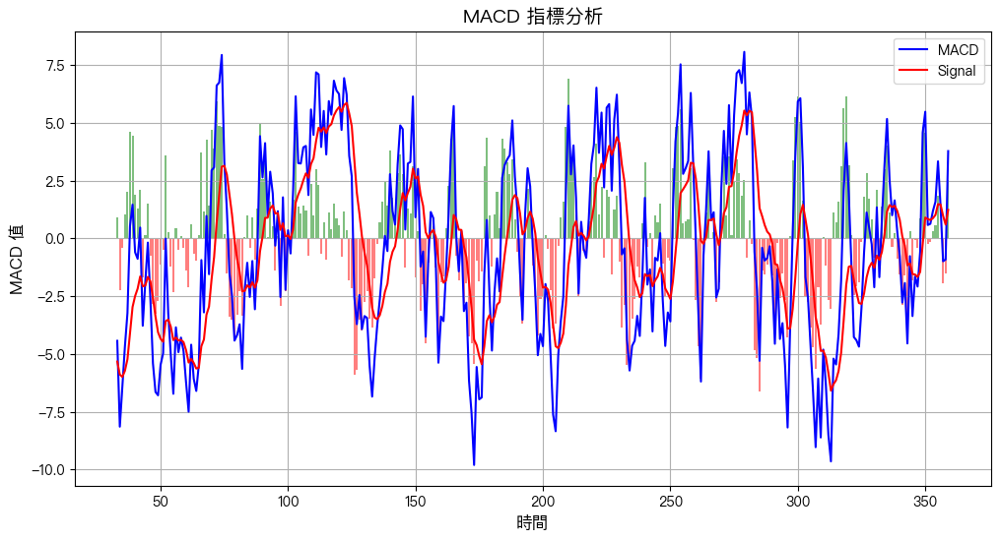

# 其他指標

<br>

## MACD

_指數平滑移動平均線，Moving Average Convergence Divergence, MACD_

<br>

1. 用於判斷市場的多空趨勢變化，組成包含 MACD 線 `短期 EMA - 長期 EMA`，Signal 線 MACD 的 `9 天 EMA`，MACD 柱狀圖 `MACD 線 - Signal 線` 反映市場動能變化。

<br>

2. 代碼。

    ```python
    import pandas as pd
    import numpy as np
    import talib
    import os

    # 設定文件路徑
    input_file = "data/股市資料_20240101-20250516.xlsx"
    output_file = "data/股市資料_MACD.xlsx"

    # 確保文件存在
    if not os.path.exists(input_file):
        print(f"錯誤：找不到檔案 {input_file}")
    else:
        print(f"讀取文件：{input_file}")

        # 讀取 Excel 檔案
        df = pd.read_excel(input_file)

        # 確保欄位名稱正確
        if not {"High", "Low", "Close"}.issubset(df.columns):
            print("錯誤：Excel 文件缺少必要的欄位 (High, Low, Close)")
        else:
            # 轉換為 NumPy 陣列
            high = df["High"].values.astype(np.float64)
            low = df["Low"].values.astype(np.float64)
            close = df["Close"].values.astype(np.float64)

            # 計算 MACD 指標
            df["MACD"], df["Signal"], df["MACD_Hist"] = talib.MACD(
                close, fastperiod=12, slowperiod=26, signalperiod=9
            )

            # 顯示最後 10 筆數據
            print(df.tail(10))

            # 儲存結果
            df.to_excel(output_file, index=False)
            print(f"MACD 計算結果已儲存到 {output_file}")
    ```

<br>

3. 添加製圖，其中 `綠色` 的線條是 `MACD 柱狀圖（Histogram）`，它是用 `plt.bar()` 繪製的，而圖例預設只會顯示 `plt.plot()` 繪製的線條，不會自動加入 `plt.bar()` 的柱狀圖。

    ```python
    import matplotlib.pyplot as plt
    import matplotlib.font_manager as fm
    import numpy as np
    import talib

    # 使用 PingFang HK 作為字體，確保不會發生亂碼
    plt.rcParams["font.family"] = "PingFang HK"
    # 避免負號變成亂碼
    plt.rcParams["axes.unicode_minus"] = False

    if not {"High", "Low", "Close"}.issubset(df.columns):
        print("錯誤：Excel 文件缺少必要的欄位 (High, Low, Close)")
    else:
        # 轉換為 NumPy 陣列
        high = df["High"].values.astype(np.float64)
        low = df["Low"].values.astype(np.float64)
        close = df["Close"].values.astype(np.float64)

        # 計算 MACD 指標
        df["MACD"], df["Signal"], df["MACD_Hist"] = talib.MACD(
            close, fastperiod=12, slowperiod=26, signalperiod=9
        )

        # 繪製 MACD 圖表
        plt.figure(figsize=(12, 6))

        # 繪製 MACD 和 Signal 線
        plt.plot(df.index, df["MACD"], label="MACD", color="blue")
        plt.plot(df.index, df["Signal"], label="Signal", color="red")

        # 繪製 MACD 柱狀圖
        plt.bar(df.index, df["MACD_Hist"], color=np.where(df["MACD_Hist"] >= 0, "green", "red"), alpha=0.5)

        # 設定標題和圖例
        plt.title("MACD 指標分析", fontsize=14)
        plt.xlabel("時間", fontsize=12)
        plt.ylabel("MACD 值", fontsize=12)
        plt.legend()
        plt.grid()

        # 顯示圖表
        plt.show()
    ```

    

<br>

4. 添加綠色。

    ```python
    import matplotlib.pyplot as plt
    import matplotlib.font_manager as fm
    import numpy as np
    import talib
    # 手動添加 "綠色" 標註
    from matplotlib.lines import Line2D

    # 使用 PingFang HK 作為字體，確保不會發生亂碼
    plt.rcParams["font.family"] = "PingFang HK"
    # 避免負號變成亂碼
    plt.rcParams["axes.unicode_minus"] = False

    if not {"High", "Low", "Close"}.issubset(df.columns):
        print("錯誤：Excel 文件缺少必要的欄位 (High, Low, Close)")
    else:
        # 轉換為 NumPy 陣列
        high = df["High"].values.astype(np.float64)
        low = df["Low"].values.astype(np.float64)
        close = df["Close"].values.astype(np.float64)

        # 計算 MACD 指標
        df["MACD"], df["Signal"], df["MACD_Hist"] = talib.MACD(
            close, fastperiod=12, slowperiod=26, signalperiod=9
        )

        # 繪製 MACD 圖表
        plt.figure(figsize=(12, 6))

        # 繪製 MACD 和 Signal 線
        plt.plot(df.index, df["MACD"], label="MACD", color="blue")
        plt.plot(df.index, df["Signal"], label="Signal", color="red")

        # 繪製 MACD 柱狀圖
        plt.bar(df.index, df["MACD_Hist"], color=np.where(df["MACD_Hist"] >= 0, "green", "red"), alpha=0.5)

        # 設定標題和圖例
        plt.title("MACD 指標分析", fontsize=14)
        plt.xlabel("時間", fontsize=12)
        plt.ylabel("MACD 值", fontsize=12)
        # plt.legend()

        legend_elements = [
            Line2D([0], [0], color="blue", lw=2, label="MACD"),
            Line2D([0], [0], color="red", lw=2, label="Signal"),
            # 綠色標註
            Line2D([0], [0], color="green", lw=4, label="MACD Histogram")
        ]

        plt.legend(handles=legend_elements)
        plt.grid()

        # 顯示圖表
        plt.show()
    ```

<br>

## ATR

_平均真實波動範圍，Average True Range_

<br>

1. 用來衡量市場波動程度，ATR 就是 `過去 N 天的真實範圍的平均值`，真實範圍 `TR` 就是 `(當日高點 - 當日低點)`、`|(當日高點 - 前一日收盤價)|`、`|(當日低點 - 前一日收盤價)|` 三者的最大值。

    

<br>

2. 代碼。

    ```python
    # 轉換數據格式
    high = df["High"].values.astype(np.float64)
    low = df["Low"].values.astype(np.float64)
    close = df["Close"].values.astype(np.float64)

    # 計算 ATR
    df["ATR"] = talib.ATR(high, low, close, timeperiod=14)

    # 儲存結果
    output_file = "data/股市資料_ATR.xlsx"
    df.to_excel(output_file, index=False)
    print(f"ATR 計算結果已儲存到 {output_file}")
    ```

<br>

## CCI

_商品通道指標，Commodity Channel Index_

<br>

1. 用來衡量價格與其統計平均值的偏離程度，判斷價格超買或超賣。

<br>

2. 計算公式如下，其中 `TP（Typical Price）` = `(高價 + 低價 + 收盤價) / 3`；`SMA` 為 `TP` 的 N 日均線；`Mean Deviation` = `(TP - SMA) / N`。

    ```bash
    CCI = (TP - SMA(TP, N)) / (0.015 * Mean Deviation)
    ```

<br>

3. 代碼。

    ```python
    # 計算 CCI
    df["CCI"] = talib.CCI(high, low, close, timeperiod=14)

    # 儲存結果
    output_file = "data/股市資料_CCI.xlsx"
    df.to_excel(output_file, index=False)
    print(f"CCI 計算結果已儲存到 {output_file}")
    ```

<br>

## Williams %R

_威廉指標_

<br>

1. 用來判斷市場是否超買或超賣。

<br>

2. 計算公式；其中 Hₙ 是過去 n 天的最高價，`Lₙ` 是過去 n 天的最低價，`C` 是當日收盤價。

    ```bash
    %R = `(Hₙ - C) / (Hₙ - Lₙ) * -100`
    ```

<br>

3. 代碼。

    ```python
    # 計算 Williams %R
    df["Williams %R"] = talib.WILLR(high, low, close, timeperiod=14)

    # 儲存結果
    output_file = "data/股市資料_WilliamsR.xlsx"
    df.to_excel(output_file, index=False)
    print(f"Williams %R 計算結果已儲存到 {output_file}")
    ```

<br>

___

_END_
