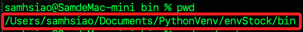
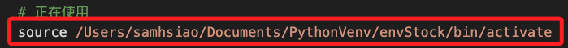
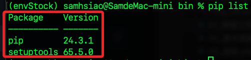

# 從頭開始

<br>

## 準備工作

_開啟終端機進行操作_

<br>

1. 若已啟用虛擬環境，可先退出當前環境。

    ```bash
    deactivate
    ```

<br>

2. 建立新的虛擬環境 `envStock`，這裡使用的路徑是在 `~/Documents/PythonVenv`。

    ```bash
    cd ~/Documents/PythonVenv && python -m venv envStock
    ```

<br>

3. 進入資料夾並查詢路徑。

    ```bash
    cd envStock/bin  && pwd
    ```

    

<br>

4. 編輯環境變數，路徑以查詢結果為前綴、加上尾綴指令 `activate`。

    ```bash
    code ~/.zshrc
    ```

    

<br>

5. 儲存後，啟動虛擬環境。

    ```bash
    source ~/.zshrc
    ```

<br>

6. 更新 pip。

    ```bash
    pip install --upgrade pip
    ```

<br>

7. 檢查當前套件，這是個乾淨的虛擬環境。

    ```bash
    pip list
    ```

    

<br>

8. 建立並進入專案。

    ```bash
    mkdir -p ~/Desktop/_exStock_ && cd ~/Desktop/_exStock_ && code .
    ```

<br>

___

_END_