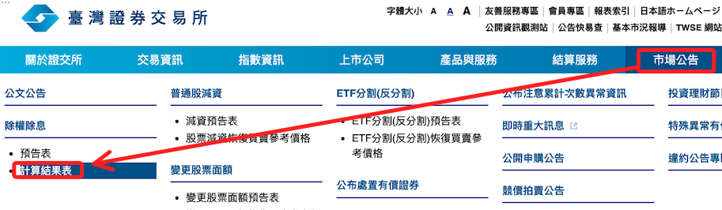
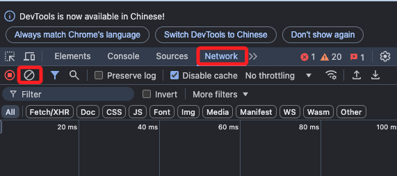
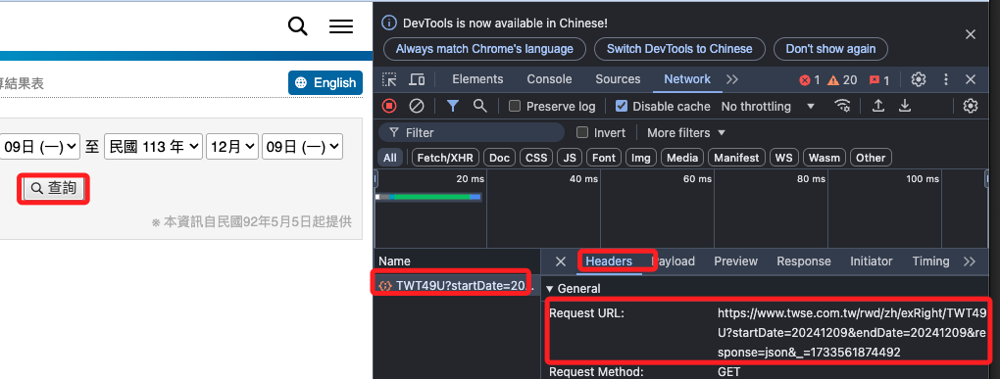
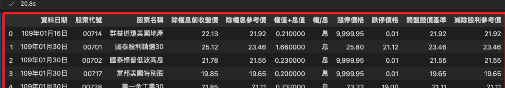

# 除權息

_當系統維護時會出現代碼運行錯誤，所以當程序報錯時，可依循以下步驟前往官網確認當前系統狀態_

<br>

## 步驟

1. 進入 [交所網站](https://www.twse.com.tw/zh/index.html)，滑動並展開 `市場公告` 頁籤，點擊左側的 `計算結果表`。

    

<br>

2. 在繼續其他操作前，先點擊按鍵 `F12` 或使用組合鍵 `option+command+I` 開啟開發人員工具，接著同樣切換到 `Network` 並清除內容。

    

<br>

3. 點擊 `查看` 來取得 URL。

    

<br>

## 編輯腳本

_開啟新的筆記本_

<br>

1. 編輯這個網址，將其中的起訖日期透過 `f-string` 語法以變數帶入。

    ```python
    startDate = '20200101'
    endDate = datetime.now().strftime('%Y%m%d')

    URL = f'https://www.twse.com.tw/rwd/zh/exRight/TWT49U?startDate={startDate}&endDate={endDate}&response=json&_=1733561874492'
    ```

    

<br>

2. 特別說明，在這個 URL 中已經包含了起訖日期，但在最後還是加入了一個 `Unix 時間戳`，這通常用於防止快取、模仿瀏覽器行為或應對伺服器的防護機制。

<br>

___

_END_