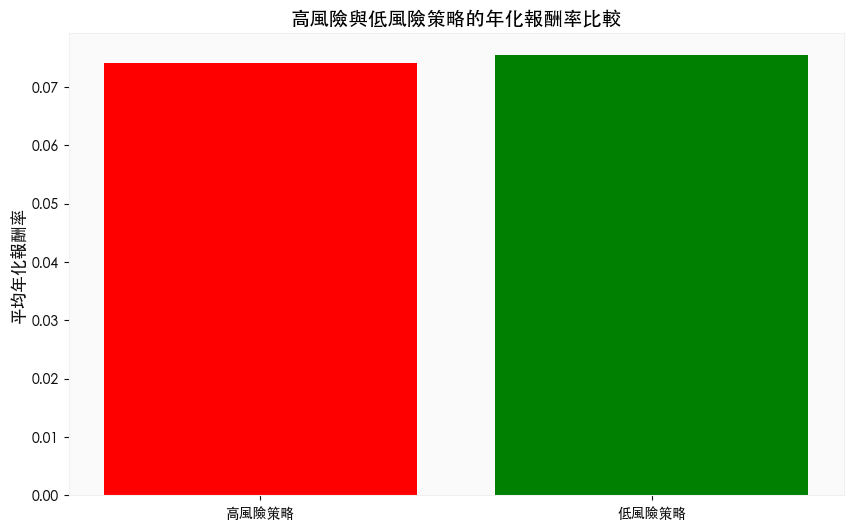
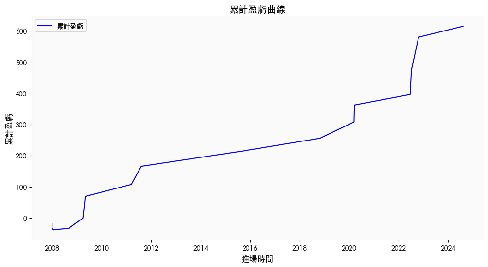

# 網格交易

<br>

## 進階觀察

1. 根據參數的不同，分析 `高風險` 和 `低風險` 策略的回報與穩定性；從風險與收益的角度來看，兩者的年化報酬率幾乎一致，那選擇低風險策略是更明智的決定。

    ```python
    # 高風險策略：網格間距大，交易單位大
    high_risk = pdf[(pdf['網格間距'] >= 0.08) & (pdf['交易單位'] >= 10)]

    # 低風險策略：網格間距小，交易單位小
    low_risk = pdf[(pdf['網格間距'] <= 0.04) & (pdf['交易單位'] <= 5)]

    # 比較年化報酬率
    plt.figure(figsize=(10, 6))
    plt.bar(['高風險策略', '低風險策略'], [high_risk['年化報酬率'].mean(), low_risk['年化報酬率'].mean()], color=['red', 'green'])
    plt.title("高風險與低風險策略的年化報酬率比較", fontsize=14)
    plt.ylabel("平均年化報酬率", fontsize=12)
    plt.grid()
    plt.show()
    ```

    

<br>

2. 繪製策略整個回測過程中的累計盈虧變化。

    ```python
    # 計算累計盈虧
    position_table['累計盈虧'] = position_table['單筆報酬'].cumsum()

    # 繪製累計盈虧曲線
    plt.figure(figsize=(12, 6))
    plt.plot(
        position_table['進場時間'], 
        position_table['累計盈虧'], 
        label='累計盈虧', 
        color='blue'
    )
    plt.title("累計盈虧曲線", fontsize=14)
    plt.xlabel("進場時間", fontsize=12)
    plt.ylabel("累計盈虧", fontsize=12)
    plt.grid()
    plt.legend()
    plt.show()
    ```

    

<br>

___

_END_