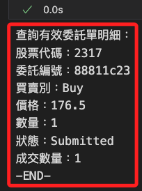

# 查詢委託

<br>

## 準備工作

_先將函數封裝寫入模組，然後導入再進行調用_

<br>

1. 列出當前有效的委託單，必須傳入正確的 api 作為參數，最終會傳出委託單列表 `list`。

    ```python
    # 列出當前有效的委託單
    def list_current_orders(api=None):
        print("【函數】列出當前有效的委託單。")
        # 檢查是否傳入 API，並初始化或取得現有的 API 實例
        api = _get_or_init_api(api)

        try:
            # 確保數據刷新
            print("正在刷新數據狀態...")
            api.update_status()

            # 查詢所有委託單
            trades = api.list_trades()
            if not trades:
                print("目前沒有任何委託單。")
                return []

            print("\n=== 有效委託單明細 ===")
            valid_trades = []
            for trade in trades:
                # 過濾有效的委託單，排除已完成、已取消或失敗的單據
                if trade.status.status not in [
                    sj.constant.Status.Filled,
                    sj.constant.Status.Cancelled,
                    sj.constant.Status.Failed,
                ]:
                    valid_trades.append(trade)
                    print(
                        f"股票代碼：{trade.contract.code}\n"
                        f"委託編號：{trade.order.id}\n"
                        f"買賣別：{trade.order.action}\n"
                        f"價格：{trade.order.price}\n"
                        f"數量：{trade.order.quantity}\n"
                        f"狀態：{trade.status.status.value}\n"
                        f"成交數量：{trade.status.order_quantity - trade.status.cancel_quantity}"
                        "\n-----------------------------\n"
                    )
            # 如果 valid_trades 為空，顯示提示訊息
            if not valid_trades:
                print("目前沒有任何有效的委託單。")
            return valid_trades

        except Exception as e:
            print(f"查詢有效委託單時發生錯誤：{e}")
            return []

    ```

<br>

## 查詢委託

1. 導入。

    ```python
    # 導入自訂函數
    import MyShioaji as msj

    # 登入
    api = msj.login_Shioaji()
    ```

<br>

2. 列出當前有效委託單。

    ```python
    # 列出當前有效委託單
    valid_trades = msj.list_current_orders(api=api)
    ```

    

<br>

___

_延續下一個單元_
