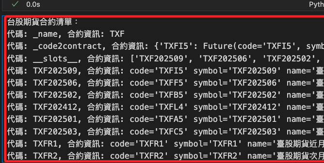

# Contract

_官方說明_

<br>

## 前置作業

1. 先完成登入，然後再開始以下操作。

    ```python
    import shioaji as sj
    import os
    from dotenv import load_dotenv
    load_dotenv()

    api_key = os.environ["API_KEY"]
    secret_key = os.environ["SECRET_KEY"]

    api = sj.Shioaji(simulation=True)

    ```

<br>

## `Contract`

_`Contract` 物件使用於訂閱行情（`subscribe_quote`）、下單（`place_order`）等，以下說明取得 `Contract` 的各種方式。_

<br>

1. 登入成功後，API 會自動開始下載所有合約資料。

    ```python
    api.login(
        api_key=api_key, 
        secret_key=secret_key,
        # 等待下載完成
        contracts_timeout=10000,
    )
    ```

    _輸出_

    ```bash
    Response Code: 0 | 
    Event Code: 0 | 
    Info: host '210.59.255.161:80', 
    hostname '210.59.255.161:80' IP 210.59.255.161:80 
    (host 1 of 1) 
    (host connection attempt 1 of 1) 
    (total connection attempt 1 of 1) | 
    Event: Session up
    
    [
        StockAccount(
            person_id='XXXXXXXXXX', 
            broker_id='9A95', 
            account_id='3453495', 
            signed=True, 
            username='蕭中柱'
        )
    ]
    
    ```

<br>

2. 在登入時設定 `fetch_contract=False` 搭配 `fetch_contracts(contract_download=True)` 手動下載合約。


    ```python
    import shioaji as sj
    api = sj.Shioaji()
    api.login(
        api_key=api_key, 
        secret_key=secret_key,
        # 禁用自動下載
        fetch_contract=False
    )
    # 手動下載
    api.fetch_contracts(contract_download=True)
    ```

    _輸出_

    ```bash
    Response Code: 0 | 
    Event Code: 0 | 
    Info: host '210.59.255.161:80', 
    hostname '210.59.255.161:80' IP 210.59.255.161:80 
    (host 1 of 1) 
    (host connection attempt 1 of 1) 
    (total connection attempt 1 of 1) | 
    Event: Session up
    ```

<br>

## 查看細節

1. 可透過輸出的 `Contracts.status` 確認下載是否完成。

    ```python
    print(api.Contracts.status)
    ```

<br>

2. 使用 repr() 查看完整的物件表示。

    ```python
    print(repr(api.Contracts.status))
    ```

<br>

3. FetchStatus 是一個物件，可以使用 Python 內建的 dir() 來查看該物件的屬性或方法。

    ```python
    print(dir(api.Contracts.status))
    ```

<br>

4. 某些物件內部的數據會儲存在 __dict__ 中，可以嘗試查看其內部數據。

    ```python
    print(api.Contracts.status.__dict__)
    ```

<br>

5. 完整檢查並顯示下載進度。

    ```python
    # 檢查 FetchStatus 屬性
    status = api.Contracts.status
    print("合約下載狀態：", status)
    # 輸出 FetchStatus 的 name 和 value
    try:
        print("合約下載狀態名稱 (name)：", status.name)
        print("合約下載狀態值 (value)：", status.value)
    except AttributeError:
        print("FetchStatus 沒有 name 或 value 屬性")

    # 確認是否等於 Fetched
    if str(status) == "FetchStatus.Fetched":
        print("合約下載已完成")
    else:
        print("合約下載未完成，狀態為：", status)
    ```

<br>

## 支援的 Contracts 類型

_Shioaji 提供多種合約資料，每種合約可以通過對應的 `api.Contracts` 屬性取得詳細資訊。_

<br>

1. Stocks（股票）

<br>

2. Futures（期貨）

<br>

3. Options（選擇權）

<br>

4. Indexs（指數）

<br>

## 股票

_後補_

<br>

## 期貨

1. 尋找當月期貨合約。

    ```python
    # 查詢當月有效的台股期貨合約
    taiwan_futures = api.Contracts.Futures.TXF

    print("台股期貨合約清單：")
    for future_code, future in taiwan_futures.__dict__.items():
        print(
            f"代碼: {future_code}, 合約資訊: {future}"
        )
    ```

    _輸出_

    

<br>

2. 使用以下方式自動選擇當月的台股期貨合約。

    ```python
    from datetime import datetime

    # 動態取得當月合約
    current_month = datetime.now().strftime("%Y%m")
    txf_code = f"TXF{current_month}"

    # 查詢是否存在當月合約
    txf_contract = api.Contracts.Futures.TXF.get(txf_code)
    if txf_contract:
        print(f"當月台股期貨合約: {txf_contract}")
    else:
        print(f"無法找到代碼為 {txf_code} 的期貨合約，請確認是否存在或過期。")
    ```

    _輸出_

    ```bash
    當月台股期貨合約: 
    code='TXFL4' 
    symbol='TXF202412' 
    name='臺股期貨12' 
    category='TXF' 
    delivery_month='202412' 
    delivery_date='2024/12/18' 
    underlying_kind='I' 
    unit=1 
    limit_up=25417.0 
    limit_down=20797.0 
    reference=23107.0 
    update_date='2024/12/13'
    ```

<br>

3. 關閉當前連線。

    ```python
    try:
        # 初始化 API
        api = sj.Shioaji()
        api.logout()
        print("登出成功")
    except Exception as e:
        print(f"登出失敗：{e}")
    ```

<br>

## 合約查詢

_查詢指定標的合約的交易屬性_

<br>

1. `Stocks (股票)`，支援現股、融資、融券，可用屬性有 `code` 股票代碼、`limit_up` / `limit_down` 漲跌停價格、`day_trade` 是否支援當日沖銷交易。

    ```python
    # 永豐金
    stock = api.Contracts.Stocks["2890"]
    print(stock)
    ```

    _輸出_

    ```bash
    # TSE 代表上市股票
    exchange=<Exchange.TSE: 'TSE'> 
    # 股票代碼
    code='2890' 
    # 股票的完整符號
    symbol='TSE28-90' 
    name='永豐金' 
    # 股票分類，標示該股票的產業或市場類別
    category='17'
    # 每張股票的單位數量，若為零股交易，單位數量將顯示為單股。
    unit=1000
    # 當日的漲停價格
    limit_up=26.1 
    # 當日跌停價格
    limit_down=21.4 
    # 前一交易日的收盤價或基準價格
    reference=23.75
    # 此合約資訊的更新日期
    update_date='2024/12/13'
    # 是否支援當日沖銷交易
    day_trade=<DayTrade.Yes: 'Yes'>
    ```

<br>

2. `Futures (期貨)`，可用屬性有 `delivery_month` 交割月份、`limit_up` / `limit_down` 漲跌停價格、`reference` 參考價格、

    ```python
    # 臺股期貨01
    future = api.Contracts.Futures["TXFA3"]
    print(future)
    ```

    _輸出_

    ```bash
    Future(
        code='TXFA3', 
        name='臺股期貨01', 
        delivery_month='202301', 
        limit_up=16417.0, 
        limit_down=13433.0
    )
    ```

<br>

3. `Options (選擇權)`，可用屬性有 `strike_price` 履約價格、`option_right` 買權或賣權、`delivery_month` 交割月份。

    ```python
    # 臺指選擇權
    option = api.Contracts.Options["TXO18000R3"]
    print(option)
    ```

    _輸出_

    ```bash
    Option(
        code='TXO18000R3', 
        name='臺指選擇權06月 18000P', 
        strike_price=18000, 
        option_right=<OptionRight.Put: 'P'>, 
        delivery_month='202306'
    )
    ```

<br>

4. `Indexs (指數)`，僅支持行情訂閱，不支援下單；可用屬性有 `code` 指數代碼、`name` 指數名稱。

    ```python
    # 加權指數
    index = api.Contracts.Indexs.TSE["001"]
    print(index)
    ```

    _輸出_

    ```bash
    Index(
        exchange=<Exchange.TSE: 'TSE'>, 
        code='001', 
        name='加權指數'
    )
    ```

<br>

## 實用技巧與注意事項

1. Contracts.status：確認合約下載進度，確保在操作前資料已加載完畢。

<br>

2. Day Trade 支援：可通過 `day_trade` 屬性查看股票是否支援當日沖銷。

<br>

3. 手動合約下載：若初次未下載，需手動調用 `fetch_contracts(contract_download=True)`。

<br>

4. 產品細節擴展：使用 `api.Contracts.<類別>` 可以取得所有類別的詳細資訊。

<br>

___

_END_