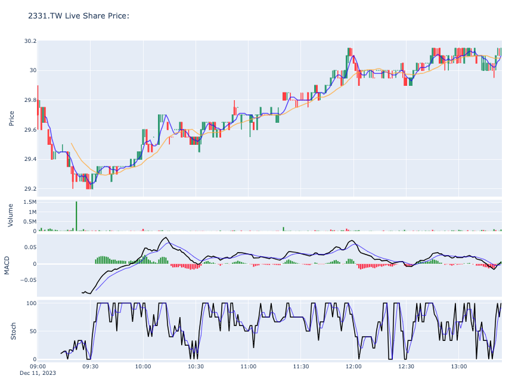

# yfinance

_使用 yfinance 查詢_

## 說明

1. 成果圖。

    


<br>

1. 安裝 `yfinance` 套件。

    ```bash
    pip install yfinance TA-Lib ta plotly
    ```

<br>

2. 更新套件。

    ```bash
    pip install yfinance --upgrade --no-cache-dir
    ```

<br>

3. 查看版本：可能出現警告，參考講義 SSL 部分的說明。

    ```python
    import yfinance as yf 
    print(yf.__version__)
    ```

<br>

## 基本用法

1. 導入庫

    ```python
    #
    import ssl
    #
    import yfinance as yf
    ```

<br>

2. 取得單一個股資料

    ```python

    ```

<br>

3. 取得多個股 `AAPL`、`MSFT`、`GOOGL` 即時價格

    ```python

    ```

<br>

4. 下載個股資料 Ticker


    ```python

    ```

<br>

5. 下載報表等資訊 Ticker：包含 `balance_sheet`、`dividends`、`earnings`等。

    ```python

    ```

<br>

6. 批次下載股價資訊： NVDA、MSFT、AAPL。

    ```python

    ```

<br>

7. 選擇權數據：Nvidia (NVDA)

    ```python

    ```

<br>

---

_END_