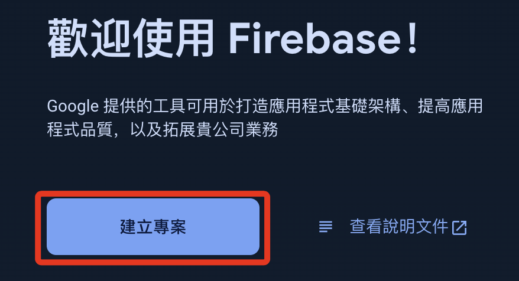
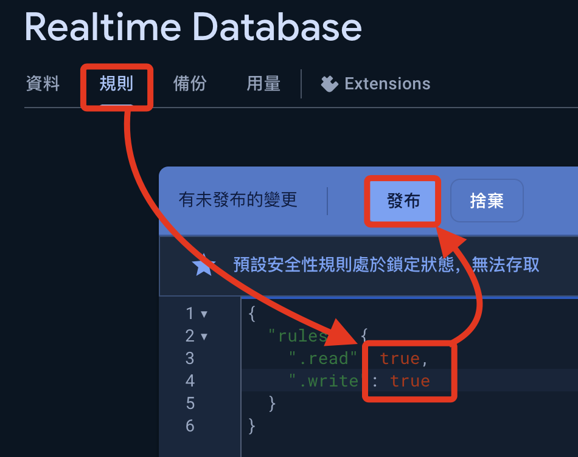
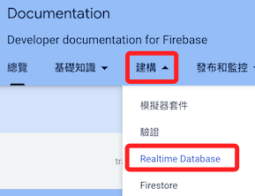
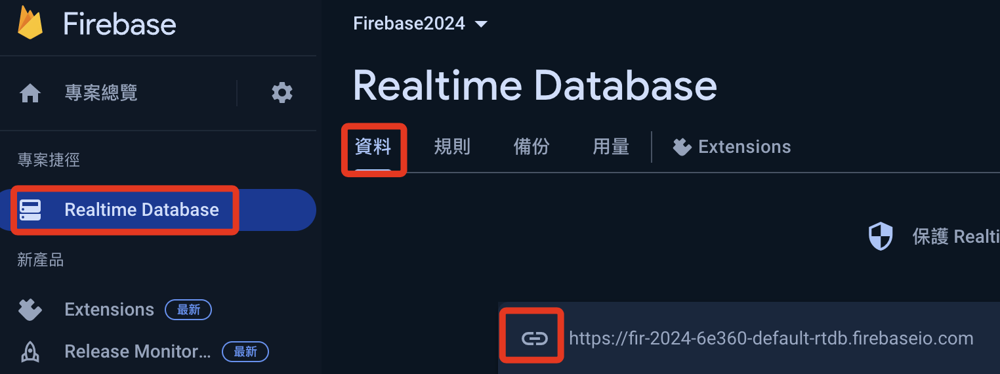
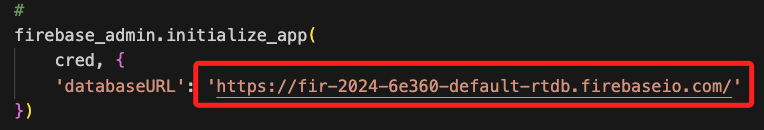

# 存入 Firebase

[Firebase 官網](https://firebase.google.com/)

<br>

## 步驟說明

1. 登入後，點擊右上角 `Go to console` 進入主控台。

    

<br>

2. 初次使用者將會看到畫面中央的 `建立專案`，點擊進入。

    

<br>

3. 已有專案則點擊 `新增專案`。

    

<br>

4. 自訂名稱，如 `Firebase2024`。

    

<br>

5. 儘量簡化專案設置，所以先關閉 `Analytics` 選項，然後 `建立專案`。

    

<br>

6. 點擊 `繼續`，完成新建專案。

    

<br>

7. 展開左側導覽中的 `建構`，點選 `Realtime Database`。

    

<br>

8. 點擊 `建立資料庫`。

    

<br>

9. 使用預設資料庫位置，點擊 `下一步`。

    

<br>

10. 使用預設的安全模式後 `啟用`。

    

<br>

11. 點擊 `規則`，暫時不管安全性問題，將讀寫參數都設置為 `true`，並且 `發布`。

    

<br>

12. 這時會有警告訊息，暫時不予理會。

    

<br>

13. 回到專案總覽，展開 `齒輪` 圖標後點擊 `專案設定`。

    

<br>

14. 切換到 `服務帳戶` 頁籤，將 `Admin SDK 設定程式碼片段` 改用 `Python`，接著點擊 `產生新的私密金鑰`。

    

<br>

15. 點擊後會下載金鑰檔案到本地電腦，可直接將這個 `.json` 檔案拖曳到專案所在目錄；特別注意，假如專案會同步到 `Github`，務必將金鑰名稱寫入 `.gitignore`。

    

<br>

16. 可複製 Firebase 畫面中的範例腳本，後續編輯腳本時將使用得到。

    

<br>

17. 延續上一個步驟，修改其中的路徑及檔案名稱，因為將檔案拖曳到同層路徑，可以僅寫上檔名就好。

    ```python
    import firebase_admin
    from firebase_admin import credentials
    # 要更改為自己的金鑰名稱
    cred = credentials.Certificate("fir-2024-6e360-firebase-adminsdk-16wwf-d2983e1f68.json")
    firebase_admin.initialize_app(cred)
    ```

<br>

18. 相關說明可點擊右上方 `瀏覽說明文件` 查看官方說明。

    

<br>

19. 選取 `建構`，點擊 `Realtime Database`。

    

<br>

20. 建議切換到英文介面比較清楚。

    

<br>

21. 在 `Realtime Database` 中選擇 `Admin`，然後從 `Get Started` 開始。

    

<br>

22. 滑動到下方 `Authenticate with admin privileges` 區塊，切換為 `Python`。

    

<br>

23. 複製並修改範例腳本如下。

    ```python
    import firebase_admin
    from firebase_admin import credentials
    from firebase_admin import db

    # 更換為自己的金鑰檔案名稱
    cred = credentials.Certificate(
        'fir-2024-6e360-firebase-adminsdk-16wwf-d2983e1f68.json'
    )
    # 下面這個網址要更換為自己的，在後面步驟會進行查詢
    firebase_admin.initialize_app(
        cred, {
        'databaseURL': 'https://databaseName.firebaseio.com'
    })
    # 這是資料庫節點，查看後續引導
    ref = db.reference('restricted_access/secret_document')
    print(ref.get())
    ```

<br>

24. 上個步驟的腳本中，要更改為自己的資料庫網址，回到資料庫後點擊 `複製資料庫網址`。

    

<br>

25. 更改腳本中的網址。

    

<br>

26. 進入 Firebase 的 `Realtime Database` 資料庫，任意添加一個節點用來測試連線，僅測試使用，內容不拘。

    

<br>

27. 修改腳本中的 `ref` 為自訂的節點名稱如下，並運行腳本進行連線測試。

    ```python
    import firebase_admin
    from firebase_admin import credentials
    from firebase_admin import db

    #
    cred = credentials.Certificate(
        'fir-2024-6e360-firebase-adminsdk-16wwf-d2983e1f68.json'
    )
    #
    firebase_admin.initialize_app(
        cred, {
        'databaseURL': 'https://fir-2024-6e360-default-rtdb.firebaseio.com/'
    })

    #
    ref = db.reference('Test/ABC')
    print(ref.get())
    ```

<br>

28. 假如能取得自訂的內容，這裡演繹的是 `112233`，此時便表示正確讀取節點資訊。

    

<br>

_以上為 Firebase 連線的初步建立_

___

_END_