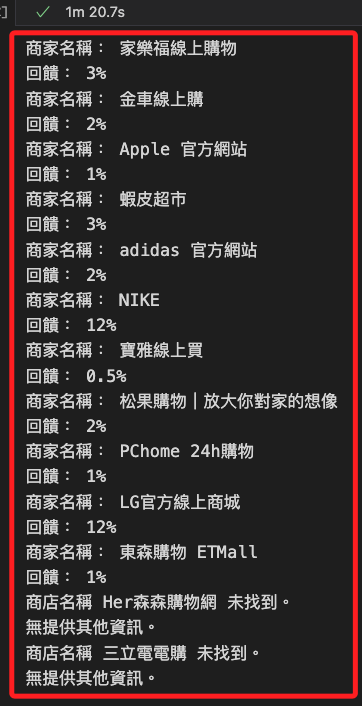

# 查詢當前回饋

<br>

## 步驟

1. 使用虛擬環境 `envWorldGym`。

<br>

2. 建立專案。

    ```bash
    cd ~/Desktop && mkdir _shoping_ && cd _shoping_ &&  touch ex01.ipynb && code .
    ```

<br>

## 程式碼

1. 完整腳本。

    ```python
    # 載入庫
    from selenium import webdriver
    from selenium.webdriver.chrome.options import Options
    from selenium.webdriver.common.by import By
    from selenium.webdriver.support.ui import WebDriverWait
    from selenium.webdriver.support import expected_conditions as EC
    import time
    import random

    # 設定查詢的關鍵字
    keywords = [
        'Yahoo',
        '家樂福線上',
        '金車線上',
        'Apple',
        '蝦皮商城',
        '蝦皮超市',
        'adidas 官方',
        'NIKE',
        '寶雅',
        '松果',
        'PChome',
        'LG',
        '東森',
        '森森購物',
        '三立電電購'
    ]

    # 瀏覽器選項
    options = Options()
    options.add_argument("--disable-notifications")
    # 使用無頭模式
    options.add_argument("--headless")
    options.add_argument("--disable-gpu")
    options.add_argument("--no-sandbox")
    options.add_argument("--disable-dev-shm-usage")

    chrome = webdriver.Chrome(options=options)

    # 查詢每個關鍵字
    for keyword in keywords:
        URL = f"https://buy.line.me/s/{keyword}"
        chrome.get(URL)
        # 加入隨機延遲，避免封鎖
        time.sleep(random.uniform(2, 5))

        try:
            # 顯式等待商家名稱
            _name = WebDriverWait(chrome, 10).until(
                EC.presence_of_element_located((
                    By.XPATH, 
                    "//div[@class='suggestedMerchantCards-title']/h2"
                ))
            )
            # 顯式等待回饋內容
            _perc = WebDriverWait(chrome, 10).until(
                EC.presence_of_element_located((
                    By.XPATH, 
                    "//div[@class='suggestedMerchantCards-point point']"
                ))
            )
            print("商家名稱：", _name.text)
            print("回饋：", _perc.text)
        except Exception as e:
            # 捕捉異常，輸出簡要錯誤信息及關鍵字
            # 簡要錯誤信息
            print(f"商店名稱 {keyword} 未找到。")
            # 取出錯誤訊息並排除空格
            error_message = str(e).strip()
            # 當異常信息為空，或是僅有 `Message:` 時 
            if not error_message or error_message.startswith("Message:"):
                print("無提供其他資訊。")
            else:
                print(f"詳細資訊：{str(e).splitlines()[0]}")
    # 關閉瀏覽器
    chrome.quit()

    ```

    

<br>

___

_END_