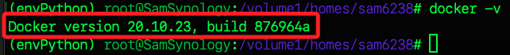
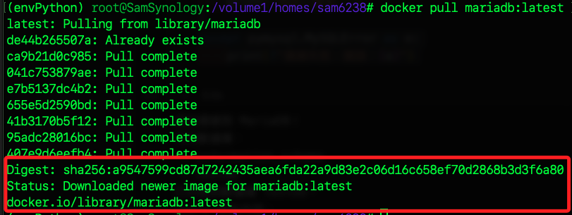
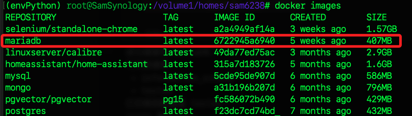

# MariaDB

_在 NAS 使用 Docker 部署資料庫_

<br>

## 連線

_在本機開啟終端機_

<br>

1. 連線 NAS。

    ```bash
    ssh sam6238@nas
    ```

<br>

2. 切換為超級用戶；這個指令將以 `root` 權限啟動新的 `shell`，允許在該 `shell` 中執行需要 `sudo` 權限的命令，且不必每次都在加 `sudo` 或輸入密碼。

    ```bash
    sudo -s
    ```

    

<br>

## 容器

1. 檢查是否已安裝 Docker。

    ```bash
    docker -v
    ```

    

<br>

2. 查詢當前鏡像，並篩選關鍵字 `mariadb`，確定尚未下載相關鏡像。

    ```bash
    docker images | grep mariadb
    ```

<br>

3. 拉取 MariaDB 鏡像。

    ```bash
    docker pull mariadb:latest
    ```

    

<br>

4. 檢查是否成功拉取 `mariadb:latest`。

    ```bash
    docker images
    ```

    

<br>

## 建立數據目錄

1. 查看當前預設目錄內的數據。

    ```bash
    ls /volume1/docker/
    ```

<br>

2. 建立儲存 `數據` 與 `配置` 的目錄。

    ```bash
    mkdir -p /volume1/docker/mariadb/data /volume1/docker/mariadb/conf
    ```

<br>

3. 查看建立後的目錄；補充說明，在 NAS 中並無 `tree` 指令。

    ```bash
    ls /volume1/docker/mariadb/
    ```

<br>

## 啟動容器

1. 先建立帳號密碼等變數；以下要輸入自己的帳號密碼，因為資料庫密碼並無敏感性，這裡不做遮蔽，僅遮蔽 NAS 密碼。

    ```bash
    export MYSQL_USER=sam6238
    export MYSQL_PASSWORD=sam112233
    export MYSQL_DATABASE=testdb
    export MYSQL_ROOT_PASSWORD=<NAS-的密碼>
    ```

<br>

2. 可透過 `echo` 指令加上 `$` 提取變數，確認皆已正確設置。

    ```bash
    echo $MYSQL_USER $MYSQL_PASSWORD $MYSQL_DATABASE $MYSQL_ROOT_PASSWORD
    ```

<br>

3. 啟動 MariaDB 容器，並設置端口、帳號和密碼。

    ```bash
    docker run -d \
    --name mariadb \
    -e MYSQL_ROOT_PASSWORD=$MYSQL_ROOT_PASSWORD \
    -e MYSQL_DATABASE=$MYSQL_DATABASE \
    -e MYSQL_USER=$MYSQL_USER \
    -e MYSQL_PASSWORD=$MYSQL_PASSWORD \
    -p 3306:3306 \
    -v /volume1/docker/mariadb/data:/var/lib/mysql \
    mariadb:latest
    ```

    

<br>

4. 補充說明，建立後所傳回的是 `新建立的容器的 ID`，這是容器的唯一標識符；`容器 ID` 是一個 `64 字元` 的十六進制字串，但在一般操作上僅需 `前 12 個字元`，所以運行 `docker ps` 指令時，顯示的就是這個字串。

    

<br>

## 參數說明

1. `-d`：在後台運行容器。

<br>

2. `-p 3306:3306`：將宿主機的 `3306` 端口映射到容器的 `3306` 端口。

<br>

3. `-v /volume1/docker/mariadb/data:/var/lib/mysql`：將數據目錄掛載到宿主機。

<br>

## 檢查容器狀態

1. 查看容器是否運行中。

    ```bash
    docker ps
    ```

    

<br>

2. 查看 MariaDB 的日誌，確認是否正常啟動。

    ```bash
    docker logs mariadb
    ```

<br>

## 測試連線

_在 NAS 中要使用 `mariadb` 的 CLI 客戶端連線到 MariaDB_

<br>

1. 透過執行 `容器內命令` 在宿主機測試連線，這裡使用 `root` 連線，所以要輸入的是 NAS 的密碼；宿主機就是 NAS，也就是安裝容器的主機，`docker exec` 用於進入正在運行的容器內執行命令。

    ```bash
    docker exec -it mariadb mariadb -u root -p
    ```

    

<br>

2. 退出；退出可不用分號 `;`。

    ```sql
    exit;
    ```

<br>

3. 若使用前面步驟建立的帳號 `sam6238` 連線，則輸入該帳號的密碼。

    ```bash
    docker exec -it mariadb mariadb -u sam6238 -p
    ```

<br>

## 運行資料庫

_指令使用大小寫皆可，`大寫` 語句只是資料庫的慣用表達方式，音易讀性較高，並可與 Linux 指令區隔，建議使用。_

<br>

1. 查看現有資料庫。

    ```sql
    SHOW DATABASES;
    ```

    

<br>

2. 切換到特定資料庫 `testdb`。

    ```sql
    USE testdb;
    ```

    

<br>

3. 查看資料表；當前尚無資料表。

    ```sql
    SHOW TABLES;
    ```

<br>

4. 嘗試建立新資料庫。

    ```sql
    CREATE DATABASE newdb_test;
    ```

<br>

5. 顯示當前用戶無權限建立。

    

<br>

## 資料庫簡易操作

_基於當前權限_

<br>

1. 確認當前選中的資料庫。

    ```sql
    SELECT DATABASE();
    ```

<br>

2. 建立一個資料表。

    ```sql
    CREATE TABLE users (
        id INT AUTO_INCREMENT PRIMARY KEY,
        name VARCHAR(100),
        email VARCHAR(100)
    );
    ```

<br>

3. 插入數據。

    ```sql
    INSERT INTO users (name, email) 
    VALUES ('Alice', 'alice@example.com'), ('Bob', 'bob@example.com');
    ```

<br>

4. 查看數據。

    ```sql
    SELECT * FROM users;
    ```

    

<br>

## 查詢權限

1. 查詢當前正在使用資料庫的用戶訊息。

    ```sql
    SELECT USER();
    ```

    

<br>

2. 查看當前用戶的權限，結果表明 _授予用戶對指定資料庫的所有操作權限_，但並不包括全域級別的權限如 `CREATE USER`、`RELOAD` 或 `GRANT OPTION`，如果需要全域權限，需要明確地通過 `GRANT` 授予，如此符合 `最小權限原則`。

    ```bash
    SHOW GRANTS FOR CURRENT_USER();
    ```

    

<br>

## 授權

_以下將切換到 root 帳號進行授權，並先分開處理以說明各項權限的設定_

<br>

1. 直接在當前用戶指令下切換到管理員；其中 `\!` 表示執行的是系統指令，接著要輸入的是 root 的密碼，也就是 NAS 密碼。

    ```sql
    \! mariadb -u root -p
    ```

    

<br>

2. 在當前權限的基礎上授予 `GRANT OPTION`，允許 `sam6238` 用戶將該權限授予其他用戶。

    ```sql
    GRANT ALL PRIVILEGES ON testdb.* TO 'sam6238'@'%' WITH GRANT OPTION;
    FLUSH PRIVILEGES;
    ```

<br>

3. 授予用戶對指定資料表 `mysql.user` 的 `SELECT` 查詢權限。

    ```sql
    GRANT SELECT ON mysql.user TO 'sam6238'@'%';
    FLUSH PRIVILEGES;
    ```

<br>

4. 透過以下截圖可觀察授權前後的變化，若無授權，`sam6238` 是無法執行 `SELECT User, Host FROM mysql.user;` 查詢的。

    

<br>

5. 授予 `CREATE USER` 權限，也就是針對 `所有資料庫（*.*）` 授予 `建立用戶` 的權限。

    ```sql
    GRANT CREATE USER ON *.* TO 'sam6238'@'%';
    FLUSH PRIVILEGES;
    ```

<br>

6. 還要授予 `RELOAD` 權限，也就是針對 `所有資料庫（*.*）` 授予 `刷新權限表` 的權限。

    ```sql
    GRANT RELOAD ON *.* TO 'sam6238'@'%';
    FLUSH PRIVILEGES;
    ```

<br>

7. 以上語句可一次性表達。

    ```sql
    GRANT ALL PRIVILEGES ON testdb.* TO 'sam6238'@'%' WITH GRANT OPTION;
    GRANT SELECT ON mysql.user TO 'sam6238'@'%';
    GRANT CREATE USER, RELOAD ON *.* TO 'sam6238'@'%';
    FLUSH PRIVILEGES;
    ```

<br>

8. 再次切換帳號到 `sam6238`。

    ```sql
    \! mariadb -u sam6238 -p
    ```

<br>

9. 查看當前用戶的權限；以下顯示當前用戶 `sam6238@%` 的所有權限。

    ```sql
    SHOW GRANTS FOR CURRENT_USER();
    ```

    

<br>

## 操作資料庫

1. 查看所有用戶及其主機訊息。

    ```sql
    SELECT User, Host FROM mysql.user;
    ```

    

<br>

2. 建立新用戶 `sam6239`，並完成 `授權`、`確保插件`、`刷新授權`。

    ```sql
    CREATE USER 'sam6239'@'%' IDENTIFIED BY 'sam112233';
    GRANT ALL PRIVILEGES ON testdb.* TO 'sam6239'@'%';
    ALTER USER 'sam6239'@'%' IDENTIFIED VIA mysql_native_password USING PASSWORD('sam112233');
    FLUSH PRIVILEGES;
    ```

<br>

3. 確認用戶是否正確建立。

    ```sql
    SELECT User, Host, Plugin FROM mysql.user WHERE User = 'sam6239';
    ```

    

<br>

4. 刪除用戶 `sam6239`，刪除後可重複上步驟指令查看。

    ```sql
    DROP USER IF EXISTS 'sam6239'@'%';
    ```

<br>

___

_END_