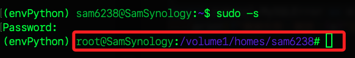
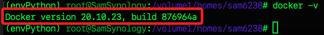
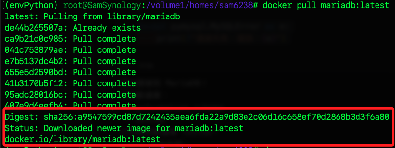
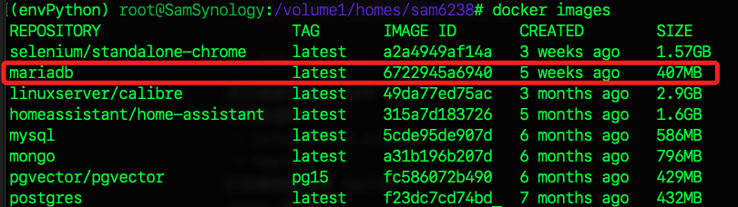
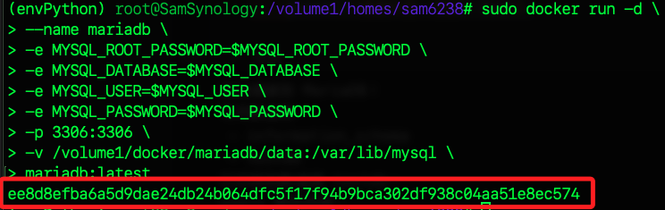
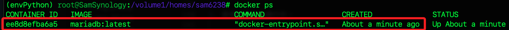
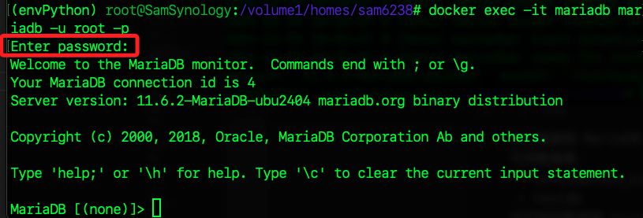

# MariaDB

_在 NAS 使用 Docker 部署_

<br>

## 連線

1. 連線 NAS。

    ```bash
    ssh sam6238@nas
    ```

<br>

2. 切換為超級用戶；這個指令將以 `root` 權限啟動新的 `shell`，允許在該 `shell` 中執行需要 `sudo` 權限的命令，且不必每次都在加 `sudo` 或輸入密碼。

    ```bash
    sudo -s
    ```

    

<br>

## 容器

1. 檢查是否已安裝 Docker。

    ```bash
    docker -v
    ```

    

<br>

2. 拉取 MariaDB 映像。

    ```bash
    docker pull mariadb:latest
    ```

    

<br>

3. 檢查是否成功拉取 `mariadb:latest`。

    ```bash
    docker images
    ```

    

<br>

## 建立數據目錄

1. 查看當前預設目錄內的數據。

    ```bash
    ls /volume1/docker/
    ```

<br>

2. 建立儲存 `數據` 與 `配置` 的目錄。

    ```bash
    mkdir -p /volume1/docker/mariadb/data /volume1/docker/mariadb/conf
    ```

<br>

3. 查看建立後的目錄；補充說明，在 NAS 中並無 `tree` 指令。

    ```bash
    ls /volume1/docker/mariadb/
    ```

<br>

## 啟動容器

1. 先建立帳號密碼等變數；以下要輸入自己的帳號密碼，因為資料庫密碼並無敏感性，這裡不做遮蔽，僅遮蔽 NAS 密碼。

    ```bash
    export MYSQL_USER=sam6238
    export MYSQL_PASSWORD=sam112233
    export MYSQL_ROOT_PASSWORD=<NAS-的密碼>
    export MYSQL_DATABASE=testdb
    ```

<br>

2. 可透過 `echo` 指令加上 `$` 提取變數，確認皆已正確設置。

    ```bash
    echo $MYSQL_USER $MYSQL_PASSWORD $MYSQL_ROOT_PASSWORD $MYSQL_DATABASE
    ```

<br>

3. 啟動 MariaDB 容器，並設置端口、帳號和密碼。

    ```bash
    docker run -d \
    --name mariadb \
    -e MYSQL_ROOT_PASSWORD=$MYSQL_ROOT_PASSWORD \
    -e MYSQL_DATABASE=$MYSQL_DATABASE \
    -e MYSQL_USER=$MYSQL_USER \
    -e MYSQL_PASSWORD=$MYSQL_PASSWORD \
    -p 3306:3306 \
    -v /volume1/docker/mariadb/data:/var/lib/mysql \
    mariadb:latest
    ```

    

<br>

## 參數說明

1. `-d`：在後台運行容器。

<br>

2. `-p 3306:3306`：將宿主機的 `3306` 端口映射到容器的 `3306` 端口。

<br>

3. `-v /volume1/docker/mariadb/data:/var/lib/mysql`：將數據目錄掛載到宿主機。

<br>

## 檢查容器狀態

1. 查看容器是否運行中。

    ```bash
    docker ps
    ```

    

<br>

2. 查看 MariaDB 的日誌，確認是否正常啟動。

    ```bash
    docker logs mariadb
    ```

<br>

## 測試連線

_在 NAS 中要使用 `mariadb` 的 CLI 客戶端連線到 MariaDB_

<br>

1. 在宿主機測試連線，這裡使用 `root` 連線，所以要輸入的是 NAS 的密碼；宿主機就是 NAS，也就是安裝容器的主機。

    ```bash
    docker exec -it mariadb mariadb -u root -p
    ```

    

<br>

2. 退出；退出可不用分號 `;`。

    ```sql
    exit;
    ```

<br>

3. 若使用前面步驟建立的帳號 `sam6238` 連線，則輸入該帳號的密碼。

    ```bash
    docker exec -it mariadb mariadb -u sam6238 -p
    ```

<br>

## 運行資料庫

1. 查看現有資料庫。

    ```sql
    SHOW DATABASES;
    ```

<br>

2. 切換到特定資料庫 `testdb`。

    ```sql
    USE testdb;
    ```

<br>

3. 建立新資料庫

    ```sql
    CREATE DATABASE newdb_test;
    ```

<br>

4. 然後確認資料庫是否建立成功。

    ```sql
    SHOW DATABASES;
    ```

<br>

5. 查看資料表。

    ```sql
    SHOW TABLES;
    ```

<br>

## 建立新用戶

1. 查詢當前正在使用資料庫的用戶訊息。

    ```sql
    SELECT USER();
    ```

<br>

2. 查看所有用戶及其主機訊息。

    ```sql
    SELECT User, Host FROM mysql.user;
    ```

<br>

3. 重新建立，先刪除。

    ```sql
    DROP USER IF EXISTS 'sam6238'@'%';
    ```

<br>

4. 建立用戶、授權、確保插件、刷新授權。

    ```sql
    CREATE USER 'sam6238'@'%' IDENTIFIED BY 'sam112233';
    GRANT ALL PRIVILEGES ON testdb.* TO 'sam6238'@'%';
    ALTER USER 'sam6238'@'%' IDENTIFIED VIA mysql_native_password USING PASSWORD('sam112233');
    FLUSH PRIVILEGES;
    ```

<br>

5. 確認用戶是否正確建立。

    ```sql
    SELECT User, Host, Plugin FROM mysql.user WHERE User = 'sam6238';
    ```

<br>

## 安裝

1. 取消 mysql 連結。

    ```bash
    brew unlink mysql
    ```

<br>

2. 安裝 mariaDB 連結。

    ```bash
    brew unlink mariaDB
    ```

<br>

3. 安裝 mariadb。

    ```bash
    brew install mariadb
    ```

<br>

4. 連結 mariadb。

    ```bash
    brew link mariadb
    ```

<br>

5. 連線。

    ```bash
    mariadb -h 192.168.1.239 -P 3306 -u sam6238 -p
    ```

<br>

6. 若要改用 mysql，要先取消連線 mariaDB。

    ```bash
    brew unlink mariaDB
    ```

<br>

7. 重新連線 mysql。

    ```bash
    brew link mysql
    ```

<br>

## 操作資料庫

1. 切換到目標資料庫。

    ```sql
    USE testdb;
    ```

<br>

2. 確認當前選中的資料庫。

    ```sql
    SELECT DATABASE();
    ```

<br>

3. 建立一個資料表。

    ```sql
    CREATE TABLE users (
        id INT AUTO_INCREMENT PRIMARY KEY,
        name VARCHAR(100),
        email VARCHAR(100)
    );
    ```

<br>

4. 插入數據。

    ```sql
    INSERT INTO users (name, email) 
    VALUES ('Alice', 'alice@example.com'), ('Bob', 'bob@example.com');
    ```

<br>

5. 查看數據。

    ```sql
    SELECT * FROM users;
    ```

<br>

6. 退出 MariaDB。

    ```sql
    EXIT;
    ```

<br>

___

_END_