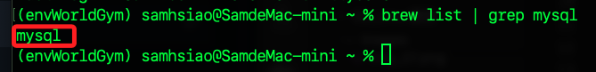
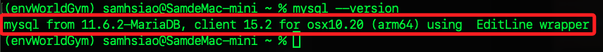
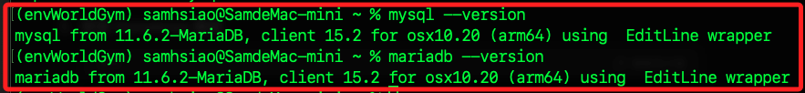
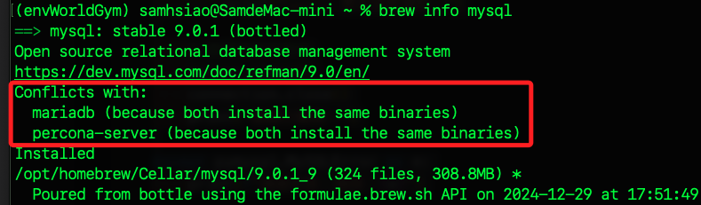

# 建立本機環境

_以下是在本機進行連線 NAS 資料庫的容器；重新開啟終端機。_

<br>

## 查看

_雖然 `MariaDB` 和 `MySQL` 在基本語法上具有很高的兼容性，但 `MariaDB` 一些新特性和認證插件無法完全被 `MySQL` 的客戶端支持，尤其是 `MySQL` 客戶端無法加載 `mysql_native_password` 插件，這會在連線認證上出現問題。_

<br>

1. 檢查 MySQL 是否已安裝。

    ```bash
    brew list | grep mysql
    ```

    

<br>

2. 檢查 MySQL 客戶端版本

    ```bash
    mysql --version
    ```

    

<br>

3. 檢查 MariaDB 是否已安裝；若尚未安裝，跳到下一小節進行安裝。

    ```bash
    brew list | grep mariadb
    ```

<br>

4. 需要將可執行文件的路徑鏈接到系統的全域路徑中才能進行查詢。

    ```bash
    brew link --overwrite mariadb
    ```

<br>

5. 檢查 MariaDB 客戶端版本。

    ```bash
    mariadb --version
    ```

<br>

## 重新鏈接

_特別注意，因為前面使用 `--overwrite` 強制覆蓋現有的符號鏈接_

<br>

1. 查詢 `mysql` 版本，會發現原本指向 `MySQL` 的鏈接被 `MariaDB` 的設定所覆蓋。

    ```bash
    mysql --version
    ```

    

<br>

2. 查看當前的 mysql 的資訊，指出 `MySQL` 與 `MariaDB` 和 `Percona-Server` 存在衝突，原因是它們安裝了相同的二進制文件，如果安裝了 MySQL，則無法同時使用 Homebrew 安裝 MariaDB 或 Percona-Server，除非解除鏈接 `brew unlink`；其中 `Percona-Server` 是一個基於 MySQL 的高性能版本，提供企業級功能且完全免費。

    ```bash
    brew info mysql
    ```

    

<br>

3. 檢查 mysql 命令的具體路徑。

    ```bash
    which mysql
    ```

<br>

4. 檢查 mariadb 命令的具體路徑。

    ```bash
    which mariadb
    ```

<br>

5. 查看當前的 mariadb 的資訊，同樣會顯示衝突；其中 `mytop` 是一個類似 `top` 的工具，用於監控 `MySQL` 或 `MariaDB` 的活動。

    ```bash
    brew info mariadb
    ```

<br>

6. 若需要解除安裝，例如解除 `mytop` 工具。

    ```bash
    brew uninstall mytop
    ```

<br>

7. 另外，如僅需使用一種數據庫，可透過解除鏈接方式來切換，例如只使用 `mariadb`。

    ```bash
    brew unlink mysql
    brew unlink percona-server
    brew link mariadb
    ```

<br>

## 安裝

_假如尚未安裝 `mariadb`_

<br>

1. 取消 `MySQL` 客戶端在 `brew` 的全域路徑鏈接。

    ```bash
    brew unlink mysql
    ```

<br>

2. 安裝 `mariadb` 客戶端。

    ```bash
    brew install mariadb
    ```

<br>

3. 取消 `mysql` 全域鏈接。

    ```bash
    brew unlink mysql
    ```

<br>

4. 建立 `mariadb` 全域鏈接。

    ```bash
    brew link mariadb
    ```

<br>

5. 使用 `mariadb` 連線 NAS 的資料庫。

    ```bash
    mariadb -h 192.168.1.239 -P 3306 -u sam6238 -p
    ```

<br>

6. 若要改用 `mysql`，要先取消 `mariaDB` 的全域鏈接。

    ```bash
    brew unlink mariaDB
    ```

<br>

7. 重新連線 `mysql`。

    ```bash
    brew link mysql
    ```

<br>

___

_END_