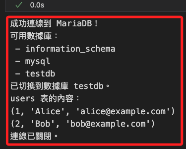

# 連線資料庫

_假如連線的是 NAS 中的 MariaDB_

<br>

## 步驟

_使用 Python 的 `pymysql` 庫進行連接；特別注意，安裝套件時，不要使用 `root` 帳號_

<br>

1. 確認 NAS 的 MariaDB 服務已啟動並允許遠端連線，預設端口為 `3306`。

<br>

2. 安裝 `pymysql` 庫。

    ```bash
    pip install pymysql
    ```

<br>

3. 取得 MariaDB 的主機 IP，在這就是 NAS 的內網或外網 IP，另外還需要用戶名、密碼、資料庫名稱等。

<br>

4. Python 腳本。

    ```python
    import pymysql

    # MariaDB 連線資訊
    db_config = {
        "host": "192.168.1.239",
        "port": 3306,
        "user": "sam6238",
        "password": "sam112233",
        "database": "testdb",
        "charset": "utf8mb4"
    }

    try:
        # 建立連線
        connection = pymysql.connect(**db_config)
        print("成功連線到 MariaDB！")

        # 建立游標
        cursor = connection.cursor()

        # 執行 SQL 查詢：列出資料庫
        cursor.execute("SHOW DATABASES;")
        databases = cursor.fetchall()

        print("可用資料庫：")
        for db in databases:
            print(f" - {db[0]}")

        # 切換到目標資料庫
        cursor.execute("USE testdb;")
        print("已切換到資料庫 testdb。")

        # 查詢表格內容（假設有一個名為 `users` 的表）
        cursor.execute("SELECT * FROM users;")
        rows = cursor.fetchall()

        print("users 表的內容：")
        if rows:
            for row in rows:
                print(row)
        else:
            print("users 表中沒有資料。")

        # 關閉游標與連線
        cursor.close()
        connection.close()
        print("連線已關閉。")

    except pymysql.MySQLError as e:
        print(f"連線失敗，錯誤：{e}")

    ```

    

<br>

___

_END_