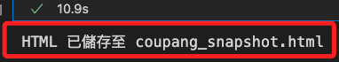
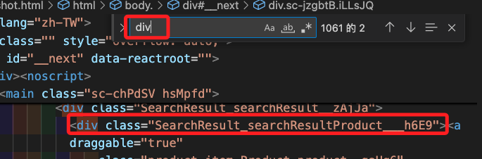
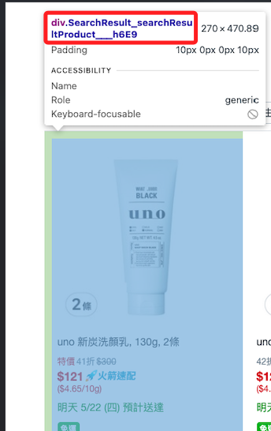

# 準備工作

_觀察實際的 HTML 原始碼，用以提供分析使用哪一層 DOM 作為爬蟲主容器。_

<br>

## 說明

_可使用代碼或使用瀏覽器工具觀察文本_

<br>

1. 使用以下代碼將酷澎搜尋頁的完整 HTML 存到本地檔案 `coupang_snapshot.html` 中，關鍵字可任意輸入。

    ```python
    from selenium import webdriver
    from selenium.webdriver.chrome.service import Service
    from selenium.webdriver.chrome.options import Options
    from webdriver_manager.chrome import ChromeDriverManager
    from urllib.parse import quote
    import time

    # 自訂函數：取得搜尋頁面的超文本
    def snapshot_coupang_html(
        search_keyword: str,
        output_file: str = "coupang_snapshot.html"
    ):
        encoded_keyword = quote(search_keyword)
        url = f"https://www.tw.coupang.com/search?q={encoded_keyword}&channel=user"

        options = Options()
        options.add_argument("--headless=new")
        options.add_argument("--disable-gpu")
        options.add_argument("--no-sandbox")
        options.add_argument("--lang=zh-TW")

        driver = webdriver.Chrome(
            service=Service(ChromeDriverManager().install()),
            options=options
        )

        driver.get(url)
        # 可依實際網速延長
        time.sleep(5)

        html = driver.page_source
        driver.quit()

        with open(output_file, "w", encoding="utf-8") as f:
            f.write(html)

        print(f"HTML 已儲存至 {output_file}")

    if __name__ == "__main__":
        snapshot_coupang_html("uno 洗面乳")
    ```

    

<br>

2. 開啟文件觀察，可發現商品都包覆在 `div` 的 `class` 為 `SearchResult_searchResultProduct___h6E9` 的容器中。

    

<br>

3. 使用瀏覽器工具會得到相同結果；每個 `div` 中包含了 `商品圖片`、`商品標題`、`價格區塊`、`運費資訊`、`評價區塊` 等。

    

<br>

___

_END_
