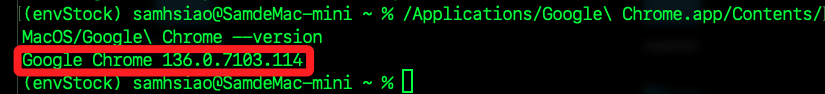
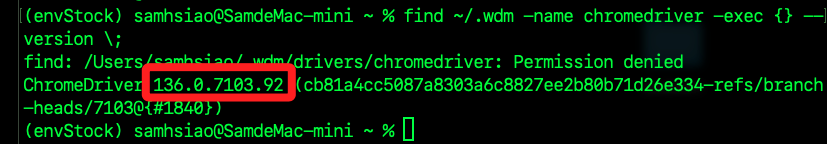

# Coupang

_以下單元將針對購物網 [酷澎](https://www.tw.coupang.com/) 進行商品價格查詢，進一步拓展寫入資料庫，並透過網頁伺服器查詢資料庫數據；最終將應用部署在樹莓派，並透過外網進行訪問。_

<br>

## 準備工作

_在後續專案終將使用到 `Selenium` 套件進行資料探勘，這需要 Chrome 與 chromedriver 的版本匹配，所以先進行版本查詢與配置；特別注意，ChromeDriver 通常允許 `patch-level` 的差異，`patch-level` 是指版本號中的第三個數字。_

<br>

1. 確認 Chrome 版本；如下查詢結果為 `136.0.7103.114`。

    ```bash
    /Applications/Google\ Chrome.app/Contents/MacOS/Google\ Chrome --version
    ```

    

<br>

2. 查詢已安裝的 Chromedriver 版本；如下查詢結果為 `136.0.7103.92`，特別說明，結果中 `Permission denied` 是來自部分子資料夾，而 `chromedriver --version` 的結果則是從另一個有權限的路徑成功執行的，兩者不衝突。

    ```bash
    find ~/.wdm -name chromedriver -exec {} --version \;
    ```

    

<br>

3. 若版本不相容，可先清除舊 driver 快取，`webdriver-manager` 會在後續代碼運行時自動下載新版的 Driver。

    ```bash
    rm -rf ~/.wdm/drivers
    ```

<br>

## 查詢數據

_以下代碼將提供 `商品關鍵字` 在網站上查詢數據資料，接著在取回的數據中進行 `進階篩選`_

<br>

1. 這個過程需要兩個步驟，首先是確認所提供的 `關鍵字` 可取得所需資訊，然後針對該數據進行 `進階篩選` 以縮小範圍。

    ```python
    # 導入庫
    from selenium import webdriver
    from selenium.webdriver.chrome.service import Service
    from webdriver_manager.chrome import ChromeDriverManager
    from selenium.webdriver.chrome.options import Options
    from bs4 import BeautifulSoup
    from urllib.parse import quote
    import time


    # 自訂函數：搜尋並取回數據
    def get_coupang_search_results(
        search_keyword: str,
        advanced_keywords: list[str]
    ):
        # 將搜尋關鍵字轉成網址安全格式，避免中文字或特殊符號導致網址錯誤
        encoded_keyword = quote(search_keyword)
        # 拼接查詢網址
        url = f"https://www.tw.coupang.com/search?q={encoded_keyword}&channel=user"
        # 建立 Chrome 的啟動選項設定物件
        options = Options()
        # 無頭模式
        options.add_argument("--headless=new")
        # 停用 GPU 加速，避免 headless 模式下 GPU 相容性問題
        options.add_argument("--disable-gpu")
        # 避免 Chrome 在沙箱環境下執行，有時對某些系統權限有問題
        options.add_argument("--no-sandbox")
        # 設定瀏覽器語言為繁體中文
        options.add_argument("--lang=zh-TW")
        # 建立 Chrome 瀏覽器實例
        # 透過 webdriver-manager 自動下載對應版本的 ChromeDriver
        driver = webdriver.Chrome(
            service=Service(
                ChromeDriverManager().install()),
                options=options
        )
        # 開啟指定的目標網址
        driver.get(url)
        # 等待一定時數
        time.sleep(5)

        html = driver.page_source
        # 若需重複操作瀏覽器可先保留不關閉
        driver.quit()

        soup = BeautifulSoup(html, "html.parser")
        product_cards = soup.select(
            "div.SearchResult_searchResultProduct___h6E9"
        )

        results = []
        matched_results = []

        for card in product_cards:
            try:
                # 完整內容文字
                full_text = card.get_text(separator=" ", strip=True)

                # 精簡標題（僅取 title 區塊）
                title_tag = card.select_one("div.Product_title__8K0xk")
                title = title_tag.get_text(strip=True) if title_tag else "N/A"

                # 價格
                price_tag = card.select_one("span.Product_salePricePrice__2FbsL span")
                price = price_tag.get_text(strip=True) if price_tag else "N/A"

                # 每單位價格
                unit_price_tag = card.select_one("div.Product_unitPrice__QQPdR")
                unit_price = unit_price_tag.get_text(strip=True) if unit_price_tag else "N/A"

                product = {
                    "title": title,
                    "full_text": full_text,
                    "price": price,
                    "unit_price": unit_price
                }

                results.append(product)

                # 進階條件：從完整描述中過濾
                if all(kw in full_text for kw in advanced_keywords):
                    matched_results.append(product)

            except Exception as e:
                print("解析錯誤：", e)
                continue

        return results, matched_results

    # 主程式區塊
    if __name__ == "__main__":
        # 搜尋主關鍵字
        search_keyword = "DORO CAT 豆乳貓"

        # 進階篩選條件（需同時包含全部關鍵詞）
        advanced_keywords = ["混合豆腐與礦物貓砂", "6袋"]

        # 執行爬取
        all_products, filtered_products = get_coupang_search_results(
            search_keyword,
            advanced_keywords
        )

        print(f"搜尋關鍵字：{search_keyword}")
        print("所有搜尋結果：")
        for idx, product in enumerate(all_products, 1):
            print(f"{idx}. 標題: {product['title']}")
            print(f"   價格: {product['price']}")
            print(f"   每單位: {product['unit_price']}")
            print(f"   完整內容: {product['full_text']}")
            print("-" * 60)

        print(
            f"\n進階條件符合項目（包含：{'、'.join(advanced_keywords)}）："
        )
        for idx, product in enumerate(filtered_products, 1):
            print(f"{idx}. 標題: {product['title']}")
            print(f"   價格: {product['price']}")
            print(f"   每單位: {product['unit_price']}")
            print(f"   完整內容: {product['full_text']}")
            print("-" * 60)
    ```

<br>

2. 以上的結果在進階搜尋部分會得到。

    ```bash
    進階條件符合項目（包含：混合豆腐與礦物貓砂）：
    1. 標題: DORO CAT 豆乳貓 混合豆腐與礦物貓砂, 無味, 7L, 6袋
    價格: $677
    每單位: ($1.61/100ml)
    完整內容: DORO CAT 豆乳貓 混合豆腐與礦物貓砂, 無味, 7L, 6袋 特價 64折 $1,074 $677 ($1.61/100ml) 7折 優惠券 明天 5/12 (一) 預計送達 免運 ( 65 )
    ------------------------------------------------------------
    2. 標題: DORO CAT 豆乳貓 混合豆腐與礦物貓砂, 無味, 7L, 1袋
    價格: $125
    每單位: ($1.79/100ml)
    完整內容: DORO CAT 豆乳貓 混合豆腐與礦物貓砂, 無味, 7L, 1袋 特價 5折 $250 $125 ($1.79/100ml) 7折 優惠券 明天 5/12 (一) 預計送達 免運 滿 $490 ( 65 )
    ------------------------------------------------------------
    ```

<br>

3. 可依據結果，將進階關鍵字添加一組 `6袋`。

    ```python
    advanced_keywords = ["混合豆腐與礦物貓砂", "6袋"]
    ```

<br>

4. 會進一步篩選得到更細緻的結果。

    ```bash
    進階條件符合項目（包含：混合豆腐與礦物貓砂、6袋）：
    1. 標題: DORO CAT 豆乳貓 混合豆腐與礦物貓砂, 無味, 7L, 6袋
    價格: $677
    每單位: ($1.61/100ml)
    完整內容: DORO CAT 豆乳貓 混合豆腐與礦物貓砂, 無味, 7L, 6袋 特價 64折 $1,074 $677 ($1.61/100ml) 7折 優惠券 明天 5/12 (一) 預計送達 免運 ( 65 )
    ------------------------------------------------------------
    ```

<br>
