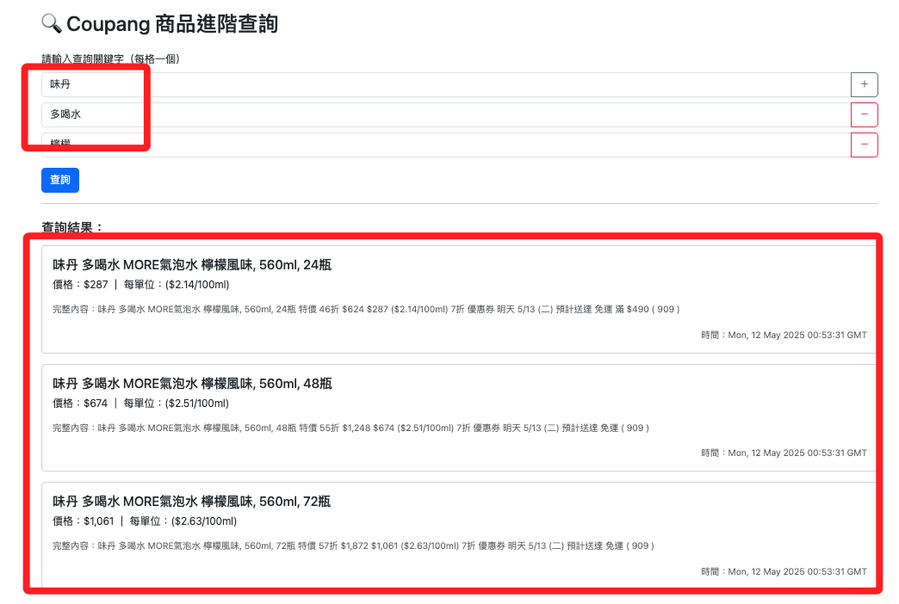

# 網頁查詢

<br>

## 環境

1. 安裝。

    ```bash
    pip install flask
    ```

<br>

2. 建立專案結構。

    ```bash
    mkdir -p coupang_webapp/templates && \
    touch coupang_webapp/app.py coupang_webapp/.env coupang_webapp/.gitignore coupang_webapp/templates/index.html && \
    echo "✅ 專案目錄已建立：coupang_webapp/"
    ```

<br>

3. 可透過指令查詢。

    ```bash
    cd coupang_webapp && tree
    ```

<br>

4. 編輯 `.env` 及 `.gitignore`，請參考前面相同的步驟，此處不再贅述。

<br>

## 代碼

1. 編輯 `app.py`。

    ```python
    from flask import Flask, request, jsonify, render_template
    import pymysql
    import os
    from dotenv import load_dotenv

    # 載入 .env 設定
    load_dotenv()

    app = Flask(__name__)

    # 資料庫連線參數
    DB_CONFIG = {
        "host": os.getenv("DB_HOST"),
        "port": int(os.getenv("DB_PORT", 3306)),
        "user": os.getenv("DB_USER"),
        "password": os.getenv("DB_PASSWORD"),
        "database": os.getenv("DB_NAME"),
        "charset": "utf8mb4",
        "cursorclass": pymysql.cursors.DictCursor,
    }


    @app.route("/")
    def index():
        return render_template("index.html")


    @app.route("/query", methods=["POST"])
    def query():
        data = request.get_json()
        keywords = data.get("keywords", [])

        if not keywords:
            return jsonify([])

        # 建立資料庫連線
        connection = pymysql.connect(**DB_CONFIG)
        seen_full_text = set()
        results = []

        with connection:
            with connection.cursor() as cursor:
                sql = "SELECT title, price, unit_price, full_text, timestamp FROM coupang_products ORDER BY timestamp DESC"
                cursor.execute(sql)
                rows = cursor.fetchall()

                for row in rows:
                    full_text = row["full_text"]
                    if all(kw in full_text for kw in keywords):
                        if full_text in seen_full_text:
                            continue
                        seen_full_text.add(full_text)
                        results.append(row)

        return jsonify(results)


    if __name__ == "__main__":
        app.run(debug=True)
    ```

<br>

2. 編輯 `index.html`。

    ```html
    <!DOCTYPE html>
    <html lang="zh-Hant">

    <head>
        <meta charset="UTF-8" />
        <meta name="viewport" content="width=device-width, initial-scale=1" />
        <title>Coupang 商品進階查詢</title>
        <link href="https://cdn.jsdelivr.net/npm/bootstrap@5.3.3/dist/css/bootstrap.min.css" rel="stylesheet">
        <style>
            .remove-btn {
                cursor: pointer;
                color: red;
                margin-left: 10px;
            }
        </style>
    </head>

    <body>
        <div class="container py-5">
            <h2 class="mb-4">🔍 Coupang 商品進階查詢</h2>

            <form id="query-form">
                <div id="keyword-fields" class="mb-3">
                    <label class="form-label">請輸入查詢關鍵字（每格一個）</label>
                    <div class="input-group mb-2">
                        <input type="text" class="form-control keyword" placeholder="例如：味丹 多喝水">
                        <span class="input-group-text btn btn-outline-secondary" onclick="addKeywordField()">＋</span>
                    </div>
                </div>
                <button type="submit" class="btn btn-primary">查詢</button>
            </form>

            <hr>

            <div id="results" class="mt-4">
                <h5 class="mb-3">查詢結果：</h5>
                <div id="output"></div>
            </div>
        </div>

        <script>
            function addKeywordField() {
                const container = document.getElementById("keyword-fields");
                const div = document.createElement("div");
                div.className = "input-group mb-2";
                div.innerHTML = `
            <input type="text" class="form-control keyword" placeholder="請輸入關鍵字">
            <span class="input-group-text btn btn-outline-danger" onclick="removeField(this)">－</span>
        `;
                container.appendChild(div);
            }

            function removeField(btn) {
                btn.parentNode.remove();
            }

            document.getElementById("query-form").addEventListener("submit", async function (event) {
                event.preventDefault();
                const inputs = document.querySelectorAll(".keyword");
                const keywords = Array.from(inputs)
                    .map(input => input.value.trim())
                    .filter(Boolean);

                if (keywords.length === 0) {
                    alert("請至少輸入一個關鍵字！");
                    return;
                }

                const res = await fetch("/query", {
                    method: "POST",
                    headers: { "Content-Type": "application/json" },
                    body: JSON.stringify({ keywords })
                });

                const data = await res.json();
                const output = document.getElementById("output");
                output.innerHTML = "";

                if (data.length === 0) {
                    output.innerHTML = '<p class="text-muted">查無符合條件的資料。</p>';
                } else {
                    data.forEach(item => {
                        const card = document.createElement("div");
                        card.className = "card mb-3";
                        card.innerHTML = `
                            <div class="card-body">
                            <h5 class="card-title">${item.title}</h5>
                            <p class="card-text">價格：${item.price} ｜ 每單位：${item.unit_price}</p>
                            <p class="card-text text-muted small">完整內容：${item.full_text}</p>
                            <p class="card-text text-end"><small class="text-muted">時間：${item.timestamp}</small></p>
                            </div>
                        `;
                        output.appendChild(card);
                    });
                }
            });
        </script>
    </body>

    </html>
    ```

<br>

3. 運行腳本

    ```bash
    python app.py
    ```

<br>

4. 輸入關鍵字 `味丹`、`多喝水`、`檸檬`。

    

<br>

___

_END_