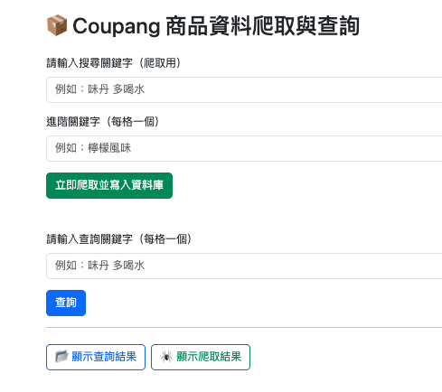
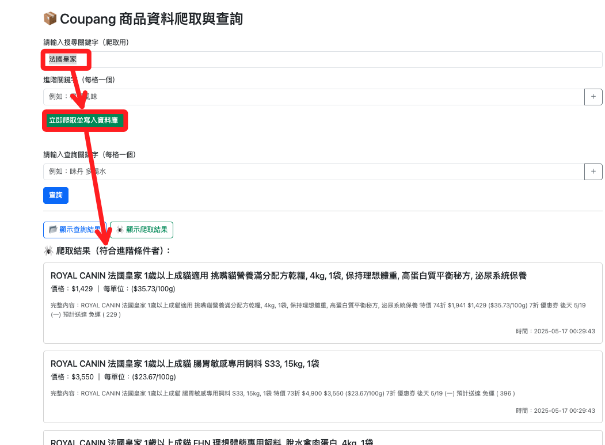
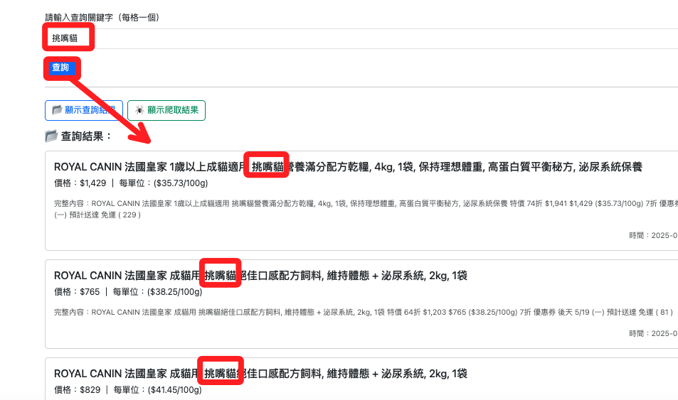

# 拓展網頁

<br>

## 網頁

1. 修改 `index.html` 如下。

    ```html
    <!DOCTYPE html>
    <html lang="zh-Hant">

    <head>
        <meta charset="UTF-8" />
        <meta name="viewport" content="width=device-width, initial-scale=1" />
        <title>Coupang 商品資料爬取與查詢</title>
        <link href="https://cdn.jsdelivr.net/npm/bootstrap@5.3.3/dist/css/bootstrap.min.css" rel="stylesheet">
        <style>
            .remove-btn {
                cursor: pointer;
                color: red;
                margin-left: 10px;
            }
        </style>
    </head>

    <body>
        <div class="container container-md py-5" style="min-width: 360px;">
            <h2 class="mb-4">📦 Coupang 商品資料爬取與查詢</h2>

            <!-- ✅ 爬取資料表單 -->
            <form id="scrape-form" class="mb-5">
                <div class="mb-3">
                    <label for="scrape-keyword" class="form-label">請輸入搜尋關鍵字（爬取用）</label>
                    <input type="text" class="form-control" id="scrape-keyword" placeholder="例如：味丹 多喝水">
                </div>
                <div class="mb-3">
                    <label class="form-label">進階關鍵字（每格一個）</label>
                    <div id="scrape-adv-fields">
                        <div class="input-group mb-2">
                            <input type="text" class="form-control scrape-adv-keyword" placeholder="例如：檸檬風味">
                            <span class="input-group-text btn btn-outline-secondary" onclick="addScrapeAdvField()">＋</span>
                        </div>
                    </div>
                </div>
                <button type="submit" class="btn btn-success">立即爬取並寫入資料庫</button>
            </form>

            <!-- ✅ 查詢資料表單 -->
            <form id="query-form">
                <label class="form-label">請輸入查詢關鍵字（每格一個）</label>
                <div id="keyword-fields" class="mb-3">
                    <div class="input-group mb-2">
                        <input type="text" class="form-control keyword" placeholder="例如：味丹 多喝水">
                        <span class="input-group-text btn btn-outline-secondary" onclick="addKeywordField()">＋</span>
                    </div>
                </div>
                <button type="submit" class="btn btn-primary">查詢</button>
            </form>

            <hr>

            <div class="mt-4">
                <div class="row g-2 mb-3">
                    <div class="col-auto">
                        <button class="btn btn-outline-primary w-100" onclick="toggleView('query')">📂 顯示查詢結果</button>
                    </div>
                    <div class="col-auto">
                        <button class="btn btn-outline-success w-100" onclick="toggleView('scrape')">🕷️ 顯示爬取結果</button>
                    </div>
                </div>

                <div id="query-results" style="display:none;">
                    <h5 class="mb-3">📂 查詢結果：</h5>
                    <div id="query-output"></div>
                </div>

                <div id="scrape-results" style="display:none;">
                    <h5 class="mb-3">🕷️ 爬取結果（符合進階條件者）：</h5>
                    <div id="scrape-output"></div>
                </div>
            </div>
        </div>

        <script>
            function toggleView(mode) {
                document.getElementById("query-results").style.display = mode === 'query' ? 'block' : 'none';
                document.getElementById("scrape-results").style.display = mode === 'scrape' ? 'block' : 'none';
            }

            function addKeywordField() {
                const container = document.getElementById("keyword-fields");
                const div = document.createElement("div");
                div.className = "input-group mb-2";
                div.innerHTML = `
            <input type="text" class="form-control keyword" placeholder="請輸入關鍵字">
            <span class="input-group-text btn btn-outline-danger" onclick="removeField(this)">－</span>
        `;
                container.appendChild(div);
            }

            function addScrapeAdvField() {
                const container = document.getElementById("scrape-adv-fields");
                const div = document.createElement("div");
                div.className = "input-group mb-2";
                div.innerHTML = `
            <input type="text" class="form-control scrape-adv-keyword" placeholder="請輸入進階關鍵字">
            <span class="input-group-text btn btn-outline-danger" onclick="removeField(this)">－</span>
        `;
                container.appendChild(div);
            }

            function removeField(btn) {
                btn.parentNode.remove();
            }

            document.getElementById("query-form").addEventListener("submit", async function (e) {
                e.preventDefault();
                toggleView('query');

                const inputs = document.querySelectorAll(".keyword");
                const keywords = Array.from(inputs).map(i => i.value.trim()).filter(Boolean);
                if (!keywords.length) return alert("請至少輸入一個關鍵字！");

                const res = await fetch("/query", {
                    method: "POST",
                    headers: { "Content-Type": "application/json" },
                    body: JSON.stringify({ keywords })
                });
                const data = await res.json();
                renderCards(data, "query-output");
            });

            document.getElementById("scrape-form").addEventListener("submit", async function (e) {
                e.preventDefault();
                toggleView('scrape');

                const keyword = document.getElementById("scrape-keyword").value.trim();
                const advInputs = document.querySelectorAll(".scrape-adv-keyword");
                const advanced_keywords = Array.from(advInputs).map(i => i.value.trim()).filter(Boolean);

                if (!keyword) return alert("請輸入主要關鍵字");

                const res = await fetch("/scrape", {
                    method: "POST",
                    headers: { 'Content-Type': 'application/json' },
                    body: JSON.stringify({ keyword, advanced_keywords })
                });

                const data = await res.json();
                renderCards(data, "scrape-output");
            });

            function renderCards(data, containerId) {
                const output = document.getElementById(containerId);
                output.innerHTML = "";
                if (!data.length) {
                    output.innerHTML = '<p class="text-muted">查無符合條件的資料。</p>';
                    return;
                }
                data.forEach(item => {
                    const card = document.createElement("div");
                    card.className = "card mb-3";
                    card.innerHTML = `
                        <div class="card-body">
                            <h5 class="card-title">${item.title}</h5>
                            <p class="card-text">價格：${item.price} ｜ 每單位：${item.unit_price}</p>
                            <p class="card-text text-muted small">完整內容：${item.full_text}</p>
                            <p class="card-text text-end"><small class="text-muted">時間：${item.timestamp}</small></p>
                        </div>
                        `;
                    output.appendChild(card);
                });
            }
        </script>
    </body>

    </html>
    ```

<br>

2. 刷新網頁可看到新的功能介面。

    

<br>

3. 優化 `app.py`。

    ```python
    from flask import Flask, request, jsonify, render_template
    import pymysql
    import os
    from dotenv import load_dotenv
    from datetime import datetime
    from selenium import webdriver
    from selenium.webdriver.chrome.options import Options
    from selenium.webdriver.chrome.service import Service
    from webdriver_manager.chrome import ChromeDriverManager
    from bs4 import BeautifulSoup
    from urllib.parse import quote

    # 載入 .env 設定
    load_dotenv()

    app = Flask(__name__)

    # 資料庫連線參數
    DB_CONFIG = {
        "host": os.getenv("DB_HOST"),
        "port": int(os.getenv("DB_PORT", 3306)),
        "user": os.getenv("DB_USER"),
        "password": os.getenv("DB_PASSWORD"),
        "database": os.getenv("DB_NAME"),
        "charset": "utf8mb4",
        "cursorclass": pymysql.cursors.DictCursor,
    }

    @app.route("/")
    def index():
        return render_template("index.html")

    @app.route("/query", methods=["POST"])
    def query():
        data = request.get_json()
        keywords = data.get("keywords", [])
        if not keywords:
            return jsonify([])

        connection = pymysql.connect(**DB_CONFIG)
        seen_full_text = set()
        results = []

        with connection:
            with connection.cursor() as cursor:
                cursor.execute("SELECT title, price, unit_price, full_text, timestamp FROM coupang_products ORDER BY timestamp DESC")
                for row in cursor.fetchall():
                    full_text = row["full_text"]
                    if all(kw in full_text for kw in keywords):
                        if full_text in seen_full_text:
                            continue
                        seen_full_text.add(full_text)
                        row["timestamp"] = row["timestamp"].strftime("%Y-%m-%d %H:%M:%S")
                        results.append(row)

        return jsonify(results)

    @app.route("/scrape", methods=["POST"])
    def scrape():
        data = request.get_json()
        keyword = data.get("keyword", "")
        advanced_keywords = data.get("advanced_keywords", [])

        if not keyword:
            return jsonify([])

        # 建立搜尋 URL
        encoded_keyword = quote(keyword)
        url = f"https://www.tw.coupang.com/search?q={encoded_keyword}&channel=user"

        # 啟動 Selenium
        options = Options()
        options.add_argument("--headless=new")
        options.add_argument("--no-sandbox")
        options.add_argument("--disable-gpu")
        options.add_argument("--lang=zh-TW")

        driver = webdriver.Chrome(service=Service(ChromeDriverManager().install()), options=options)
        driver.get(url)
        driver.implicitly_wait(5)
        html = driver.page_source
        driver.quit()

        soup = BeautifulSoup(html, "html.parser")
        product_cards = soup.select("div.SearchResult_searchResultProduct___h6E9")
        now = datetime.now()
        display_results = []

        connection = pymysql.connect(**DB_CONFIG)
        with connection:
            with connection.cursor() as cursor:
                cursor.execute("""
                    CREATE TABLE IF NOT EXISTS coupang_products (
                        id INT AUTO_INCREMENT PRIMARY KEY,
                        search_keyword VARCHAR(255),
                        title TEXT,
                        full_text TEXT,
                        price VARCHAR(50),
                        unit_price VARCHAR(50),
                        timestamp DATETIME
                    )
                """)

                for card in product_cards:
                    try:
                        full_text = card.get_text(separator=" ", strip=True)
                        title_tag = card.select_one("div.Product_title__8K0xk")
                        title = title_tag.get_text(strip=True) if title_tag else "N/A"
                        price_tag = card.select_one("span.Product_salePricePrice__2FbsL span")
                        price = price_tag.get_text(strip=True) if price_tag else "N/A"
                        unit_price_tag = card.select_one("div.Product_unitPrice__QQPdR")
                        unit_price = unit_price_tag.get_text(strip=True) if unit_price_tag else "N/A"

                        # ✅ 寫入資料庫（無條件寫入）
                        cursor.execute("""
                            INSERT INTO coupang_products (search_keyword, title, full_text, price, unit_price, timestamp)
                            VALUES (%s, %s, %s, %s, %s, %s)
                        """, (keyword, title, full_text, price, unit_price, now))

                        # ✅ 只回傳符合進階條件的項目
                        if all(kw in full_text for kw in advanced_keywords):
                            display_results.append({
                                "title": title,
                                "price": price,
                                "unit_price": unit_price,
                                "full_text": full_text,
                                "timestamp": now.strftime("%Y-%m-%d %H:%M:%S")
                            })

                    except Exception as e:
                        print("⚠️ 寫入錯誤：", e)

                connection.commit()

        return jsonify(display_results)

    if __name__ == "__main__":
        app.run(debug=True)
    ```

<br>

3. Flask 應用當設定為 `Debug 模式（debug=True）` 時，修正 `app.py` 之後無需重新運行，僅需刷新網頁，否則需重新啟動應用。

    ```bash
    python app.py
    ```

<br>

## 操作

1. 查詢商品關鍵字為 `法國皇家`。

    

<br>

2. 輸入查詢關鍵字 `挑嘴貓`。

    

<br>

___

_END_