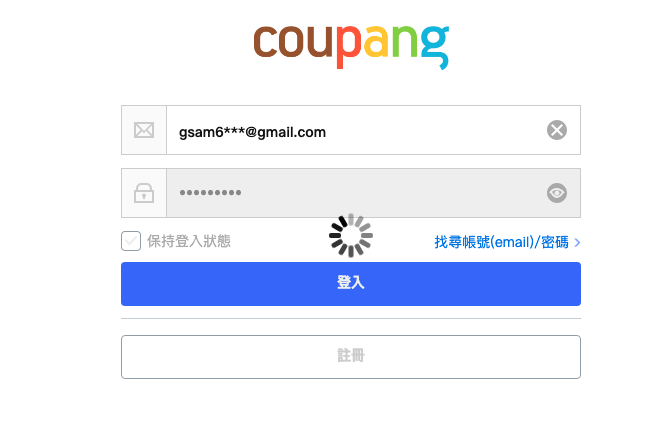
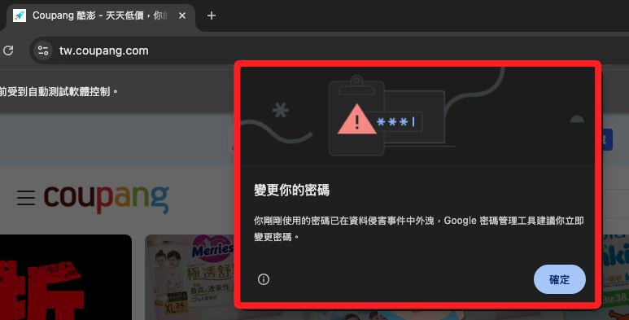

# 登入

_由於 Coupang 對於新加入會員有首購優惠，所以使用 Selenium 進行爬取數據時，所得到的價格是 `新手優惠的價格`，的這並非實際可買到的價格；以下將進行代碼優化，在取得數據資錢，先進行會員登入再查詢，如此便可排除前述的錯誤。_

<br>

## 登入測試

_需提供 `Coupang` 的帳號與密碼_

<br>

1. 將帳號密碼等敏感資訊加入 `.env` 文件中。

    ```bash
    COUPANG_EMAIL=<酷澎帳號>
    COUPANG_PASSWORD=<酷澎密碼>
    ```

<br>

2. 進行登入測試；以下暫時關閉啟動選項中的 `無頭模式` 設定，用以觀察瀏覽器開啟網頁後是否正確登入會員帳號，同時也將 `driver.quit()` 註解用以觀察頁面。

    ```python

    from selenium import webdriver
    from selenium.webdriver.common.by import By
    from selenium.webdriver.chrome.service import Service
    from selenium.webdriver.chrome.options import Options
    from webdriver_manager.chrome import ChromeDriverManager
    import time

    # 處理敏感資訊
    from dotenv import load_dotenv
    import os

    load_dotenv()
    EMAIL = os.getenv("COUPANG_EMAIL")
    PASSWORD = os.getenv("COUPANG_PASSWORD")

    options = Options()
    # 無頭
    # options.add_argument("--headless=new")
    options.add_argument("--disable-gpu")
    options.add_argument("--no-sandbox")
    options.add_argument("--lang=zh-TW")

    driver = webdriver.Chrome(
        service=Service(ChromeDriverManager().install()),
        options=options
    )
    driver.get("https://member.tw.coupang.com/login/login.pang")
    # 等待兩秒，確保頁面加載完成
    time.sleep(2)

    # 輸入帳號
    email_input = driver.find_element(
        By.ID, "login-email-input"
    )
    email_input.send_keys(EMAIL)

    # 輸入密碼
    password_input = driver.find_element(
        By.ID, "login-password-input"
    )
    password_input.send_keys(PASSWORD)

    # 點擊登入按鈕
    login_button = driver.find_element(
        By.CLASS_NAME, "login__button--submit"
    )
    login_button.click()

    # 等待跳轉
    time.sleep(5)

    # 可自行接著進入訂單頁、商品頁
    print("✅ 登入流程已觸發")
    # 結束時再關閉瀏覽器
    # driver.quit()
    ```

    

<br>

3. 對於可能出現的警告彈窗無需理會，不會影響後續進行。

    

<br>

## 整合查詢

_確認帳號可正確登入後，繼續以下步驟_

<br>

1. 登入後進行查詢；在實務上，可先不提供進階篩選關鍵字，依據第一次查詢結果提取必要關鍵字後再次搜尋。

    ```python
    from selenium import webdriver
    from selenium.webdriver.common.by import By
    from selenium.webdriver.chrome.service import Service
    from selenium.webdriver.chrome.options import Options
    from webdriver_manager.chrome import ChromeDriverManager
    from bs4 import BeautifulSoup
    from urllib.parse import quote
    import time
    from dotenv import load_dotenv
    import os

    # 載入帳號密碼
    load_dotenv()
    EMAIL = os.getenv("COUPANG_EMAIL")
    PASSWORD = os.getenv("COUPANG_PASSWORD")
    # 啟動選項
    options = Options()
    # 無頭模式
    options.add_argument("--headless=new")
    options.add_argument("--disable-gpu")
    options.add_argument("--no-sandbox")
    options.add_argument("--lang=zh-TW")

    # 驅動器
    driver = webdriver.Chrome(
        service=Service(ChromeDriverManager().install()),
        options=options
    )

    # 登入
    driver.get("https://member.tw.coupang.com/login/login.pang")
    time.sleep(2)

    email_input = driver.find_element(
        By.ID, "login-email-input"
    )
    email_input.send_keys(EMAIL)

    password_input = driver.find_element(
        By.ID, "login-password-input"
    )
    password_input.send_keys(PASSWORD)

    login_button = driver.find_element(
        By.CLASS_NAME, "login__button--submit"
    )
    login_button.click()
    time.sleep(5)

    print("✅ 已登入 Coupang")

    # 自訂函數：搜尋並取回數據
    def get_coupang_search_results(
            search_keyword: str,
            advanced_keywords: list[str]
    ):
        # 將搜尋關鍵字轉成網址安全格式，避免中文字或特殊符號導致網址錯誤
        encoded_keyword = quote(search_keyword)
        # 拼接查詢網址
        url = f"https://www.tw.coupang.com/search?q={encoded_keyword}&channel=user"
        # 建立 Chrome 的啟動選項設定物件
        options = Options()
        # 無頭模式
        options.add_argument("--headless=new")
        # 停用 GPU 加速，避免 headless 模式下 GPU 相容性問題
        options.add_argument("--disable-gpu")
        # 避免 Chrome 在沙箱環境下執行，有時對某些系統權限有問題
        options.add_argument("--no-sandbox")
        # 設定瀏覽器語言為繁體中文
        options.add_argument("--lang=zh-TW")
        # 建立 Chrome 瀏覽器實例
        # 透過 webdriver-manager 自動下載對應版本的 ChromeDriver
        driver = webdriver.Chrome(
            service=Service(
                ChromeDriverManager().install()),
                options=options
        )
        # 開啟指定的目標網址
        driver.get(url)
        # 等待一定時數
        time.sleep(5)

        html = driver.page_source
        # 若需重複操作瀏覽器可先保留不關閉
        driver.quit()

        soup = BeautifulSoup(html, "html.parser")
        product_cards = soup.select(
            "div.SearchResult_searchResultProduct___h6E9"
        )

        results = []
        matched_results = []

        for card in product_cards:
            try:
                # 完整內容文字
                full_text = card.get_text(separator=" ", strip=True)

                # 精簡標題（僅取 title 區塊）
                title_tag = card.select_one("div.Product_title__8K0xk")
                title = title_tag.get_text(strip=True) if title_tag else "N/A"

                # 價格
                price_tag = card.select_one(
                    "span.Product_salePricePrice__2FbsL span"
                )
                price = price_tag.get_text(strip=True) if price_tag else "N/A"

                # 每單位價格
                unit_price_tag = card.select_one("div.Product_unitPrice__QQPdR")
                unit_price = unit_price_tag.get_text(strip=True) if unit_price_tag else "N/A"

                product = {
                    "title": title,
                    "full_text": full_text,
                    "price": price,
                    "unit_price": unit_price
                }

                results.append(product)

                # 進階條件：從完整描述中過濾
                if all(kw in full_text for kw in advanced_keywords):
                    matched_results.append(product)

            except Exception as e:
                print("解析錯誤：", e)
                continue

        return results, matched_results

    # 主程式區塊
    if __name__ == "__main__":
        # 搜尋主關鍵字
        search_keyword = "uno 洗面乳"

        # 進階篩選條件，需同時包含全部關鍵詞
        advanced_keywords = ["2條"]

        # 執行爬取
        all_products, filtered_products = get_coupang_search_results(
            search_keyword,
            advanced_keywords
        )
        # 輸出關鍵字查看
        print(f"搜尋關鍵字：{search_keyword}")

        # 將所有結果輸出
        print("所有搜尋結果：")
        for idx, product in enumerate(all_products, 1):
            print(f"{idx}. 標題: {product['title']}")
            print(f"   價格: {product['price']}")
            print(f"   每單位: {product['unit_price']}")
            print(f"   完整內容: {product['full_text']}")
            print("-" * 60)

        # 輸出進階查詢結果
        if advanced_keywords:
            print(f"\n進階條件符合項目（包含：{'、'.join(advanced_keywords)}）：")
            for idx, product in enumerate(filtered_products, 1):
                print(f"{idx}. 標題: {product['title']}")
                print(f"   價格: {product['price']}")
                print(f"   每單位: {product['unit_price']}")
                print(f"   完整內容: {product['full_text']}")
                print("-" * 60)
        else:
            print("無提供進階篩選條件")
    ```

<br>

2. 輸出如下結果。

    ```bash
    ✅ 已登入 Coupang
    搜尋關鍵字：uno 洗面乳
    所有搜尋結果：
    1. 標題: uno 新炭洗顏乳, 130g, 2條
    價格: $91
    每單位: ($3.50/10g)
    完整內容: uno 新炭洗顏乳, 130g, 2條 特價 31折 $300 $91 ($3.50/10g) 7折 優惠券 後天 5/19 (一) 預計送達 免運 滿 $490 ( 1,687 )
    ------------------------------------------------------------
    # 略...
    ------------------------------------------------------------
    30. 標題: DASHU 男性海洋深層水泡沫洗面乳, 150ml, 2條
    價格: $310
    每單位: ($10.33/10ml)
    完整內容: DASHU 男性海洋深層水泡沫洗面乳, 150ml, 2條 特價 58折 $538 $310 ($10.33/10ml) 7折 優惠券 後天 5/19 (一) 預計送達 免運 滿 $490 ( 11,516 )
    ------------------------------------------------------------

    進階條件符合項目（包含：2條）：
    1. 標題: uno 新炭洗顏乳, 130g, 2條
    價格: $91
    每單位: ($3.50/10g)
    完整內容: uno 新炭洗顏乳, 130g, 2條 特價 31折 $300 $91 ($3.50/10g) 7折 優惠券 後天 5/19 (一) 預計送達 免運 滿 $490 ( 1,687 )
    ------------------------------------------------------------
    # 略...
    ------------------------------------------------------------
    7. 標題: DASHU 男性海洋深層水泡沫洗面乳, 150ml, 2條
    價格: $310
    每單位: ($10.33/10ml)
    完整內容: DASHU 男性海洋深層水泡沫洗面乳, 150ml, 2條 特價 58折 $538 $310 ($10.33/10ml) 7折 優惠券 後天 5/19 (一) 預計送達 免運 滿 $490 ( 11,516 )
    ------------------------------------------------------------
    ```

<br>

3. 查詢並寫入資料庫。

    ```python
    import os
    import time
    import pymysql
    from dotenv import load_dotenv
    from selenium import webdriver
    from selenium.webdriver.common.by import By
    from selenium.webdriver.chrome.service import Service
    from selenium.webdriver.chrome.options import Options
    from webdriver_manager.chrome import ChromeDriverManager
    from bs4 import BeautifulSoup
    from urllib.parse import quote
    from datetime import datetime

    # 載入環境變數
    load_dotenv()
    EMAIL = os.getenv("COUPANG_EMAIL")
    PASSWORD = os.getenv("COUPANG_PASSWORD")

    DB_CONFIG = {
        "host": os.getenv("DB_HOST"),
        "port": int(os.getenv("DB_PORT", 3306)),
        "user": os.getenv("DB_USER"),
        "password": os.getenv("DB_PASSWORD"),
        "database": os.getenv("DB_NAME")
    }

    # 登入函數
    def login_and_get_driver(email, password):
        options = Options()
        # 如需顯示可註解
        options.add_argument("--headless=new")
        options.add_argument("--disable-gpu")
        options.add_argument("--no-sandbox")
        options.add_argument("--lang=zh-TW")

        driver = webdriver.Chrome(
            service=Service(ChromeDriverManager().install()),
            options=options
        )
        driver.get("https://member.tw.coupang.com/login/login.pang")
        time.sleep(2)

        driver.find_element(By.ID, "login-email-input").send_keys(email)
        driver.find_element(By.ID, "login-password-input").send_keys(password)
        driver.find_element(By.CLASS_NAME, "login__button--submit").click()
        time.sleep(5)
        print("✅ 登入成功")
        return driver

    # 爬蟲函數
    def get_search_results(driver, keyword):
        encoded = quote(keyword)
        url = f"https://www.tw.coupang.com/search?q={encoded}&channel=user"
        driver.get(url)
        time.sleep(5)

        soup = BeautifulSoup(driver.page_source, "html.parser")
        cards = soup.select("div.SearchResult_searchResultProduct___h6E9")
        now = datetime.now()

        results = []
        for card in cards:
            try:
                full_text = card.get_text(" ", strip=True)
                title = card.select_one("div.Product_title__8K0xk")
                price = card.select_one("span.Product_salePricePrice__2FbsL span")
                unit_price = card.select_one("div.Product_unitPrice__QQPdR")
                results.append({
                    "search_keyword": keyword,
                    "title": title.get_text(strip=True) if title else "N/A",
                    "full_text": full_text,
                    "price": price.get_text(strip=True) if price else "N/A",
                    "unit_price": unit_price.get_text(strip=True) if unit_price else "N/A",
                    "timestamp": now
                })
            except Exception as e:
                print("❌ 錯誤：", e)
                continue
        return results

    # 寫入資料庫
    def insert_into_db(data_list, db_config):
        conn = pymysql.connect(
            host=db_config["host"],
            port=db_config["port"],
            user=db_config["user"],
            password=db_config["password"],
            database=db_config["database"],
            charset="utf8mb4"
        )
        with conn:
            with conn.cursor() as cursor:
                cursor.execute("""
                    CREATE TABLE IF NOT EXISTS coupang_products (
                        id INT AUTO_INCREMENT PRIMARY KEY,
                        search_keyword VARCHAR(255),
                        title TEXT,
                        full_text TEXT,
                        price VARCHAR(50),
                        unit_price VARCHAR(50),
                        timestamp DATETIME
                    );
                """)
                for item in data_list:
                    cursor.execute("""
                        INSERT INTO coupang_products (search_keyword, title, full_text, price, unit_price, timestamp)
                        VALUES (%s, %s, %s, %s, %s, %s);
                    """, (
                        item["search_keyword"], item["title"], item["full_text"],
                        item["price"], item["unit_price"], item["timestamp"]
                    ))
            conn.commit()
        print("✅ 已寫入資料庫")

    # 主程式
    if __name__ == "__main__":
        keyword = "BLUE BAY 倍力 Sense"
        driver = login_and_get_driver(EMAIL, PASSWORD)
        results = get_search_results(driver, keyword)
        driver.quit()

        if results:
            for idx, r in enumerate(results, 1):
                print(f"{idx}. {r['title']} - {r['price']} - {r['unit_price']}")
            insert_into_db(results, DB_CONFIG)
        else:
            print("⚠️ 查無結果")
```

<br>

___

_END_