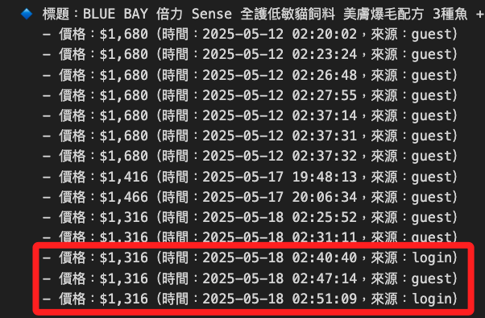

# 加入價格類型

_因應 `是否登入` 會回應不同價格，所以添加欄位 `source_type` 區分是否為成功登入後所取得的價格_

<br>

## 說明

1. 藉由檢查登入表單是否還在畫面上，若已登入會消失；登入失敗並不影響查詢，但來源會顯示為 `None`。

    ```bash
    ⚠️ 登入失敗
    1. BLUE BAY 倍力 Sense 全護低敏貓飼料 美膚爆毛配方 3種魚 + 台灣鱉蛋, 皮膚/毛髮, 1.5kg, 1袋 - $279 - ($18.60/100g) - 來源: None
    # 其餘省略...
    30. BLUE BAY 倍力 S30 心血管保健低敏 狗糧, 雞肉 + 燕麥, 7.5kg, 1袋 - $937 - ($12.49/100g) - 來源: None
    ✅ 已寫入資料庫
    ```

<br>

2. 正確登入則顯示來源為 `login`。

    ```bash
    ✅ 登入成功
    1. BLUE BAY 倍力 Sense 全護低敏貓飼料 美膚爆毛配方 3種魚 + 台灣鱉蛋, 皮膚/毛髮, 1.5kg, 3袋 - $937 - ($20.82/100g) - 來源: login
    # 其餘省略...
    30. BLUE BAY 倍力 S30 心血管保健低敏 狗糧, 雞肉 + 燕麥, 7.5kg, 1袋 - $987 - ($13.16/100g) - 來源: login
    ✅ 已寫入資料庫
    ```

<br>

3. 完整代碼。

    ```python
    # 導入庫
    import os
    import time
    import pymysql
    from dotenv import load_dotenv
    from selenium import webdriver
    from selenium.webdriver.common.by import By
    from selenium.webdriver.chrome.service import Service
    from selenium.webdriver.chrome.options import Options
    from webdriver_manager.chrome import ChromeDriverManager
    from bs4 import BeautifulSoup
    from urllib.parse import quote
    from datetime import datetime

    # 載入環境變數
    load_dotenv()
    EMAIL = os.getenv("COUPANG_EMAIL")
    PASSWORD = os.getenv("COUPANG_PASSWORD")

    # 資料庫
    DB_CONFIG = {
        "host": os.getenv("DB_HOST"),
        "port": int(os.getenv("DB_PORT", 3306)),
        "user": os.getenv("DB_USER"),
        "password": os.getenv("DB_PASSWORD"),
        "database": os.getenv("DB_NAME")
    }

    # 登入函數，會檢查是否登入成功
    def login_and_get_driver(email, password):
        options = Options()
        options.add_argument("--headless=new")
        options.add_argument("--disable-gpu")
        options.add_argument("--no-sandbox")
        options.add_argument("--lang=zh-TW")

        driver = webdriver.Chrome(
            service=Service(ChromeDriverManager().install()),
            options=options
        )
        driver.get("https://member.tw.coupang.com/login/login.pang")
        time.sleep(2)

        driver.find_element(By.ID, "login-email-input").send_keys(email)
        driver.find_element(By.ID, "login-password-input").send_keys(password)
        driver.find_element(By.CLASS_NAME, "login__button--submit").click()
        time.sleep(5)

        # 驗證登入是否成功
        # 檢查登入表單是否還在畫面上，若已登入會消失
        try:
            driver.find_element(By.ID, "login-email-input")
            print("⚠️ 登入失敗")
            return driver, False
        except:
            print("✅ 登入成功")
            return driver, True

    # 爬蟲函數（依登入狀態決定是否註記來源）
    def get_search_results(driver, keyword, is_logged_in):
        encoded = quote(keyword)
        url = f"https://www.tw.coupang.com/search?q={encoded}&channel=user"
        driver.get(url)
        time.sleep(5)

        soup = BeautifulSoup(driver.page_source, "html.parser")
        cards = soup.select("div.SearchResult_searchResultProduct___h6E9")
        now = datetime.now()

        results = []
        for card in cards:
            try:
                full_text = card.get_text(" ", strip=True)
                title = card.select_one("div.Product_title__8K0xk")
                price = card.select_one("span.Product_salePricePrice__2FbsL span")
                unit_price = card.select_one("div.Product_unitPrice__QQPdR")
                item = {
                    "search_keyword": keyword,
                    "title": title.get_text(strip=True) if title else "N/A",
                    "full_text": full_text,
                    "price": price.get_text(strip=True) if price else "N/A",
                    "unit_price": unit_price.get_text(strip=True) if unit_price else "N/A",
                    "timestamp": now,
                    "source_type": "login" if is_logged_in else None
                }
                results.append(item)
            except Exception as e:
                print("❌ 錯誤：", e)
                continue
        return results

    # 資料庫寫入函數（允許 source_type 為 null）
    def insert_into_db(data_list, db_config):
        conn = pymysql.connect(
            host=db_config["host"],
            port=db_config["port"],
            user=db_config["user"],
            password=db_config["password"],
            database=db_config["database"],
            charset="utf8mb4"
        )
        with conn:
            with conn.cursor() as cursor:
                # 檢查並新增欄位（若尚未存在）
                cursor.execute("SHOW COLUMNS FROM coupang_products LIKE 'source_type';")
                if not cursor.fetchone():
                    cursor.execute("ALTER TABLE coupang_products ADD COLUMN source_type VARCHAR(20) NULL;")

                cursor.execute("""
                    CREATE TABLE IF NOT EXISTS coupang_products (
                        id INT AUTO_INCREMENT PRIMARY KEY,
                        search_keyword VARCHAR(255),
                        title TEXT,
                        full_text TEXT,
                        price VARCHAR(50),
                        unit_price VARCHAR(50),
                        timestamp DATETIME,
                        source_type VARCHAR(20) NULL
                    );
                """)
                for item in data_list:
                    cursor.execute("""
                        INSERT INTO coupang_products
                        (search_keyword, title, full_text, price, unit_price, timestamp, source_type)
                        VALUES (%s, %s, %s, %s, %s, %s, %s);
                    """, (
                        item["search_keyword"],
                        item["title"],
                        item["full_text"],
                        item["price"],
                        item["unit_price"],
                        item["timestamp"],
                        item.get("source_type")
                    ))
            conn.commit()
        print("✅ 已寫入資料庫")

    # 主程式
    if __name__ == "__main__":
        keyword = "BLUE BAY 倍力 Sense"
        driver, is_logged_in = login_and_get_driver(EMAIL, PASSWORD)
        results = get_search_results(driver, keyword, is_logged_in)
        driver.quit()

        if results:
            for idx, r in enumerate(results, 1):
                print(f"{idx}. {r['title']} - {r['price']} - {r['unit_price']} - 來源: {r.get('source_type', 'N/A')}")
            insert_into_db(results, DB_CONFIG)
        else:
            print("⚠️ 查無結果")
    ```

<br>

## 查詢

1. 依據目前資料庫已新增的欄位 `source_type`，顯示每筆價格的來源是會員登入（`login`）或匿名訪客（`NULL`）。

    ```python
    import pymysql
    import os
    from dotenv import load_dotenv
    from collections import defaultdict

    # 載入設定
    load_dotenv()
    db_config = {
        "host": os.getenv("DB_HOST"),
        "port": int(os.getenv("DB_PORT", 3306)),
        "user": os.getenv("DB_USER"),
        "password": os.getenv("DB_PASSWORD"),
        "database": os.getenv("DB_NAME")
    }

    # 查詢條件
    search_keyword = "BLUE BAY 倍力 Sense"
    # 進階篩選條件（title 中必須同時包含所有這些關鍵字）
    filter_keywords_in_title = ["3種魚"]

    # SQL 查詢（包含登入來源欄位）
    sql = """
        SELECT title, price, timestamp, source_type
        FROM coupang_products
        WHERE search_keyword LIKE %s
        ORDER BY title, timestamp
    """

    # 建立連線並查詢
    connection = pymysql.connect(
        host=db_config["host"],
        port=db_config["port"],
        user=db_config["user"],
        password=db_config["password"],
        database=db_config["database"],
        charset='utf8mb4',
        cursorclass=pymysql.cursors.DictCursor
    )

    with connection:
        with connection.cursor() as cursor:
            cursor.execute(sql, (f"%{search_keyword}%",))
            rows = cursor.fetchall()

    # 進階條件篩選（title 同時包含所有關鍵字）
    def is_match_advanced(title: str, keywords: list[str]) -> bool:
        return all(kw in title for kw in keywords)

    if filter_keywords_in_title:
        rows = [r for r in rows if is_match_advanced(r['title'], filter_keywords_in_title)]

    # 分組：依 title 對應多筆 (價格, 時間, 來源)
    grouped = defaultdict(list)
    for row in rows:
        grouped[row['title']].append((row['price'], row['timestamp'], row['source_type'] or "guest"))

    # 僅保留有兩種以上價格的 title（根據不同價格去重）
    filtered_grouped = {
        title: entries
        for title, entries in grouped.items()
        if len(set(price for price, _, _ in entries)) >= 2
    }

    # 輸出結果
    print(f"📌 搜尋條件：search_keyword 含『{search_keyword}』")
    if filter_keywords_in_title:
        print(f"🎯 進階條件：title 同時包含『{'、'.join(filter_keywords_in_title)}』\n")

    if not filtered_grouped:
        print("⚠️ 查無重複價格變化的項目")
    else:
        for title, records in filtered_grouped.items():
            print(f"🔹 標題：{title}")
            for price, timestamp, source in sorted(records, key=lambda x: x[1]):
                print(f"   - 價格：{price}（時間：{timestamp}，來源：{source}）")
            print("-" * 60)
    ```

    

<br>

## 修正要點說明

1. 新增 `source_type` 欄位查詢。

    ```sql
    SELECT title, price, timestamp, source_type
    ```

<br>

2. 處理登入來源註記，若為 `None` 則視為匿名訪客，非會員登入查詢結果。

    ```python
    row['source_type'] or "guest"
    ```

<br>

3. 輸出加上來源辨識。

    ```bash
    價格：{price}（時間：{timestamp}，來源：{source}）
    ```

<br>

___

_END_