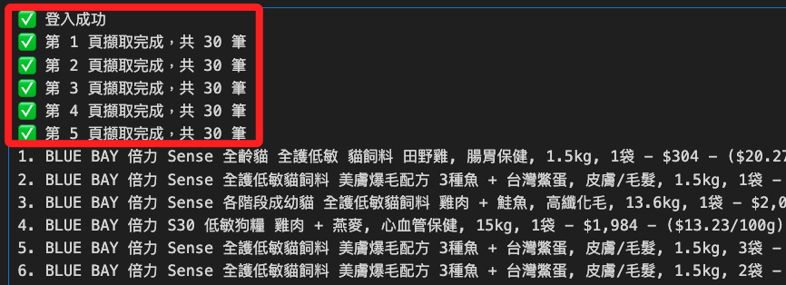
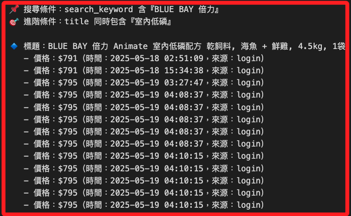
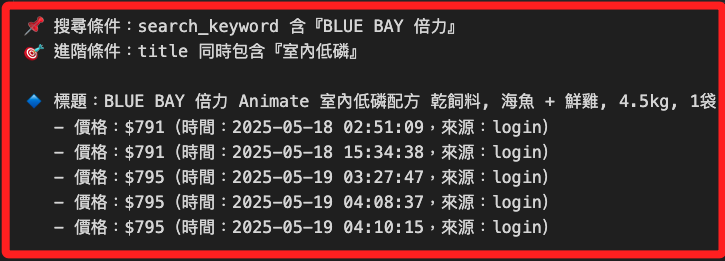

# 翻頁

_實現翻頁後，將數據寫入資料庫，並在查詢時去重_

<br>

## 說明

1. 基礎代碼。

    ```python
    # 導入庫
    import os
    import time
    import pymysql
    from dotenv import load_dotenv
    from selenium import webdriver
    from selenium.webdriver.common.by import By
    from selenium.webdriver.chrome.service import Service
    from selenium.webdriver.chrome.options import Options
    from webdriver_manager.chrome import ChromeDriverManager
    from bs4 import BeautifulSoup
    from urllib.parse import quote
    from datetime import datetime

    # 載入環境變數
    load_dotenv()
    EMAIL = os.getenv("COUPANG_EMAIL")
    PASSWORD = os.getenv("COUPANG_PASSWORD")

    DB_CONFIG = {
        "host": os.getenv("DB_HOST"),
        "port": int(os.getenv("DB_PORT", 3306)),
        "user": os.getenv("DB_USER"),
        "password": os.getenv("DB_PASSWORD"),
        "database": os.getenv("DB_NAME")
    }

    # 登入函數
    def login_and_get_driver(email, password):
        options = Options()
        # options.add_argument("--headless=new")
        options.add_argument("--disable-gpu")
        options.add_argument("--no-sandbox")
        options.add_argument("--lang=zh-TW")

        driver = webdriver.Chrome(
            service=Service(ChromeDriverManager().install()),
            options=options
        )
        driver.get("https://member.tw.coupang.com/login/login.pang")
        time.sleep(2)

        driver.find_element(By.ID, "login-email-input").send_keys(email)
        driver.find_element(By.ID, "login-password-input").send_keys(password)
        driver.find_element(By.CLASS_NAME, "login__button--submit").click()
        time.sleep(5)
        print("✅ 登入成功")
        return driver

    # 爬蟲函數（含翻頁）
    def get_search_results(driver, keyword, max_pages=5):
        encoded = quote(keyword)
        now = datetime.now()
        results = []

        for page in range(1, max_pages + 1):
            url = f"https://www.tw.coupang.com/search?q={encoded}&channel=user&page={page}"
            driver.get(url)
            time.sleep(5)

            soup = BeautifulSoup(driver.page_source, "html.parser")
            cards = soup.select("div.SearchResult_searchResultProduct___h6E9")

            if not cards:
                print(f"⚠️ 第 {page} 頁無資料，停止翻頁。")
                break

            for card in cards:
                try:
                    full_text = card.get_text(" ", strip=True)
                    title = card.select_one("div.Product_title__8K0xk")
                    price = card.select_one("span.Product_salePricePrice__2FbsL span")
                    unit_price = card.select_one("div.Product_unitPrice__QQPdR")
                    results.append({
                        "search_keyword": keyword,
                        "title": title.get_text(strip=True) if title else "N/A",
                        "full_text": full_text,
                        "price": price.get_text(strip=True) if price else "N/A",
                        "unit_price": unit_price.get_text(strip=True) if unit_price else "N/A",
                        "timestamp": now
                    })
                except Exception as e:
                    print("❌ 錯誤：", e)
                    continue
            print(f"✅ 第 {page} 頁擷取完成，共 {len(cards)} 筆")
        return results

    # 寫入資料庫
    def insert_into_db(data_list, db_config):
        conn = pymysql.connect(
            host=db_config["host"],
            port=db_config["port"],
            user=db_config["user"],
            password=db_config["password"],
            database=db_config["database"],
            charset="utf8mb4"
        )
        with conn:
            with conn.cursor() as cursor:
                cursor.execute("""
                    CREATE TABLE IF NOT EXISTS coupang_products (
                        id INT AUTO_INCREMENT PRIMARY KEY,
                        search_keyword VARCHAR(255),
                        title TEXT,
                        full_text TEXT,
                        price VARCHAR(50),
                        unit_price VARCHAR(50),
                        timestamp DATETIME
                    );
                """)
                for item in data_list:
                    cursor.execute("""
                        INSERT INTO coupang_products (search_keyword, title, full_text, price, unit_price, timestamp)
                        VALUES (%s, %s, %s, %s, %s, %s);
                    """, (
                        item["search_keyword"], item["title"], item["full_text"],
                        item["price"], item["unit_price"], item["timestamp"]
                    ))
            conn.commit()
        print("✅ 已寫入資料庫")

    # 主程式
    if __name__ == "__main__":
        keyword = "BLUE BAY 倍力 Sense"
        driver = login_and_get_driver(EMAIL, PASSWORD)
        results = get_search_results(driver, keyword, max_pages=5)
        driver.quit()

        if results:
            for idx, r in enumerate(results, 1):
                print(f"{idx}. {r['title']} - {r['price']} - {r['unit_price']}")
            insert_into_db(results, DB_CONFIG)
        else:
            print("⚠️ 查無結果")
    ```

<br>

2. 先顯示每一頁數據量，然後顯示結果。

    

<br>

## 寫入資料庫

1. 添加類型後寫入資料庫。

    ```python
    import os
    import time
    import pymysql
    from dotenv import load_dotenv
    from selenium import webdriver
    from selenium.webdriver.common.by import By
    from selenium.webdriver.chrome.service import Service
    from selenium.webdriver.chrome.options import Options
    from webdriver_manager.chrome import ChromeDriverManager
    from bs4 import BeautifulSoup
    from urllib.parse import quote
    from datetime import datetime

    # 載入環境變數
    load_dotenv()
    EMAIL = os.getenv("COUPANG_EMAIL")
    PASSWORD = os.getenv("COUPANG_PASSWORD")

    DB_CONFIG = {
        "host": os.getenv("DB_HOST"),
        "port": int(os.getenv("DB_PORT", 3306)),
        "user": os.getenv("DB_USER"),
        "password": os.getenv("DB_PASSWORD"),
        "database": os.getenv("DB_NAME")
    }

    # 登入並取得 driver
    def login_and_get_driver(email, password):
        options = Options()
        # options.add_argument("--headless=new")  # 若需無頭模式可取消註解
        options.add_argument("--disable-gpu")
        options.add_argument("--no-sandbox")
        options.add_argument("--lang=zh-TW")

        driver = webdriver.Chrome(
            service=Service(ChromeDriverManager().install()),
            options=options
        )

        driver.get("https://member.tw.coupang.com/login/login.pang")
        time.sleep(2)

        driver.find_element(By.ID, "login-email-input").send_keys(email)
        driver.find_element(By.ID, "login-password-input").send_keys(password)
        driver.find_element(By.CLASS_NAME, "login__button--submit").click()
        time.sleep(5)
        print("✅ 登入成功")
        return driver

    # 爬蟲含翻頁與來源欄位
    def get_search_results(driver, keyword, max_pages=5):
        encoded = quote(keyword)
        now = datetime.now()
        results = []

        for page in range(1, max_pages + 1):
            url = f"https://www.tw.coupang.com/search?q={encoded}&channel=user&page={page}"
            driver.get(url)
            time.sleep(5)

            soup = BeautifulSoup(driver.page_source, "html.parser")
            cards = soup.select("div.SearchResult_searchResultProduct___h6E9")

            if not cards:
                print(f"⚠️ 第 {page} 頁無資料，停止翻頁。")
                break

            for card in cards:
                try:
                    full_text = card.get_text(" ", strip=True)
                    title = card.select_one("div.Product_title__8K0xk")
                    price = card.select_one("span.Product_salePricePrice__2FbsL span")
                    unit_price = card.select_one("div.Product_unitPrice__QQPdR")

                    results.append({
                        "search_keyword": keyword,
                        "title": title.get_text(strip=True) if title else "N/A",
                        "full_text": full_text,
                        "price": price.get_text(strip=True) if price else "N/A",
                        "unit_price": unit_price.get_text(strip=True) if unit_price else "N/A",
                        "timestamp": now,
                        "source_type": "login"
                    })
                except Exception as e:
                    print("❌ 錯誤：", e)
                    continue
            print(f"✅ 第 {page} 頁擷取完成，共 {len(cards)} 筆")
        return results

    # 寫入資料庫（自動檢查 source_type 欄位）
    def insert_into_db(data_list, db_config):
        conn = pymysql.connect(
            host=db_config["host"],
            port=db_config["port"],
            user=db_config["user"],
            password=db_config["password"],
            database=db_config["database"],
            charset="utf8mb4"
        )

        with conn:
            with conn.cursor() as cursor:
                # 檢查欄位 source_type 是否存在，若無則新增
                cursor.execute("SHOW COLUMNS FROM coupang_products LIKE 'source_type';")
                if not cursor.fetchone():
                    cursor.execute("ALTER TABLE coupang_products ADD COLUMN source_type VARCHAR(20) NULL;")

                cursor.execute("""
                    CREATE TABLE IF NOT EXISTS coupang_products (
                        id INT AUTO_INCREMENT PRIMARY KEY,
                        search_keyword VARCHAR(255),
                        title TEXT,
                        full_text TEXT,
                        price VARCHAR(50),
                        unit_price VARCHAR(50),
                        timestamp DATETIME,
                        source_type VARCHAR(20) NULL
                    );
                """)

                for item in data_list:
                    cursor.execute("""
                        INSERT INTO coupang_products
                        (search_keyword, title, full_text, price, unit_price, timestamp, source_type)
                        VALUES (%s, %s, %s, %s, %s, %s, %s);
                    """, (
                        item["search_keyword"],
                        item["title"],
                        item["full_text"],
                        item["price"],
                        item["unit_price"],
                        item["timestamp"],
                        item.get("source_type")
                    ))
            conn.commit()
        print("✅ 已寫入資料庫")

    # 主程式
    if __name__ == "__main__":
        keyword = "BLUE BAY 倍力 Animate"
        driver = login_and_get_driver(EMAIL, PASSWORD)
        results = get_search_results(driver, keyword, max_pages=5)
        # driver.quit()

        if results:
            for idx, r in enumerate(results, 1):
                print(f"{idx}. {r['title']} - {r['price']} - {r['unit_price']} - 來源: {r.get('source_type')}")
            insert_into_db(results, DB_CONFIG)
        else:
            print("⚠️ 查無結果")
    ```

<br>

2. 僅顯示其中 `login` 的數據。

    ```python
    import pymysql
    import os
    from dotenv import load_dotenv
    from collections import defaultdict

    # 載入設定
    load_dotenv()
    db_config = {
        "host": os.getenv("DB_HOST"),
        "port": int(os.getenv("DB_PORT", 3306)),
        "user": os.getenv("DB_USER"),
        "password": os.getenv("DB_PASSWORD"),
        "database": os.getenv("DB_NAME")
    }

    # 查詢條件
    search_keyword = "BLUE BAY 倍力"
    # 進階篩選條件（title 中必須同時包含所有這些關鍵字）
    filter_keywords_in_title = ["室內低磷"]

    # SQL 查詢（包含登入來源欄位）
    # sql = """
    #     SELECT title, price, timestamp, source_type
    #     FROM coupang_products
    #     WHERE search_keyword LIKE %s
    #     ORDER BY title, timestamp
    # """
    # SQL 查詢（僅抓取 login 資料）
    sql = """
        SELECT title, price, timestamp, source_type
        FROM coupang_products
        WHERE search_keyword LIKE %s AND source_type = 'login'
        ORDER BY title, timestamp
    """


    # 建立連線並查詢
    connection = pymysql.connect(
        host=db_config["host"],
        port=db_config["port"],
        user=db_config["user"],
        password=db_config["password"],
        database=db_config["database"],
        charset='utf8mb4',
        cursorclass=pymysql.cursors.DictCursor
    )

    with connection:
        with connection.cursor() as cursor:
            cursor.execute(sql, (f"%{search_keyword}%",))
            rows = cursor.fetchall()

    # 進階條件篩選（title 同時包含所有關鍵字）
    def is_match_advanced(title: str, keywords: list[str]) -> bool:
        return all(kw in title for kw in keywords)

    if filter_keywords_in_title:
        rows = [r for r in rows if is_match_advanced(r['title'], filter_keywords_in_title)]

    # 分組：依 title 對應多筆 (價格, 時間, 來源)
    grouped = defaultdict(list)
    for row in rows:
        grouped[row['title']].append((row['price'], row['timestamp'], row['source_type'] or "guest"))

    # 僅保留有兩種以上價格的 title（根據不同價格去重）
    filtered_grouped = {
        title: entries
        for title, entries in grouped.items()
        if len(set(price for price, _, _ in entries)) >= 2
    }

    # 輸出結果
    print(f"📌 搜尋條件：search_keyword 含『{search_keyword}』")
    if filter_keywords_in_title:
        print(f"🎯 進階條件：title 同時包含『{'、'.join(filter_keywords_in_title)}』\n")

    if not filtered_grouped:
        print("⚠️ 查無重複價格變化的項目")
    else:
        for title, records in filtered_grouped.items():
            print(f"🔹 標題：{title}")
            for price, timestamp, source in sorted(records, key=lambda x: x[1]):
                print(f"   - 價格：{price}（時間：{timestamp}，來源：{source}）")
            print("-" * 60)
    ```

    

<br>

3. 去除重複的部分，除 Title 相同外，時間也相同。

    ```python
    import pymysql
    import os
    from dotenv import load_dotenv
    from collections import defaultdict

    # 載入設定
    load_dotenv()
    db_config = {
        "host": os.getenv("DB_HOST"),
        "port": int(os.getenv("DB_PORT", 3306)),
        "user": os.getenv("DB_USER"),
        "password": os.getenv("DB_PASSWORD"),
        "database": os.getenv("DB_NAME")
    }

    # 查詢條件
    search_keyword = "BLUE BAY 倍力"
    # 進階篩選條件（title 中必須同時包含所有這些關鍵字）
    filter_keywords_in_title = ["室內低磷"]

    # SQL 查詢（包含登入來源欄位）
    # sql = """
    #     SELECT title, price, timestamp, source_type
    #     FROM coupang_products
    #     WHERE search_keyword LIKE %s
    #     ORDER BY title, timestamp
    # """
    # SQL 查詢（僅抓取 login 資料）
    sql = """
        SELECT title, price, timestamp, source_type
        FROM coupang_products
        WHERE search_keyword LIKE %s AND source_type = 'login'
        ORDER BY title, timestamp
    """


    # 建立連線並查詢
    connection = pymysql.connect(
        host=db_config["host"],
        port=db_config["port"],
        user=db_config["user"],
        password=db_config["password"],
        database=db_config["database"],
        charset='utf8mb4',
        cursorclass=pymysql.cursors.DictCursor
    )

    with connection:
        with connection.cursor() as cursor:
            cursor.execute(sql, (f"%{search_keyword}%",))
            rows = cursor.fetchall()

    # 進階條件篩選（title 同時包含所有關鍵字）
    def is_match_advanced(title: str, keywords: list[str]) -> bool:
        return all(kw in title for kw in keywords)

    if filter_keywords_in_title:
        rows = [r for r in rows if is_match_advanced(r['title'], filter_keywords_in_title)]

    # 分組：依 title 對應多筆 (價格, 時間, 來源)
    grouped = defaultdict(list)
    # 記錄 (title, timestamp)
    seen = set()
    # 去重複
    for row in rows:
        key = (row['title'], row['timestamp'])
        if key in seen:
            # 跳過完全重複的記錄
            continue
        # 標記為已見
        seen.add(key)

        grouped[row['title']].append((row['price'], row['timestamp'], row['source_type'] or "guest"))

    # 僅保留有兩種以上價格的 title（根據不同價格去重）
    filtered_grouped = {
        title: entries
        for title, entries in grouped.items()
        if len(set(price for price, _, _ in entries)) >= 2
    }

    # 輸出結果
    print(f"📌 搜尋條件：search_keyword 含『{search_keyword}』")
    if filter_keywords_in_title:
        print(f"🎯 進階條件：title 同時包含『{'、'.join(filter_keywords_in_title)}』\n")

    if not filtered_grouped:
        print("⚠️ 查無重複價格變化的項目")
    else:
        for title, records in filtered_grouped.items():
            print(f"🔹 標題：{title}")
            for price, timestamp, source in sorted(records, key=lambda x: x[1]):
                print(f"   - 價格：{price}（時間：{timestamp}，來源：{source}）")
            print("-" * 60)
    ```

    

<br>

___

_END_