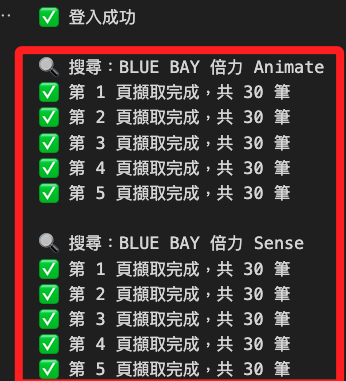
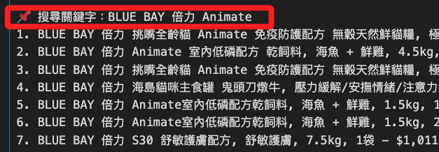

# 批次搜尋

_批次搜尋多個項目並寫入資料庫_

<br>

## 說明

1. 將原本的單一 `keyword` 查詢邏輯，優化為批次查詢多個關鍵字清單，並統一用一個 `driver` 執行登入與操作，節省資源與時間。

    ```python
    # 導入庫
    import os
    import time
    import pymysql
    from dotenv import load_dotenv
    from selenium import webdriver
    from selenium.webdriver.common.by import By
    from selenium.webdriver.chrome.service import Service
    from selenium.webdriver.chrome.options import Options
    from webdriver_manager.chrome import ChromeDriverManager
    from bs4 import BeautifulSoup
    from urllib.parse import quote
    from datetime import datetime

    # 載入環境變數
    load_dotenv()
    EMAIL = os.getenv("COUPANG_EMAIL")
    PASSWORD = os.getenv("COUPANG_PASSWORD")

    # 資料庫
    DB_CONFIG = {
        "host": os.getenv("DB_HOST"),
        "port": int(os.getenv("DB_PORT", 3306)),
        "user": os.getenv("DB_USER"),
        "password": os.getenv("DB_PASSWORD"),
        "database": os.getenv("DB_NAME")
    }

    # 登入並取得 driver
    def login_and_get_driver(email, password):
        options = Options()
        # 暫時註解可用於觀察
        # options.add_argument("--headless=new")
        options.add_argument("--disable-gpu")
        options.add_argument("--no-sandbox")
        options.add_argument("--lang=zh-TW")

        driver = webdriver.Chrome(
            service=Service(ChromeDriverManager().install()),
            options=options
        )

        # 登入
        driver.get("https://member.tw.coupang.com/login/login.pang")
        time.sleep(2)
        driver.find_element(By.ID, "login-email-input").send_keys(email)
        driver.find_element(By.ID, "login-password-input").send_keys(password)
        driver.find_element(By.CLASS_NAME, "login__button--submit").click()
        time.sleep(5)
        print("✅ 登入成功")
        return driver

    # 自訂函數；單一關鍵字搜尋
    def get_search_results(driver, keyword, max_pages=5):
        encoded = quote(keyword)
        now = datetime.now()
        results = []

        for page in range(1, max_pages + 1):
            url = f"https://www.tw.coupang.com/search?q={encoded}&channel=user&page={page}"
            driver.get(url)
            time.sleep(5)

            soup = BeautifulSoup(driver.page_source, "html.parser")
            cards = soup.select("div.SearchResult_searchResultProduct___h6E9")

            if not cards:
                print(f"⚠️ 第 {page} 頁無資料，停止翻頁。")
                break

            for card in cards:
                try:
                    full_text = card.get_text(" ", strip=True)
                    title = card.select_one("div.Product_title__8K0xk")
                    price = card.select_one("span.Product_salePricePrice__2FbsL span")
                    unit_price = card.select_one("div.Product_unitPrice__QQPdR")

                    results.append({
                        "search_keyword": keyword,
                        "title": title.get_text(strip=True) if title else "N/A",
                        "full_text": full_text,
                        "price": price.get_text(strip=True) if price else "N/A",
                        "unit_price": unit_price.get_text(strip=True) if unit_price else "N/A",
                        "timestamp": now,
                        "source_type": "login"
                    })
                except Exception as e:
                    print("❌ 錯誤：", e)
                    continue
            print(f"✅ 第 {page} 頁擷取完成，共 {len(cards)} 筆")
        return results


    # 自訂函數；寫入資料庫
    def insert_into_db(data_list, db_config):
        conn = pymysql.connect(
            host=db_config["host"],
            port=db_config["port"],
            user=db_config["user"],
            password=db_config["password"],
            database=db_config["database"],
            charset="utf8mb4"
        )

        with conn:
            with conn.cursor() as cursor:
                cursor.execute("SHOW COLUMNS FROM coupang_products LIKE 'source_type';")
                if not cursor.fetchone():
                    cursor.execute("ALTER TABLE coupang_products ADD COLUMN source_type VARCHAR(20) NULL;")

                cursor.execute("""
                    CREATE TABLE IF NOT EXISTS coupang_products (
                        id INT AUTO_INCREMENT PRIMARY KEY,
                        search_keyword VARCHAR(255),
                        title TEXT,
                        full_text TEXT,
                        price VARCHAR(50),
                        unit_price VARCHAR(50),
                        timestamp DATETIME,
                        source_type VARCHAR(20) NULL
                    );
                """)

                for item in data_list:
                    cursor.execute("""
                        INSERT INTO coupang_products
                        (search_keyword, title, full_text, price, unit_price, timestamp, source_type)
                        VALUES (%s, %s, %s, %s, %s, %s, %s);
                    """, (
                        item["search_keyword"],
                        item["title"],
                        item["full_text"],
                        item["price"],
                        item["unit_price"],
                        item["timestamp"],
                        item.get("source_type")
                    ))
            conn.commit()
        print("✅ 已寫入資料庫")


    # 主程式，多關鍵字批次處理
    if __name__ == "__main__":
        
        keywords = [
            "BLUE BAY 倍力 Animate",
            "BLUE BAY 倍力 Sense",
            "INABA CIAO 啾嚕",
            "味丹 MORE氣泡水"
        ]

        driver = login_and_get_driver(EMAIL, PASSWORD)
        all_results = []

        for keyword in keywords:
            print(f"\n🔍 搜尋：{keyword}")
            results = get_search_results(driver, keyword, max_pages=5)
            all_results.extend(results)

        driver.quit()

        if all_results:
            for idx, r in enumerate(all_results, 1):
                print(f"{idx}. {r['title']} - {r['price']} - {r['unit_price']} - 來源: {r.get('source_type')}")
            insert_into_db(all_results, DB_CONFIG)
        else:
            print("⚠️ 查無結果")
    ```

<br>

2. 會依序搜尋並顯示頁數，最後才顯示結果；特別注意，這些輸出都是在測試階段才需要使用，正式階段建議停用。

    

<br>

## 主要變更

1. 支援多筆關鍵字，加入 `keywords = [...]`，for 迴圈逐一查詢。

<br>

2. 整合搜尋結果，將每次 `results` 累加到 `all_results`。

<br>

3. 共用 driver，一次登入後重複使用 driver，不重複啟動瀏覽器。

<br>

4. source\_type 寫入，確保 `"login"` 作為欄位儲存並寫入資料庫。

<br>

5. 安全寫入欄位，檢查 `source_type` 欄位是否存在，自動新增。

<br>

6. 如有特定搜尋範圍每筆只抓前 2 頁，可修改 `max_pages=2` 即可；如需再加速，也可整合多執行緒、非同步化進行。

<br>

## 優化輸出

1. 將輸出依據 `關鍵字` 分組後重新編號以提升可讀性。

    ```python
    # 主程式，多關鍵字批次處理
    if __name__ == "__main__":
        # 關鍵字
        keywords = [
            "BLUE BAY 倍力 Animate",
            "BLUE BAY 倍力 Sense",
            "INABA CIAO 啾嚕",
            "味丹 MORE氣泡水"
        ]
        # 驅動器
        driver = login_and_get_driver(EMAIL, PASSWORD)
        all_results = []
        # 存放結果的集合
        grouped_results = {}

        for keyword in keywords:
            print(f"\n🔍 搜尋：{keyword}")
            results = get_search_results(driver, keyword, max_pages=5)
            if results:
                grouped_results[keyword] = results
                all_results.extend(results)
            else:
                print(f"⚠️ 『{keyword}』查無結果")

        driver.quit()

        if all_results:
            # ✅ 分組輸出，每組編號從 1 開始
            for keyword in grouped_results:
                print(f"\n📌 搜尋關鍵字：{keyword}")
                for idx, r in enumerate(grouped_results[keyword], 1):
                    print(f"{idx}. {r['title']} - {r['price']} - {r['unit_price']} - 來源: {r.get('source_type')}")
            # 存入資料庫
            insert_into_db(all_results, DB_CONFIG)
        else:
            print("⚠️ 查無任何關鍵字的結果")
    ```

<br>

2. 輸出如下，每個關鍵字都會先輸出抬頭。

    

<br>

___

_END_