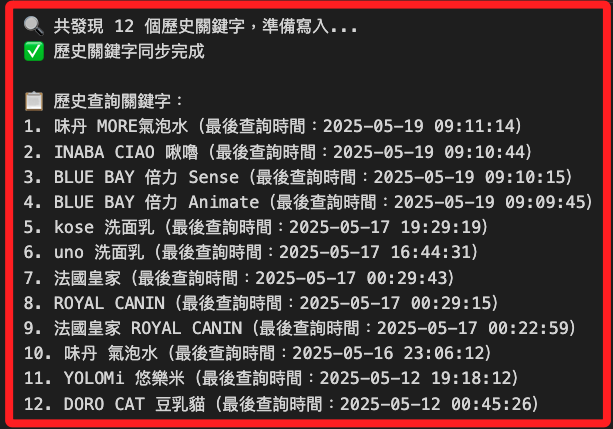

# 儲存查詢歷史

_將 `搜尋歷史` 記錄並重複利用_

<br>

## 讀取紀錄

1. 若要手動建立紀錄用的資料表 `search_keywords`，可運行以下語句，後續將用來記錄搜尋過的關鍵字與搜尋時間。

    ```sql
    CREATE TABLE IF NOT EXISTS search_keywords (
        id INT AUTO_INCREMENT PRIMARY KEY,
        keyword VARCHAR(255) UNIQUE,
        last_searched DATETIME
    );
    ```

<br>

2. 透過從主資料表 `coupang_products` 中提取已存在的搜尋關鍵字，然後建立對應的歷史紀錄 `search_keywords` 表；這屬於一次性補全腳本，適用於目前已累積搜尋記錄但未同步寫入歷史關鍵字表的情況。

    ```python
    import pymysql
    import os
    from dotenv import load_dotenv
    from datetime import datetime

    # 載入資料庫設定
    load_dotenv()
    DB_CONFIG = {
        "host": os.getenv("DB_HOST"),
        "port": int(os.getenv("DB_PORT", 3306)),
        "user": os.getenv("DB_USER"),
        "password": os.getenv("DB_PASSWORD"),
        "database": os.getenv("DB_NAME")
    }

    def sync_keywords_from_history(db_config):
        conn = pymysql.connect(
            **db_config,
            charset='utf8mb4',
            cursorclass=pymysql.cursors.DictCursor
        )

        with conn:
            with conn.cursor() as cursor:
                # 若尚未存在則建立 search_keywords 表
                cursor.execute("""
                    CREATE TABLE IF NOT EXISTS search_keywords (
                        id INT AUTO_INCREMENT PRIMARY KEY,
                        keyword VARCHAR(255) UNIQUE,
                        last_searched DATETIME
                    );
                """)

                # 從 coupang_products 抓取不同關鍵字及最新時間
                cursor.execute("""
                    SELECT search_keyword AS keyword, MAX(timestamp) AS last_searched
                    FROM coupang_products
                    GROUP BY search_keyword
                """)
                keyword_rows = cursor.fetchall()

                print(
                    f"🔍 共發現 {len(keyword_rows)} 個歷史關鍵字，準備寫入..."
                )

                for row in keyword_rows:
                    keyword = row["keyword"]
                    last_searched = row["last_searched"]

                    # 寫入或更新，如果已存在則更新最後時間
                    cursor.execute("""
                        INSERT INTO search_keywords (keyword, last_searched)
                        VALUES (%s, %s)
                        ON DUPLICATE KEY UPDATE last_searched = VALUES(last_searched)
                    """, (keyword, last_searched))

            conn.commit()
            print("✅ 歷史關鍵字同步完成")

            # 顯示所有關鍵字，依時間排序
            with conn.cursor() as cursor:
                cursor.execute("""
                    SELECT keyword, last_searched
                    FROM search_keywords
                    ORDER BY last_searched DESC
                """)
                all_keywords = cursor.fetchall()

                print("\n📋 歷史查詢關鍵字：")
                for idx, row in enumerate(all_keywords, 1):
                    print(
                        f"{idx}. {row['keyword']}"
                        f"（最後查詢時間：{row['last_searched']}）"
                    )

    # 執行補寫動作
    if __name__ == "__main__":
        sync_keywords_from_history(DB_CONFIG)
    ```

    

<br>

## 自動化紀錄

_在每次搜尋時主動進行關鍵字的紀錄_

<br>

1. 建立新的函數，在主程式內的迴圈中，搜尋每個關鍵字時同步寫入紀錄。

    ```python
    def record_keyword(keyword, db_config):
        conn = pymysql.connect(db_config, charset='utf8mb4')
        now = datetime.now()

        with conn:
            with conn.cursor() as cursor:
                cursor.execute("""
                    CREATE TABLE IF NOT EXISTS search_keywords (
                        id INT AUTO_INCREMENT PRIMARY KEY,
                        keyword VARCHAR(255) UNIQUE,
                        last_searched DATETIME
                    );
                """)
                cursor.execute("""
                    INSERT INTO search_keywords (keyword, last_searched)
                    VALUES (%s, %s)
                    ON DUPLICATE KEY UPDATE last_searched = VALUES(last_searched);
                """, (keyword, now))
            conn.commit()
    ```

<br>

2. 在主程式中調用。

    ```python
    if __name__ == "__main__":
        # 從資料庫讀出歷史搜尋關鍵字
        keywords = fetch_all_keywords(DB_CONFIG)

        driver = login_and_get_driver(EMAIL, PASSWORD)
        all_results = []

        for keyword in keywords:
            print(f"\n🔍 搜尋：{keyword}")
            results = get_search_results(driver, keyword, max_pages=5)
            all_results.extend(results)

            # 每次搜尋後記錄該關鍵字
            record_keyword(keyword, DB_CONFIG)

        driver.quit()

        if all_results:
            for idx, r in enumerate(all_results, 1):
                print(f"{idx}. {r['title']} - {r['price']} - {r['unit_price']} - 來源: {r.get('source_type')}")
            insert_into_db(all_results, DB_CONFIG)
        else:
            print("⚠️ 查無結果")
    ```

<br>

___

_END_


