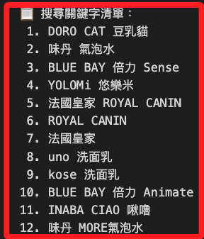
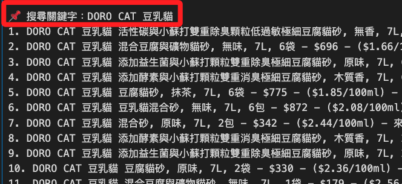
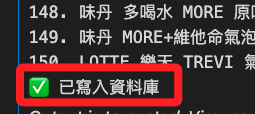

# 歷史關鍵字批次探勘

<br>

## 執行流程

1. 從 `search_keywords` 表中讀出所有曾經查詢過的關鍵字。

<br>

2. 每個關鍵字進行翻頁搜尋。

<br>

3. 每筆結果加上 `"source_type": "login"` 並寫入 `coupang_products`。

<br>

4. 輸出結果依「每個關鍵字」分段編號，提升可讀性。

<br>

## 完整代碼

1. 從資料庫的 `search_keywords` 表中讀取歷史關鍵字，依序進行批次查詢，再寫入 `coupang_products` 表中，並依據關鍵字分組輸出結果。

    ```python
    # 導入庫
    import os
    import time
    import pymysql
    from dotenv import load_dotenv
    from selenium import webdriver
    from selenium.webdriver.common.by import By
    from selenium.webdriver.chrome.service import Service
    from selenium.webdriver.chrome.options import Options
    from webdriver_manager.chrome import ChromeDriverManager
    from bs4 import BeautifulSoup
    from urllib.parse import quote
    from datetime import datetime

    # 載入環境變數
    load_dotenv()
    EMAIL = os.getenv("COUPANG_EMAIL")
    PASSWORD = os.getenv("COUPANG_PASSWORD")

    # 資料庫
    DB_CONFIG = {
        "host": os.getenv("DB_HOST"),
        "port": int(os.getenv("DB_PORT", 3306)),
        "user": os.getenv("DB_USER"),
        "password": os.getenv("DB_PASSWORD"),
        "database": os.getenv("DB_NAME")
    }

    # 從資料庫讀取歷史查詢關鍵字（不重複）
    def fetch_distinct_keywords(db_config):
        conn = pymysql.connect(
            host=db_config["host"],
            port=db_config["port"],
            user=db_config["user"],
            password=db_config["password"],
            database=db_config["database"],
            charset="utf8mb4",
            cursorclass=pymysql.cursors.DictCursor
        )
        with conn:
            with conn.cursor() as cursor:
                cursor.execute("""
                    SELECT DISTINCT search_keyword FROM coupang_products
                    WHERE search_keyword IS NOT NULL AND search_keyword <> ''
                """)
                return [row["search_keyword"] for row in cursor.fetchall()]

    # 登入並取得 driver
    def login_and_get_driver(email, password):
        options = Options()
        # options.add_argument("--headless=new")
        options.add_argument("--disable-gpu")
        options.add_argument("--no-sandbox")
        options.add_argument("--lang=zh-TW")

        driver = webdriver.Chrome(
            service=Service(ChromeDriverManager().install()),
            options=options
        )

        driver.get("https://member.tw.coupang.com/login/login.pang")
        time.sleep(2)
        driver.find_element(By.ID, "login-email-input").send_keys(email)
        driver.find_element(By.ID, "login-password-input").send_keys(password)
        driver.find_element(By.CLASS_NAME, "login__button--submit").click()
        time.sleep(5)
        print("✅ 登入成功")
        return driver

    # 爬蟲函數

    def get_search_results(driver, keyword, max_pages=5):
        encoded = quote(keyword)
        now = datetime.now()
        results = []

        for page in range(1, max_pages + 1):
            url = f"https://www.tw.coupang.com/search?q={encoded}&channel=user&page={page}"
            driver.get(url)
            time.sleep(5)

            soup = BeautifulSoup(driver.page_source, "html.parser")
            cards = soup.select("div.SearchResult_searchResultProduct___h6E9")

            if not cards:
                print(f"⚠️ 第 {page} 頁無資料，停止翻頁。")
                break

            for card in cards:
                try:
                    full_text = card.get_text(" ", strip=True)
                    title = card.select_one("div.Product_title__8K0xk")
                    price = card.select_one("span.Product_salePricePrice__2FbsL span")
                    unit_price = card.select_one("div.Product_unitPrice__QQPdR")

                    results.append({
                        "search_keyword": keyword,
                        "title": title.get_text(strip=True) if title else "N/A",
                        "full_text": full_text,
                        "price": price.get_text(strip=True) if price else "N/A",
                        "unit_price": unit_price.get_text(strip=True) if unit_price else "N/A",
                        "timestamp": now,
                        "source_type": "login"
                    })
                except Exception as e:
                    print("❌ 錯誤：", e)
                    continue
            print(f"✅ 第 {page} 頁擷取完成，共 {len(cards)} 筆")
        return results

    # 寫入資料庫

    def insert_into_db(data_list, db_config):
        conn = pymysql.connect(
            host=db_config["host"],
            port=db_config["port"],
            user=db_config["user"],
            password=db_config["password"],
            database=db_config["database"],
            charset="utf8mb4"
        )

        with conn:
            with conn.cursor() as cursor:
                cursor.execute("SHOW COLUMNS FROM coupang_products LIKE 'source_type';")
                if not cursor.fetchone():
                    cursor.execute("ALTER TABLE coupang_products ADD COLUMN source_type VARCHAR(20) NULL;")

                cursor.execute("""
                    CREATE TABLE IF NOT EXISTS coupang_products (
                        id INT AUTO_INCREMENT PRIMARY KEY,
                        search_keyword VARCHAR(255),
                        title TEXT,
                        full_text TEXT,
                        price VARCHAR(50),
                        unit_price VARCHAR(50),
                        timestamp DATETIME,
                        source_type VARCHAR(20) NULL
                    );
                """)

                for item in data_list:
                    cursor.execute("""
                        INSERT INTO coupang_products
                        (search_keyword, title, full_text, price, unit_price, timestamp, source_type)
                        VALUES (%s, %s, %s, %s, %s, %s, %s);
                    """, (
                        item["search_keyword"],
                        item["title"],
                        item["full_text"],
                        item["price"],
                        item["unit_price"],
                        item["timestamp"],
                        item.get("source_type")
                    ))
            conn.commit()
        print("✅ 已寫入資料庫")

    # 主程式：從資料庫查詢歷史關鍵字進行批次重新查詢
    if __name__ == "__main__":
        # 提取關鍵字
        keywords = fetch_distinct_keywords(DB_CONFIG)

        if not keywords:
            print("⚠️ 查無歷史關鍵字")
            exit()
        else:
            print("📋 搜尋關鍵字清單：")
            for idx, kw in enumerate(keywords, 1):
                print(f"{idx:>2}. {kw}")
        # 驅動器
        driver = login_and_get_driver(EMAIL, PASSWORD)
        # 準備存放資料的容器
        all_results = []
        grouped_results = {}
        # 遍歷關鍵字再次進行查詢
        for keyword in keywords:
            print(f"\n🔍 進行查詢：{keyword}")
            results = get_search_results(driver, keyword, max_pages=5)
            if results:
                grouped_results[keyword] = results
                all_results.extend(results)
            else:
                print(f"⚠️ 『{keyword}』查無結果")

        driver.quit()
        # 輸出查看
        if all_results:
            for keyword in grouped_results:
                print(f"\n📌 搜尋關鍵字：{keyword}")
                for idx, r in enumerate(grouped_results[keyword], 1):
                    print(
                        f"{idx}. {r['title']} - "
                        f"{r['price']} - "
                        f"{r['unit_price']} - "
                        f"來源: {r.get('source_type')}"
                    )
            insert_into_db(all_results, DB_CONFIG)
        else:
            print("⚠️ 無任何搜尋結果")
    ```

<br>

2. 首先會輸出要查詢的關鍵字清單，這份清單來自於資料庫中所有查詢過的關鍵字。

    

<br>

3. 接著遍歷關鍵字並進行搜尋。

    

<br>

4. 最後會將結果再次寫入資料庫中。

    

<br>

___

_END_