# 部署在 NAS

_將腳本部署到群暉 NAS，並設置每天早上八點自動執行以發送 LINE 通知_

<br>

## 準備工作

1. 進入套件中心，確認 NAS 已安裝 Python。

   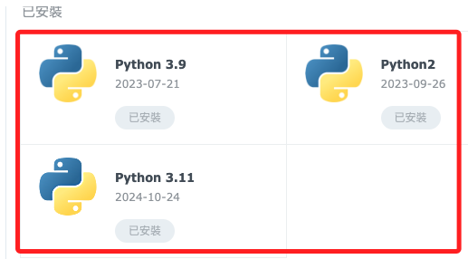

<br>

2. 使用 SSH 登入 NAS；特別注意，這裡已經將 NAS 的 IP 設定為 nas，所以直接使用別名。

   ```bash
   ssh sam6238@nas
   ```

   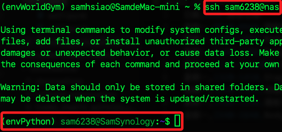

<br>

3. 檢查 Python 版本。

   ```bash
   python --version
   ```

   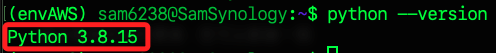

<br>

4. 升級 pip。

   ```bash
   python -m pip install --upgrade pip
   ```

<br>

5. 安裝所需的 Python 套件。

   ```bash
   pip install selenium pandas beautifulsoup4 lxml python-dotenv requests
   ```

<br>

6. 更新。

   ```bash
   pip install --upgrade selenium
   ```

<br>

7. 檢查 Selenium 版本。

   ```bash
   pip show selenium
   ```

<br>

8. 或使用 Python 檢查版本。

   ```bash
   python -c "import selenium; print(selenium.__version__)"
   ```

<br>

## 安裝 Entware

1. 確認群暉系統。

   ```bash
   uname -m
   ```

<br>

2. `x86_64` 使用 `x64-k3.2`

   ```bash
   wget -O - http://bin.entware.net/x64-k3.2/installer/generic.sh | /bin/sh
   ```

<br>

3. 成功安裝後，測試 Entware 是否運作，如果顯示可用套件列表，表示 Entware 已成功安裝。

   ```bash
   sudo opkg update && sudo opkg list
   ```

<br>

4. 更新 Entware 軟件包列表。

   ```bash
   sudo opkg update
   ```

<br>

## 進入終端機

1. 確認 Docker 可運行。

   ```bash
   docker
   ```

<br>

## 使用 Docker

_控制台_

<br>

1. 開啟 Comtainer Manager 套件，搜尋並安裝鏡像。

   ```bash
   selenium/standalone-chrome
   ```

<br>

2. 安裝好之後，可在鏡像檔中看到，選取後點擊 `執行`。

   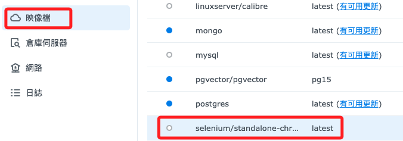

<br>

3. 容器名稱命名為 `selenium-chrome`。

   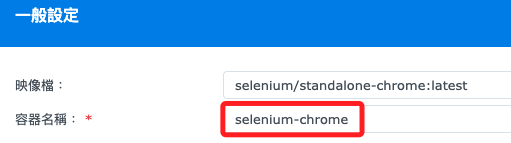

<br>

4. 端口部分，本地與容器都設定為 `4444`。

   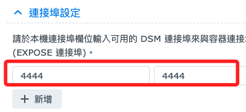

<br>

## 回到終端機

1. 檢查容器是否正常啟動。

   ```bash
   sudo docker ps
   ```

<br>

2. 在區網內的電腦，訪問 NAS 中的容器，會看到 Selenium Grid 的管理界面。

   ```bash
   <NAS IP>:4444
   ```

   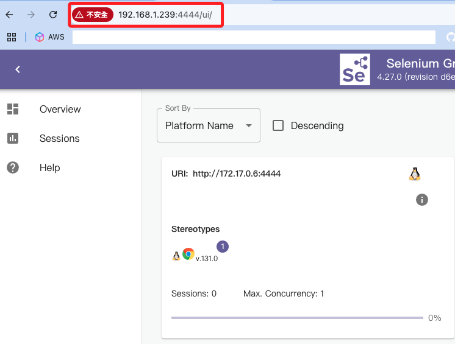

<br>

## 建立專案資料夾

1. 建立在 `~`

   ```bash
   cd ~ && mkdir 00_MyScript_2025
   ```

<br>

## 建立虛擬環境

1. 進入 NAS。

   ```bash
   ssh sam6238@nas
   ```

<br>

2. 切換路徑。

   ```bash
   cd /var/services/homes/admin/PythonVenv
   ```

<br>

3. 建立虛擬環境。

   ```bash
   python -m venv envPython
   ```

<br>

4. 編輯腳本；群暉預設的是使用 vim。 

   ```bash
   vim ~/.profile
   ```

<br>

## 使用 VSCode

1. 安裝 `Remote Explorer`。

   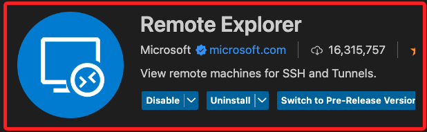

<br>

2. 連線後，寫入。

   ```bash
   # 啟動虛擬環境
   if [ -d "/volume1/homes/admin/PythonVenv/envPython" ]; then
      source /volume1/homes/admin/PythonVenv/envPython/bin/activate
   fi
   ```

<br>

3. 退出後重新登入就會啟動虛擬環境，或透過以下指令確認虛擬環境是否啟動，如果成功會顯示虛擬環境的路徑。

   ```bash
   echo $VIRTUAL_ENV
   ```

   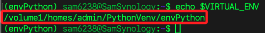

<br>

## 編輯腳本

1. 建立腳本。

   ```bash
   touch exWG_notify.py .env
   ```

<br>

2. 在腳本所在目錄建立 `.env` 文件，並添加 LINE Notify 權杖。

   ```
   LINE_NOTIFY=<填入自己的-Line-通知權杖>
   ```

<br>

3. 確保 `.env` 文件的權限設置正確，以保護敏感訊息。

   ```bash
   chmod 600 .env
   ```

<br>

4. 編輯腳本。

_先存在 `03.py`_

<br>

5. 確保腳本具有執行權限。

   ```bash
   chmod +x exWG_notify.py
   ```

<br>

## 測試腳本

1. 在設置自動化之前，先手動運行腳本以確保一切正常。

   ```bash
   python exWG_notify.py
   ```

<br>

2. 使用完整路徑運行一次。

   ```bash
   /var/services/homes/admin/PythonVenv/envPython/bin/python /var/services/homes/sam6238/00_MyScript_2025/exWG_notify.py
   ```

<br>

## 設置定時任務

1. 登入群暉 DSM，前往 `控制台` > `任務排程表`。

   

<br>

2. 點擊 `新增` > `排程任務` > `使用者定義指令碼`。

   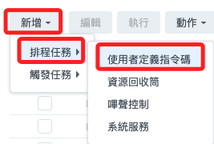

<br>

3. 設置任務基本資訊，名稱、用戶。

   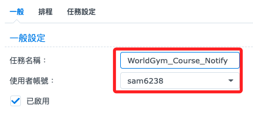

<br>

4. 排程。

   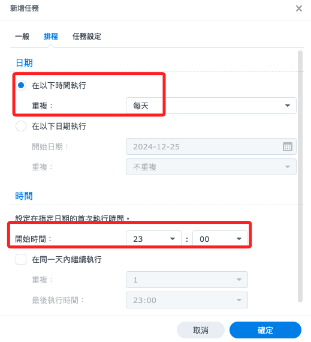

<br>

5. 在 `任務設定` 的 `執行指令` 欄位輸入命令。

   ```bash
   /var/services/homes/admin/PythonVenv/envPython/bin/python /var/services/homes/sam6238/00_MyScript_2025/exWG_notify.py
   ```

<br>

___

_END_