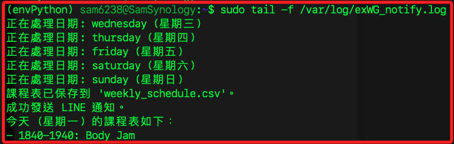

# 手動建立排程

_不明原因讓 NAS 無法正確運行排程，改用手動設置_

<br>

## 步驟

1. 登入 NAS 終端機。

    ```bash
    ssh sam6238@nas
    ```

<br>

2. 檢查排程服務 (crond) 是否運行。

    ```bash
    ps aux | grep crond
    ```

    

<br>

3. 若沒有顯示 `crond`，查詢狀態。

    ```bash
    sudo systemctl status crond
    ```

    

<br>

4. 若服務未啟動，可嘗試啟動服務。

    ```bash
    sudo systemctl start crond
    ```

<br>

5. 查詢當前排程。

    ```bash
    sudo cat /etc/crontab
    ```

<br>

## 編輯排程文件

1. 使用 `vi` 編輯排程文件。

    ```bash
    sudo vi /etc/crontab
    ```

<br>

2. 按下 `i` 進入編輯模式，左下角會顯示 `-- INSERT --`。

    

<br>

3. 添加排程任務，相關語法另作說明；特別注意，時間是 `分` 在最前面，然後是 `時`。

    ```plaintext
    0 23 * * * root /var/services/homes/admin/PythonVenv/envPython/bin/python /var/services/homes/sam6238/00_MyScript_2025/exWG_notify_v2.py >> /var/log/exWG_notify.log 2>&1
    0 9 * * * root /var/services/homes/admin/PythonVenv/envPython/bin/python /var/services/homes/sam6238/00_MyScript_2025/exWG_notify_v2.py today >> /var/log/exWG_notify.log 2>&1
    ```

<br>

4. 按下 `ESC` 退出編輯模式，左下角的 `-- INSERT --` 字樣會消失。

<br>

5. 輸入 `:wq` 儲存並退出。

<br>

6. 重新啟動 crond 服務以確保新排程生效。

    ```bash
    sudo systemctl restart crond
    ```

<br>

7. 再次檢查 `/etc/crontab` 確認新排程內容是否已加載。

    ```bash
    sudo cat /etc/crontab
    ```

<br>

## 驗證排程執行情況

1. 查看排程執行記錄；特別注意，這個日誌必須至少運行一次後才會建立，另外，參數 `-f` 的作用是 `follow`，也就是 _實時監控變化_，畫面會卡住並即時監控，所以要強制退出才可回到命令行。

    ```bash
    sudo tail -f /var/log/exWG_notify.log
    ```

    

<br>

2. 若有問題，可檢查 `/var/log/messages` 查看錯誤日誌：

    ```bash
    sudo grep "cron" /var/log/messages
    ```

<br>

## 格式參考

1. `/etc/crontab` 文件格式。

    ```bash
    # minute hour mday month wday who command
    0 23 * * * root /path/to/script.sh
    ```

<br>

2. 時間格式說明。

   - `minute`：分 (0-59)

   - `hour`：時 (0-23)

   - `mday`：日 (1-31)

   - `month`：月 (1-12)

   - `wday`：星期 (0-6, 0=星期天)

<br>

___

_END_