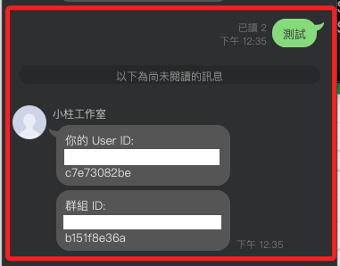

# LINE Messaging API 發送通知

_LINE Notify 服務於 `2025/3/31` 終止，官方建議使用 `Messaging API` 取代。_

<br>

## 登入開發帳號

1. 登入 [LINE Developers Console](https://developers.line.biz/console/)，建立新的或使用既有的 Messaging API 項目。

<br>

2. 進入 Messaging API 設定，找到 `Channel Access Token`，點選 Issue 來生成。

<br>

## 處理敏感資訊

_略_

<br>

## 發送 LINE 訊息

_以下代碼可在 `.ipynb` 中直接測試_

1. 測試時可在 `Basic settings` 頁籤中取得自己的 ID 進行。

    ```python
    import requests
    import os

    from dotenv import load_dotenv
    load_dotenv()

    CHANNEL_ACCESS_TOKEN = os.getenv("CHANNEL_ACCESS_TOKEN")
    USER_ID = os.getenv("USER_ID")

    # 設定 API URL
    API_URL = "https://api.line.me/v2/bot/message/push"

    # 訊息內容
    headers = {
        "Content-Type": "application/json",
        "Authorization": f"Bearer {CHANNEL_ACCESS_TOKEN}"
    }

    data = {
        "to": USER_ID,
        "messages": [
            {
                "type": "text",
                "text": "這是一則來自 Messaging API 的通知訊息。"
            }
        ]
    }

    # 發送請求
    response = requests.post(
        API_URL, headers=headers, json=data
    )

    # 輸出結果
    print(response.status_code)
    print(response.json())
    ```

<br>

## 取得使用者及群組 ID

_若加入個人好友時，僅會取得個人 ID_

<br>

1. 將官方帳號加入指定的群組或個人添加好友。

<br>

2. 在本機運行 Ngrok 以取得 Webhook，在 MacOS 中因服務衝突，端口指定使用 `5050`。

    ```bash
    ngrok http 5050
    ```

<br>

3. 將取得的 HTTPS 加入 Webhook 設定中。

<br>

4. 編輯 `app.py`。

    ```python
    from flask import Flask, request, jsonify
    import requests
    import os
    from dotenv import load_dotenv
    load_dotenv()

    CHANNEL_ACCESS_TOKEN = os.getenv("CHANNEL_ACCESS_TOKEN")
    USER_ID = os.getenv("USER_ID")

    app = Flask(__name__)

    # 設定 LINE Messaging API 回應 URL
    LINE_REPLY_API = "https://api.line.me/v2/bot/message/reply"

    # 設定 HTTP Headers
    HEADERS = {
        "Content-Type": "application/json",
        "Authorization": f"Bearer {CHANNEL_ACCESS_TOKEN}"
    }

    # 發送回應訊息到 LINE
    def send_reply(reply_token, messages):
        data = {
            "replyToken": reply_token,
            "messages": messages
        }
        response = requests.post(LINE_REPLY_API, headers=HEADERS, json=data)
        return response.status_code, response.text

    # 處理 LINE Webhook 事件
    @app.route("/webhook", methods=["POST"])
    def webhook():
        body = request.json
        print("收到的 Webhook 資料:", body)

        if "events" in body:
            for event in body["events"]:
                # 取得回應 Token
                reply_token = event.get("replyToken", "")
                
                # 取得來源資訊
                source = event.get("source", {})
                user_id = source.get("userId", "未知使用者")
                group_id = source.get("groupId", "非群組")

                # 建立回應訊息
                reply_messages = [
                    {"type": "text", "text": f"你的 User ID: {user_id}"},
                    {"type": "text", "text": f"群組 ID: {group_id}"}
                ]

                # 發送回應
                send_reply(reply_token, reply_messages)

        return jsonify({"status": "ok"}), 200

    if __name__ == "__main__":
        app.run(port=5050, debug=True)
    ```

<br>

5. 運行腳本。

    ```bashg
    python app.py
    ```

<br>

6. 發送任意訊息就會取得該使的者 ID 以及群組 ID。

    

<br>

___

_END_


