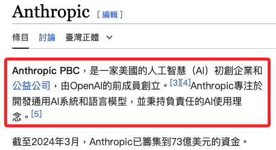
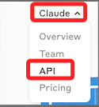
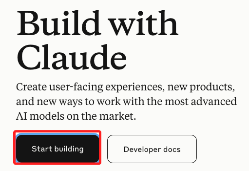
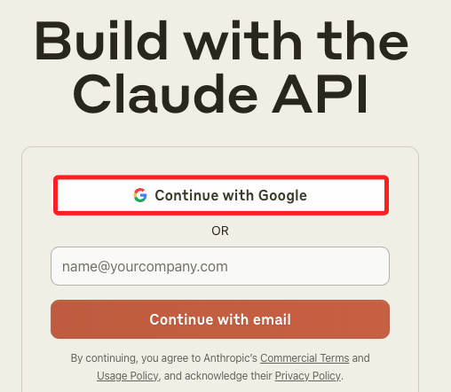
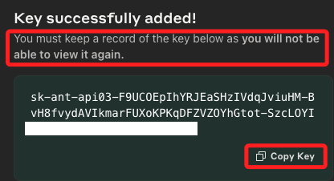
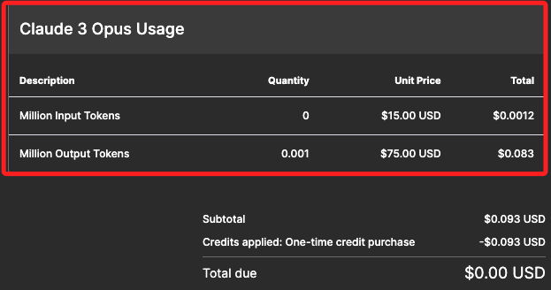
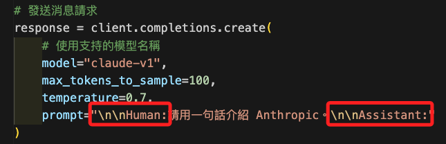

# Anthropic

_建立 Claude 應用_

<br>

## 簡介

1. 請參考 [維基百科介紹](https://zh.wikipedia.org/zh-tw/Anthropic#%E5%A4%96%E9%83%A8%E9%93%BE%E6%8E%A5)。

    

<br>

2. Anthropic 的 AI 技術和模型已經整合到多種雲服務和平台中，比如說 AWS、GCP、Azure 等，在接下來的講義中將陸續介紹。

<br>

## 取得金鑰

1. 進入 [官網](https://www.anthropic.com/)，展開 `Claude` 點擊 `API`；補充說明一下，這官網近期時有變更，但大致都是這樣的路徑開始。

    

<br>

2. 接著點擊 `Start building`。

    

<br>

3. 選取登入的帳號。

    

<br>

4. 在 `Dashboard` 頁籤中，點擊 `Get API keys`。

    

<br>

5. 點擊右上角 `Create Key` 可建立新的金鑰；金鑰建立之後無法再次查看複製。

    

<br>

6. 任意命名。

    

<br>

7. 複製金鑰，_切記_，這是唯一一次複製的機會。

    

<br>

8. 完成之後會看到列表，但是無法再窺探完整金鑰。

    

<br>

## 儲值

1. 操作過程中出現負的餘額，得先儲值才能用，先儲值了 $6 (@2024/06/01)。

    

<br>

2. 在 `Plans & billing` 頁籤中可以進行付費並查看相關內容。

    

<br>

3. 也可查看模型的計費資訊。

    

<br>

## 準備工作

1. 可先更新，或出現提示再更新。

    ```bash
    pip install --upgrade pip
    ```

<br>

2. 建立虛擬環境；這部分細節不贅述，僅做簡單提醒與紀錄。

    ```bash
    cd ~/Documents/PythonVenv && python -m venv envAnth
    ```

<br>

3. 啟動虛擬環境或寫入環境變數。

    ```bash
    source /Users/samhsiao/Documents/PythonVenv/envAnth/bin/activate
    ```

<br>

4. 建立並進入專案資料夾。

    ```bash
    cd ~/Desktop && mkdir _exAnth_ && cd _exAnth_
    ```

<br>

5. 建立專案腳本、敏感資訊文件、原始檔控制文件。

    ```bash
    touch ex01.ipynb .env .gitignore
    ```

<br>

6. 啟動 VSCode。

    ```bash
    code .
    ```

<br>

7. 編輯 `.gitignore`。

    ```bash
    .env
    ```

<br>

8. 安裝必要庫。

    ```bash
    # 處理 HTTP 請求
    pip install requests anthropic python-dotenv
    ```

<br>

## 編輯腳本

_展示如何調用 Claude 的 API 進行文本生成，可根據具體需求調整 `prompt`、`max_tokens` 和其他參數來生成不同的文本內容。_

<br>

1. 編輯 `.env`，寫入 Anthropy 的 API Key。

    ```json
    ANTHROP_API_KEY=
    ```

<br>

2. 載入必要庫以及環境變數。

    ```python
    import anthropic
    import requests
    from dotenv import load_dotenv
    import os

    # 載入環境變數
    load_dotenv()

    # 設置 API 金鑰
    API_KEY = os.getenv('ANTHROP_API_KEY')
    ```

<br>

3. 建立操作實體。

    ```python
    # 建立 Anthropic 客戶端實例
    client = anthropic.Client(api_key=API_KEY)
    ```

<br>

4. 發送請求並輸出結果。

    ```python
    # 發送消息請求
    response = client.completions.create(
        # 使用支持的模型名稱
        model="claude-v1",
        max_tokens_to_sample=100,
        temperature=0.7,
        prompt="""
        \n\nHuman:請用一句話介紹 Anthropic。
        \n\nAssistant:
        """
    )

    # 輸出生成的文本
    print(response.completion)
    ```

<br>

## 關於 Prompt

_有嚴格的格式_

<br>

1. `Claude API` 使用 `\n\nHuman:` 和 `\n\nAssistant:` 格式來標示對話的角色，這種格式有助於模型區分 `人類用戶` 和 `助手` 的對話，從而生成更連貫和相關的回應。

    

<br>

2. 可參考 [Anthropic API 文件](https://docs.anthropic.com/en/api/getting-started)。

<br>

3. 可以進行多行陳述。

    ```python
    response = client.completions.create(
        # 使用支持的模型名稱
        model="claude-v1",
        max_tokens_to_sample=100,
        temperature=0.7,
        prompt="""
        \n\nHuman:
        你是一個專業的廚師。
        請簡單表列製作活跳牆的食材以及程序。
        \n\nAssistant:
        """
    )
    # 輸出生成的文本
    print(response.completion)
    ```

<br>

## 完整腳本

1. 程式碼。

    ```python
    import anthropic
    import requests
    from dotenv import load_dotenv
    import os

    # 載入環境變數
    load_dotenv()

    # 設置 API 金鑰
    API_KEY = os.getenv('ANTHROP_API_KEY')

    # 建立 Anthropic 客戶端實例
    client = anthropic.Client(api_key=API_KEY)

    # 發送消息請求
    response = client.completions.create(
        # 使用支持的模型名稱
        model="claude-v1",
        max_tokens_to_sample=100,
        temperature=0.7,
        prompt="\n\nHuman:請用一句話介紹 Anthropic。\n\nAssistant:"
    )

    # 輸出生成的文本
    print(response.completion)

    ```

2. 結果。

    

<br>

___

_END_

