# 建立 Hugging Face 專案

_以下簡介並說明如果要建立一個專案該如何進行_

<br>

## 背景

1. 假設正在開發一個 `自然語言處理（NLP）` 專案，目的是建立一個自訂的情感分析模型，這個模型將根據中文文本資料判斷情感是正面的、負面的還是中性的。

<br>

2. 以下的操作將使用 Hugging Face 平台來訓練模型，先準備一組已標註的中文情感分析資料集，接著使用 Hugging Face 的 `transformers` 庫進行模型訓練，最終並將訓練好的模型上傳到 Hugging Face 的模型儲存庫，以便於其他開發者或應用程式使用。

<br>

## 準備工作

1. 安裝套件。

    ```bash
    pip install pandas transformers datasets torch torchvision torchaudio
    ```

<br>

2. 進行必要的更新。

    ```bash
    pip install accelerate -U
    ```

<br>

## 步驟

1. 首先，建立一個 `JupyterNotebook` 腳本並任意命名；使用以下代碼中已標註的中文情感分析資料集 `data`，內容有兩列，分別是 `text` 和 `label`；其中 `text` 是一段中文文本，`label` 是該文本的情感標註，即 `正面`、`負面` 或 `中性`。

    ```python
    import pandas as pd

    # 標籤映射
    label_map = {"正面": 2, "負面": 0, "中性": 1}

    # 擴充資料集
    data = {
        "text": [
            "這個產品非常好", 
            "我不喜歡這個服務", 
            "體驗很一般", 
            "這是一次愉快的購物", 
            "這個商品質量很差", 
            "客服非常友善"
        ],
        "label": [
            label_map["正面"], 
            label_map["負面"], 
            label_map["中性"], 
            label_map["正面"], 
            label_map["負面"], 
            label_map["正面"]
        ]
    }
    df = pd.DataFrame(data)

    # 儲存為 CSV 供後續使用
    df.to_csv("dataset_sentiment.csv", index=False)

    ```

<br>

2. 完成時會顯示如下。

    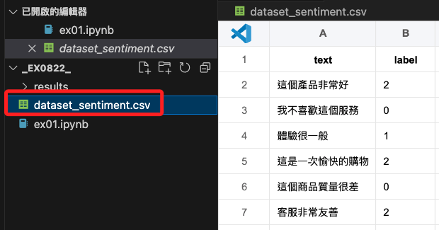

<br>

3. 接下來使用 Hugging Face 的 `transformers` 庫來訓練一個簡單的情感分析模型；這裡選用一個預訓練的 `BERT` 模型，並使用資料集進行 `微調（Fine-tuning）`。

    ```python
    from transformers import (
        BertTokenizer, 
        BertForSequenceClassification, 
        Trainer, 
        TrainingArguments
    )
    from datasets import load_dataset

    # 載入資料集
    dataset = load_dataset(
        'csv', data_files='dataset_sentiment.csv'
    )

    # 使用 Hugging Face 提供的預訓練 BERT 模型
    model_name = "bert-base-chinese"
    tokenizer = BertTokenizer.from_pretrained(model_name)
    model = BertForSequenceClassification.from_pretrained(
        model_name, num_labels=3
    )

    # 將資料集進行預處理
    def preprocess_function(examples):
        return tokenizer(
            examples['text'], 
            truncation=True, 
            padding=True
        )

    encoded_dataset = dataset.map(
        preprocess_function, 
        batched=True
    )

    # 設置訓練參數
    training_args = TrainingArguments(
        output_dir="./results",
        evaluation_strategy="epoch",
        learning_rate=2e-5,
        per_device_train_batch_size=16,
        per_device_eval_batch_size=16,
        num_train_epochs=3,
        weight_decay=0.01,
    )

    # 使用 Trainer 進行訓練
    trainer = Trainer(
        model=model,
        args=training_args,
        train_dataset=encoded_dataset["train"],
        eval_dataset=encoded_dataset["train"]
    )

    trainer.train()
    ```

<br>

4. 最終訓練結果。

    ```bash
    {
        'train_runtime': 11.7971, 
        'train_samples_per_second': 1.526, 
        'train_steps_per_second': 0.254, 
        'train_loss': 1.1331870555877686, 
        'epoch': 3.0
    }
    ```

<br>

5. 將訓練好的模型和分詞器保存到本地。

    ```python
    # 將模型權重、配置文件等保存到本地目錄
    model.save_pretrained("./sentiment_model")
    # 將分詞器的相關文件保存到同一個目錄
    tokenizer.save_pretrained("./sentiment_model")
    ```

<br>

6. 運行後顯示結果。

    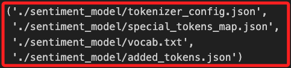

<br>

## 儲存模型

_訓練完成後，將模型儲存到 Hugging Face 模型儲存庫中，並進行分享。_

<br>

1. 確認登入狀態，如果尚未登入，可以使用以下命令進行登入；輸入 `y` 已完成登入。

    ```bash
    huggingface-cli login
    ```

    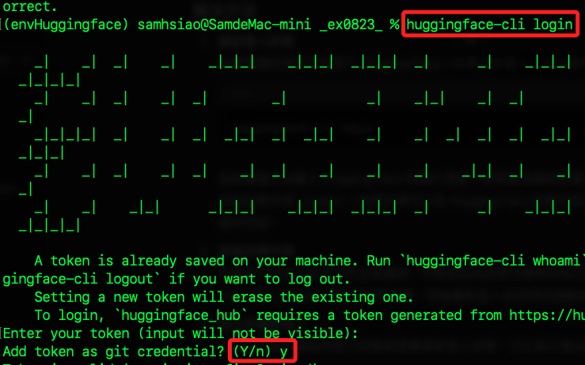

<br>

2. 成功時會顯示 Token 是有效的，並告知存放位置。

    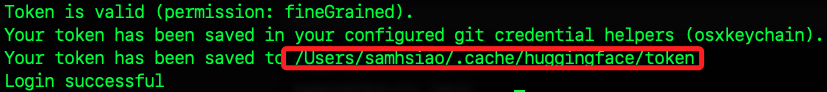

<br>

3. 使用 CLI 建立新的儲存庫來存放模型。

    ```bash
    huggingface-cli repo create sentiment-model --type model
    ```

    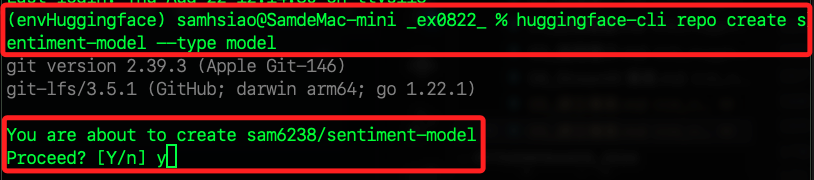

<br>

4. 在 `Process? [Y/n]` 時回覆 `Y`，顯示如下結果。

    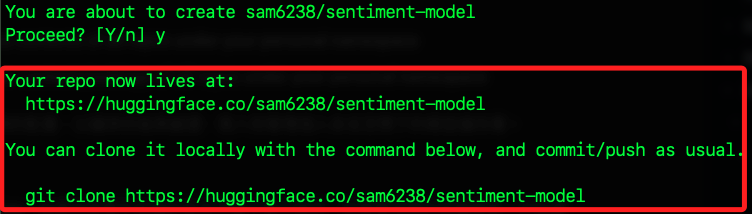

<br>

5. 完成時，會顯示儲存庫的網址。

    ```bash
    https://huggingface.co/sam6238/sentiment-model
    ```

<br>

5. 若需要下載，可使用以下命令將其複製到本地。

    ```bash
    git clone https://huggingface.co/sam6238/sentiment-model
    ```

<br>

## 查看模型

1. 使用瀏覽器訪問以上網址。

    ```http
    https://huggingface.co/sam6238/sentiment-model
    ```

<br>

2. 顯示以下內容，其中 `sentiment-model` 就是模型名稱。

    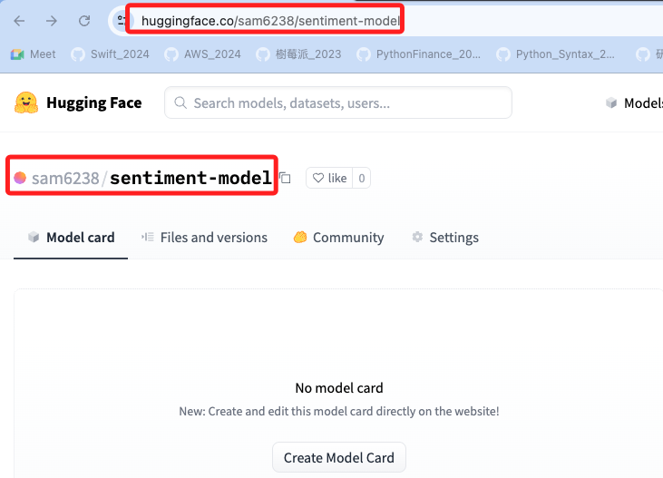

<br>

## 刪除模型

1. 點擊 `Settings` 進入設定頁面。

    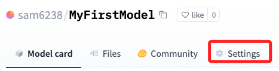

<br>

2. 進入刪除區塊。

    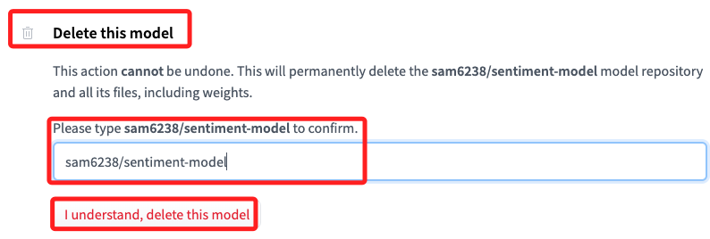

<br>

## 推送模型

_將模型推送到 Hugging Face 儲存庫，若在前一步驟已經刪除了模型，這裡要重新建立。_

<br>

1. 初始化 Git 並安裝 `git-lfs`。

    ```bash
    git init && git lfs install
    ```

    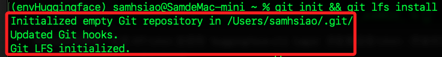

<br>

2. 重新建立遠端儲存庫。

    ```bash
    huggingface-cli repo create sentiment-model --type model
    ```

<br>

3. 確認本地 Git 儲存庫的遠端配置是否正確。使用以下命令檢查遠端 URL。

    ```bash
    git remote -v
    ```

    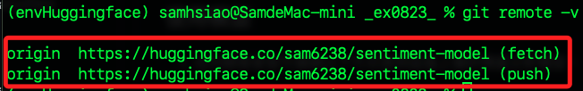

<br>

4. 使用以下命令來重新設定遠端 URL。

    ```bash
    git remote set-url origin https://huggingface.co/sam6238/sentiment-model
    ```

<br>

5. 如果發現沒有遠端儲存庫設定，則可以使用以下命令來添加。

    ```bash
    git remote add origin https://huggingface.co/sam6238/sentiment-model
    ```

<br>

6. 提交並推送；未來有變更時，也要重新提交並推送。

    ```bash
    git add .
    git commit -m "Initial commit of sentiment model"
    git push -u origin main
    ```

<br>

## Git 錯誤與排除

1. 以上步驟會出現錯誤，訊息表明本地的分支與遠端的分支存在衝突，具體是因為本地分支落後於遠端分支而導致無法進行直接推送；這通常是因為遠端分支有一些新的提交，而這些提交尚未整合到本地分支中。

    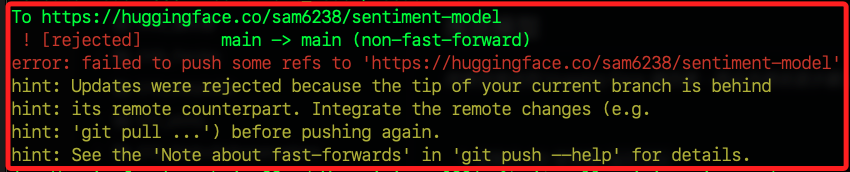

<br>

2. 先從遠端拉取最新的更改。

    ```bash
    git pull origin main --rebase
    ```

    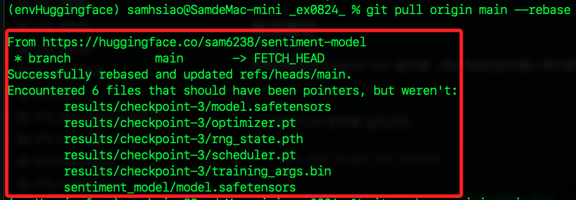

<br>

3. 直接推送。

    ```bash
    git push -u origin main
    ```

    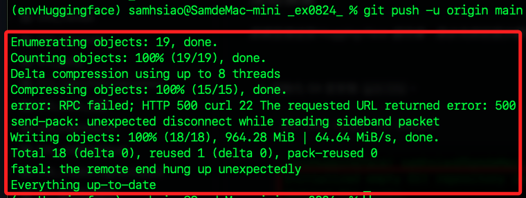

<br>

4. 或是強制推送。

    ```bash
    git push -u origin main --force
    ```

<br>

## 使用模型

1. 將 sentiment_model 目錄中的所有文件移動到根目錄。

    ```bash
    mv sentiment_model/* ./ && rm -r sentiment_model
    ```

<br>

2. 重新推送；特別注意，大型模型文件會通過 `Git LFS (Large File Storage)` 上傳到 Hugging Face 儲存庫。

    ```bash
    git add .
    git commit -m "Move model files to root directory"
    git push -u origin main
    ```

<br>

3. 任何開發者皆可通過以下方式使用這個上傳的情感分析模型。

    ```python
    from transformers import (
        AutoTokenizer,
        AutoModelForSequenceClassification
    )

    tokenizer = AutoTokenizer.from_pretrained(
        "sam6238/sentiment-model"
    )
    model = AutoModelForSequenceClassification.from_pretrained(
        "sam6238/sentiment-model"
    )

    # 使用模型進行推理
    inputs = tokenizer("這是個好產品", return_tensors="pt")
    outputs = model(inputs)
    predictions = outputs.logits.argmax(-1)
    ```

<br>

## 部署模型

_可進一步將模型部署到 Hugging Face 的 `Space`，通過使用 Streamlit 或 Gradio 來建立一個簡單的網頁應用，讓用戶可以在線輸入文本並得到情感分析結果。_

<br>

___

_END_