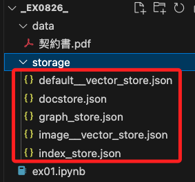

# LlamaIndex

_[官網連結](https://docs.llamaindex.ai/en/stable/)_

<br>

## 說明

1. 這是一個開源的數據框架，用於幫助開發者將大型語言模型如 OpenAI 的 GPT、Meta 的 LLaMA 等與各種數據源進行集成。

<br>

2. LlamaIndex 旨在簡化從不同數據來源如文件、API、資料庫等提取和處理數據，並將其有效地輸入到大型語言模型中，使這些模型能夠更好地理解和生成相關的自然語言輸出。

<br>

## 主要功能

1. LlamaIndex 提供了一系列工具和接口，可讓開發者將不同類型的數據如結構化和非結構化數據整合到一個統一的索引中，這些數據來源可以包括 PDF 文件、網頁、資料庫記錄、API 響應等。

<br>

2. LlamaIndex 提供了多種索引結構選項如樹狀索引、列表索引、向量索引等，可根據具體的應用場景選擇最合適的索引方式，從而提高數據查詢和檢索的效率。

<br>

3. LlamaIndex 能夠處理用戶查詢並利用索引進行高效檢索，結合大型語言模型的生成能力，生成上下文相關的自然語言響應。

<br>

4. LlamaIndex 提供了接口和工具，允許開發者使用流行的 LLMs，如 GPT-3、GPT-4、LLaMA、Claude 等來處理數據和生成文本，這些接口可以讓模型根據索引數據生成更具上下文和更精確的回答。

<br>

## 在 Python 中的應用範例

_依據 [官方的說明](https://docs.llamaindex.ai/en/stable/getting_started/starter_example/) 製作以下簡單範例_

<br>

1. 使用以下命令安裝 LlamaIndex 和 OpenAI 的 Python 庫。

    ```bash
    pip install llama-index openai
    ```

<br>

2. 假設有一些文本文檔，想使用 LlamaIndex 來構建索引並進行查詢。

    ```python
    from llama_index.core import (
        VectorStoreIndex, SimpleDirectoryReader
    )
    import openai
    openai.api_key = "OPEN AI 密鑰"

    # 將文件放置在 data 資料夾內
    documents = SimpleDirectoryReader("data").load_data()
    index = VectorStoreIndex.from_documents(documents)

    query_engine = index.as_query_engine()
    
    # 提問並取得回答
    response = query_engine.query("這份文件在說什麼？")
    print(response)
    ```

<br>

## 建立索引

1. 可透過語法儲存索引。

    ```python
    index.storage_context.persist()
    ```

<br>

2. 加載索引。

    ```python
    StorageContext.from_defaults()
    ```

<br>

3. 以下範例檢查索引是否存在，若存在則加載，否則生成並儲存索引。

    ```python
    import os.path
    from llama_index.core import (
        VectorStoreIndex,
        SimpleDirectoryReader,
        StorageContext,
        load_index_from_storage,
    )

    # 儲存索引的目錄
    PERSIST_DIR = "./storage"
    DOCSTORE_PATH = os.path.join(PERSIST_DIR, "docstore.json")

    if not os.path.exists(PERSIST_DIR) or not os.path.exists(DOCSTORE_PATH):
        # 如果目錄或文件不存在，建立目錄並重新建立索引
        os.makedirs(PERSIST_DIR, exist_ok=True)  
        documents = SimpleDirectoryReader("data").load_data()
        index = VectorStoreIndex.from_documents(documents)
        # 儲存索引到指定目錄
        index.storage_context.persist(persist_dir=PERSIST_DIR)  
    else:
        # 如果存在，則加載已儲存的索引
        storage_context = StorageContext.from_defaults(persist_dir=PERSIST_DIR)
        index = load_index_from_storage(storage_context)

    query_engine = index.as_query_engine()
    response = query_engine.query("這份文件在說什麼？")
    print(response)

    ```

<br>

4. 運行後會建立索引文件。

    

<br>

___

_END_
