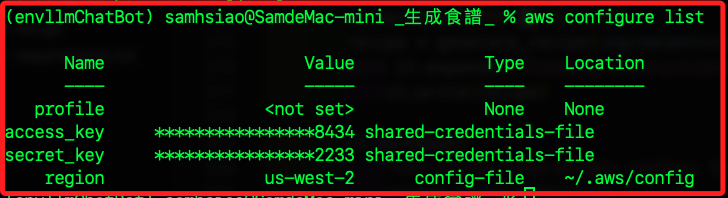

# AWS CLI

_說明本範例中的操作及其他補充，也考參考 [官網說明](https://aws.amazon.com/tw/cli/)。_

<br>

## 安裝

1. MacOS 可透過官網 [下載 PKG 安裝程式](https://aws.amazon.com/tw/cli/) 或透過以下指令安裝。

    ```bash
    brew install awscli
    ```

<br>

2. Windows 則從 [AWS CLI 官方網站](https://aws.amazon.com/tw/cli/) 中下載安裝即可。

<br>

3. Linux 系統可透過以下指令下載並且安裝。

    ```bash
    curl "https://awscli.amazonaws.com/awscli-exe-linux-x86_64.zip" -o "awscliv2.zip"
    unzip awscliv2.zip
    sudo ./aws/install
    ```

<br>

4. 驗證安裝。

    ```bash
    aws --version
    ```

<br>

## 配置 AWS CLI

1. 先在 AWS 控制台中的 `IAM` 建立使用者，並生成訪問密鑰（Access Key ID 和 Secret Access Key）。

<br>

2. 配置本地 AWS CLI。

    ```bash
    aws configure
    ```

    

<br>

3. 若因為 `botocore 和 awscli 版本之間的不兼容` 出現錯誤。

    ```bash
    pip install --upgrade botocore awscli
    pip install boto3==1.28.62 botocore==1.31.62
    ```

<br>

4. 查詢。

    ```bash
    aws configure list
    ```

    

    ```bash
        Name                    Value             Type    Location
        ----                    -----             ----    --------
    profile                <not set>             None    None
    access_key     ****************8434 shared-credentials-file    
    secret_key     ****************2233 shared-credentials-file    
        region                us-east-1      config-file    ~/.aws/config
    ```

<br>

## 其他 AWS CLI 指令

1. 查看文件。

    ```bash
    aws help
    ```

<br>

2. 列出所有 S3 儲存。

    ```bash
    aws s3 ls
    ```

<br>

3. 建立 S3。

    ```bash
    aws s3 mb s3://my-new-bucket
    ```

<br>

4. 上傳文件到 S3。

    ```bash
    aws s3 cp myfile.txt s3://my-new-bucket/
    ```

<br>

5. 列出所有 EC2 實例。

    ```bash
    aws ec2 describe-instances
    ```

<br>

6. 啟動新的 EC2 實例。

    ```bash
    aws ec2 run-instances --image-id ami-0abcdef1234567890 --count 1 --instance-type t2.micro --key-name MyKeyPair --security-group-ids sg-12345678 --subnet-id subnet-12345678
    ```

<br>

___

_END_