# Bedrock

_添加服務、申請模型訪問權限、建立使用者_

## AWS 服務

1. 搜尋並添加服務。

    

<br>

2. 點擊右上角的開始試用。

    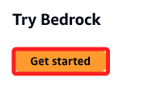

<br>

3. 管理模型存取權。

    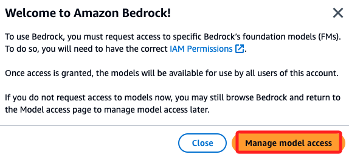

<br>

4. 在 `Anthropic` 的部分提出請求。

    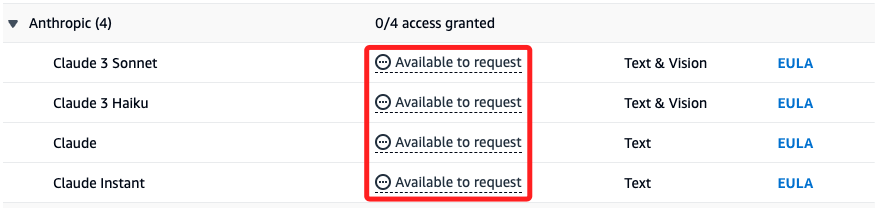

<br>

5. 點擊之後會展開另一個視窗。

    

<br>

6. 勾選。

    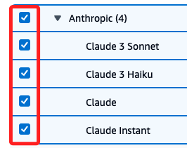

<br>

7. 點擊畫面右下角的 `Next`。

    

<br>

8. 任意填寫即可。

    

<br>

9. 提交 `Submit`。

    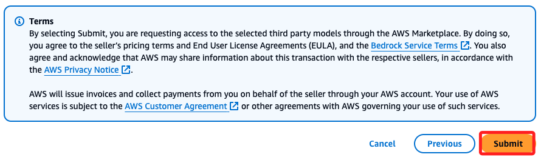

<br>

10. 提交完成後會顯示 `In Progress`。

    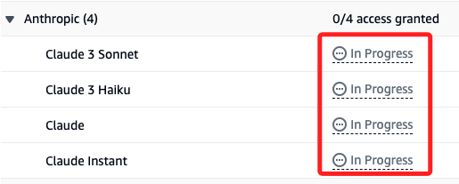

<br>

11. 過一小段時間就會通過了（這裡變成）。

    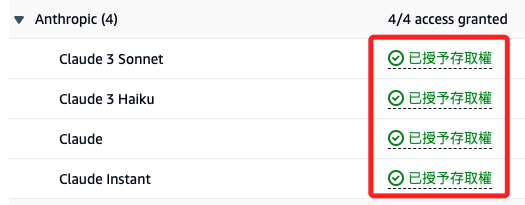

<br>

## IAM

1. 同樣地，搜尋並添加快捷鍵，接著點擊進入。

    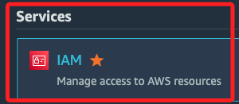

<br>

2. 點擊左側的使用者。

    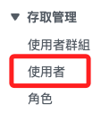

<br>

3. 建立使用者。

    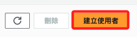

<br>

4. 自訂使用者名稱，並勾選 `提供使用者對 AWS 管理主控台的存取權` 後勾選 `我想要建立 IAM 使用者`。

    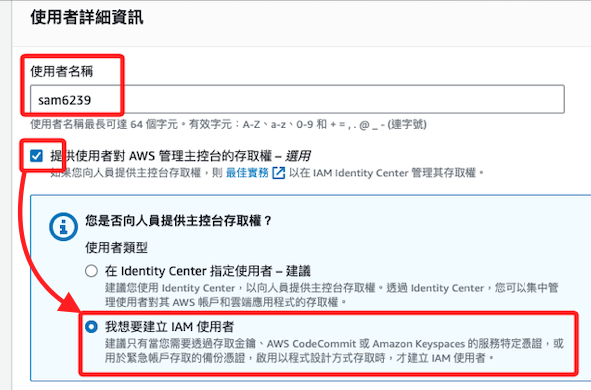

<br>

5. 使用自訂產生的密碼，另外取消預設的更新密碼選項，接著進入 `下一步`。

    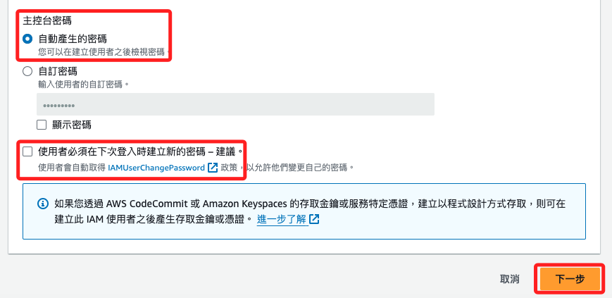

<br>

6. 這裡無論選哪個項目都無妨，點擊 `下一步`。

    

<br>

7. 點擊右下角的 `建立使用者`。

    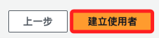

<br>

8. 接著先點擊 `下載 .csv 檔案`，這會將帳號密碼下載到本地，然後再返回使用者清單中。

    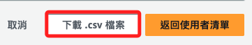

<br>

9. 變化看到添加了一個使用者。

    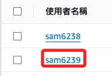

<br>

10. 查看這個以使用者名稱前綴的檔案。

    

<br>

11. 內容是使用者名稱、密碼與 URL。

    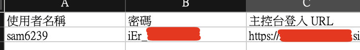

<br>

12. 點擊進入使用者後，點擊 `建立存取金鑰`。

    

<br>

13. 選取 `命令列介面` 後勾選下方的 `確認`，緊接著進入 `下一步`。

    

<br>

14. 任意描述。

    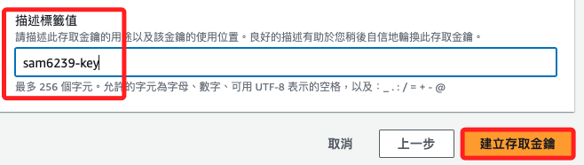

<br>

15. 避免日後遺忘，同樣 `下載 .csv 檔案`，然後 `完成`。

    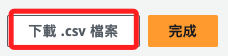

<br>

16. 這兩份檔案，前面的是 `credentials`，後面的是 `accessKeys`。

    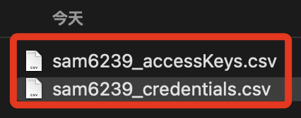

<br>

## 建立政策

1. 在 IAM 畫面中，點擊左側的 `政策`。

    

<br>

2. 點擊建立政策。

    

<br>

3. 選取 `JSON`，並將以下內容貼在 `政策編輯器`中。

    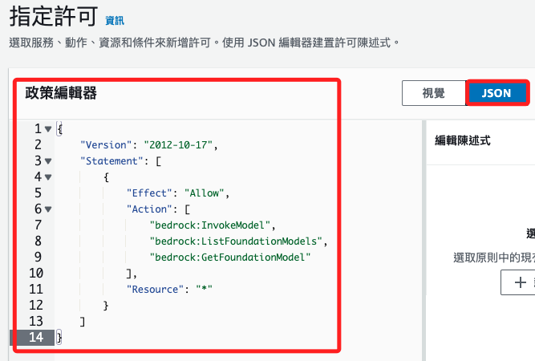

<br>

4. 內容如下。

```json
{
    "Version": "2012-10-17",
    "Statement": [
        {
            "Effect": "Allow",
            "Action": [
                "bedrock:InvokeModel",
                "bedrock:ListFoundationModels",
                "bedrock:GetFoundationModel"
            ],
            "Resource": "*"
        }
    ]
}
```

<br>

5. 點擊 `下一步`。

    

<br>

6. 命名 `BedrockAccessPolicy` 並添加描述 `Policy to allow access to Bedrock services`。

    

<br>

7. 建立政策。

    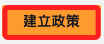

<br>

8. 完成後可查看全貌。

    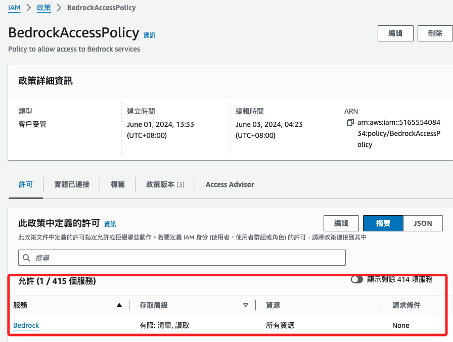

<br>

## 添加政策

1. 在指定使用者介面內，點擊 `許可` 並 `新增許可`。

    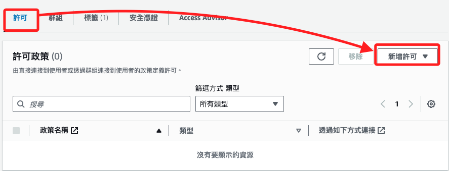

<br>

2. 點擊 `新增許可` 中的 `新增許可`。

    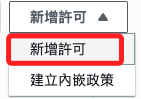

<br>

3. 會看到前面建立使用者的步驟中看過的畫面，選取 `直接連接政策`。

    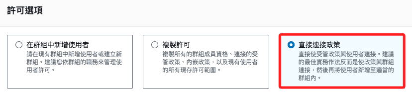

<br>

4. 搜尋前面自建的政策。

    

<br>

5. 點擊右下角 `新增許可`。

    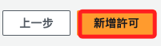

<br>

___

_END_