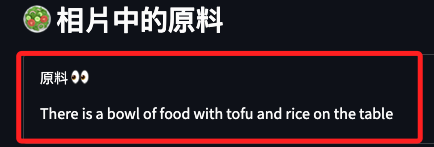
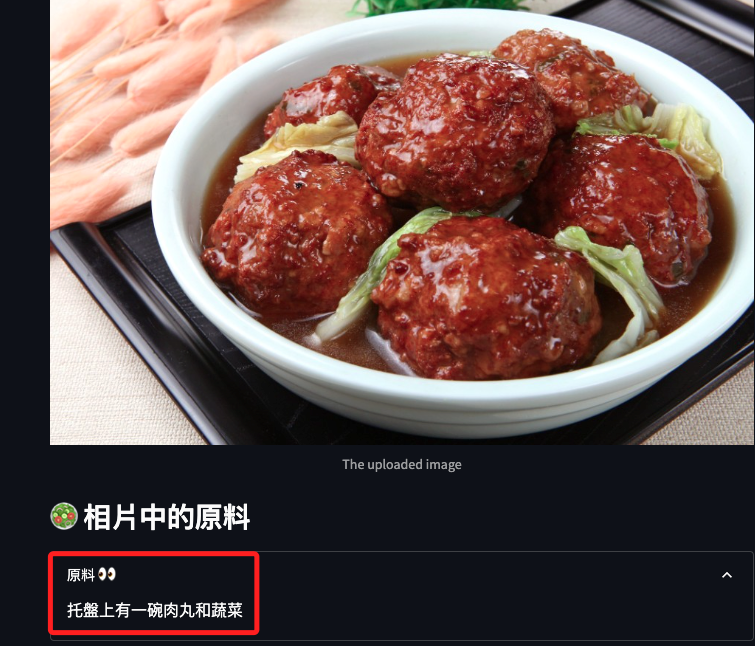

# 優化說明

_導入翻譯功能_

<br>

## 說明

1. 目前原料的說明是英文的。

    

<br>

2. 安裝套件：以下將使用翻譯 API `Google Translate API` 來實現翻譯功能。

    ```bash
    pip install googletrans==4.0.0-rc1
    ```

<br>

3. 修改腳本，包含導入、初始化翻譯器、進行翻譯、網頁顯示等四個部分。

    ```python
    # 導入翻譯函數
    from googletrans import Translator

    # 初始化翻譯器
    translator = Translator()

    # 將圖片轉換的文本翻譯為中文
    ingredients_zh = translator.translate(ingredients, src='en', dest='zh-tw').text

    # 將文字顯示在網頁上
    with st.expander("原料 👀"):
        # 取消原本英文顯示的部分
        # st.write(ingredients.capitalize())
        st.write(ingredients_zh)
    ```

<br>

4. 運行後。

    

<br>

___

_END_