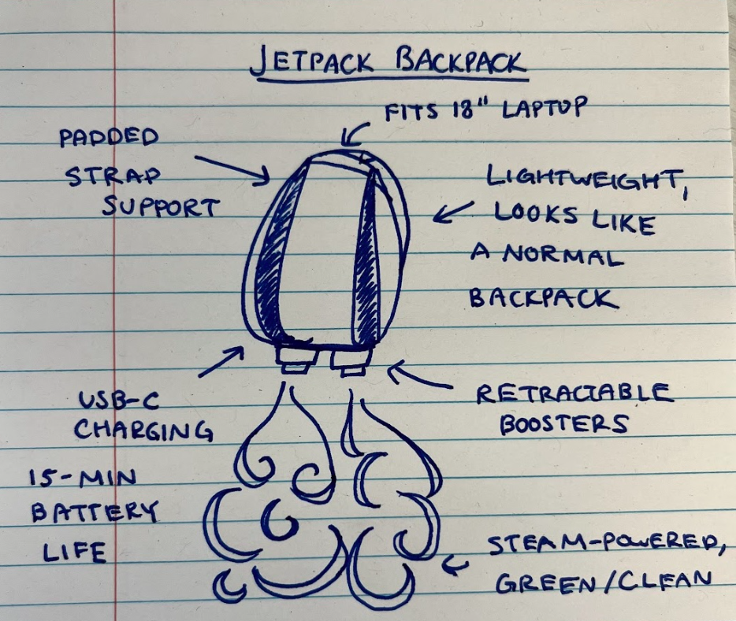
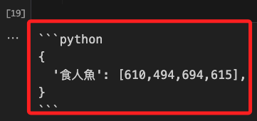

# Gemini API 的視覺功能 

_彙整 [官方的說明文件](https://ai.google.dev/gemini-api/docs/vision?lang=python&hl=zh-tw)_


<br>

## 簡介

1. `Gemini API` 可對傳遞給它的 `圖片` 和 `影片` 進行推論，包含 `描述或回答有關內容的問題`、`摘要內容`、`從內容中推斷訊息`，並將推論輸出為 `純文本`。

<br>

2. `Gemini 1.5 Pro` 和 `1.5 Flash` 支持最多 `3,600` 張圖片文件。

<br>

3. 圖片必須是以下類型之一：`PNG`、`JPEG`、`WEBP`、`HEIC`、`HEIF`，每張圖片等同於 `258` 個 tokens，另外，模型沒有特定的像素數限制，但較大的圖片會縮小到最大分辨率 `3072x3072`，而較小的圖片會放大到 `768x768` 像素，放大與縮小皆會維持原比例。

<br>

## 使用文件 API 上傳圖片

1. 下載官方提供的 [範例圖片 jetpack.jpg](https://storage.googleapis.com/generativeai-downloads/images/jetpack.jpg)，像素 `1068x906`。

    

<br>

2. 導入環境變數。

    ```python
    import google.generativeai as genai
    import os
    from dotenv import load_dotenv

    load_dotenv()

    # 設置 API 金鑰，請更改為自己的實際金鑰
    GOOGLE_API_KEY = os.getenv("GEMINI_API_KEY")
    # 配置 Google API 使用自己的金鑰
    genai.configure(api_key=GOOGLE_API_KEY)
    ```

<br>

3. 使用 `upload_file` 方法上傳圖片並輸出 `URI`，文件會被上傳到 `Google Cloud` 的 `Gemini API` 服務所管理的儲存空間。。

    ```python
    # 上傳文件並輸出確認訊息
    sample_file = genai.upload_file(
        path="jetpack.jpg",
        display_name="Jetpack drawing"
    )
    print(
        f"上傳檔案 '{sample_file.display_name}' 為： {sample_file.uri}"
    )
    ```
    _輸出_

    ```bash
    上傳檔案 'Jetpack drawing' 為： https://generativelanguage.googleapis.com/v1beta/files/bjhg067wr4qn
    ```

<br>

4. 顯示圖片內容。

    ```python
    import PIL.Image
    sample_file_1 = PIL.Image.open('jetpack.jpg')
    ```

    

<br>

5. 驗證圖片文件上傳並取得元數據。

    ```python
    # 取得文件元數據
    file = genai.get_file(name=sample_file.name)
    print(f"檢索檔案 '{file.display_name}' 為： {sample_file.uri}")
    ```

    _輸出_

    ```bash
    檢索檔案 'Jetpack drawing' 為： https://generativelanguage.googleapis.com/v1beta/files/bjhg067wr4qn
    ```

<br>

6. 使用上傳的圖片和文本提示生成內容。

    ```python
    import textwrap
    from IPython.display import Markdown
    
    # 選擇 Gemini 模型
    model = genai.GenerativeModel(
        model_name="gemini-1.5-pro"
    )

    # 提示模型生成內容
    response = model.generate_content([
        sample_file,
        "請以繁體中文描述如何製造這個產品。"
    ])

    # 將輸出轉換為 Markdown 格式並顯示
    def to_markdown(text):
        text = text.replace('•', '  *')
        return Markdown(textwrap.indent(
            text, '> ', 
            predicate=lambda _: True
        ))
    # 輸出
    to_markdown(response.text)
    ```

    _回答：_

    ```bash
    這是一個關於製造噴射背包的產品說明：
    噴射背包
    這個產品是一個結合時尚外觀和實用功能的噴射背包。
    功能：
    外觀設計: 外觀輕巧，類似一般的背包，方便日常使用。
    容量: 可容納 18 吋筆記型電腦。
    舒適性: 配備加厚背帶，提供舒適的背負體驗。
    動力系統:
    採用可伸縮的推進器，提供升力。
    以蒸汽為動力，環保清潔。
    電池續航力可達 15 分鐘。
    充電: 配備 USB-C 充電接口，方便充電。
    製造流程:
    設計階段: 首先需要設計背包的外觀、尺寸和功能，並繪製詳細的設計圖。
    材料選擇: 選擇輕便、耐用且符合環保標準的材料來製作背包主體、背帶和推進器外殼。
    推進系統研發: 這部分是技術核心，需要研發高效、安全的蒸汽動力系統，並設計可伸縮的推進器結構。
    電池技術: 開發容量大、重量輕且續航力强的電池，以支持 15 分鐘的飛行時間。
    組裝生產: 將背包主體、推進器、動力系統和電池等部件組裝起來，並進行嚴格的品質檢測。
    市場推廣:
    強調產品的時尚外觀和實用功能，吸引追求潮流和便利的消費者。
    推出不同顏色和款式的背包，滿足不同消費者的需求。
    與科技公司和時尚品牌合作，提升產品的知名度和吸引力。
    注意事項:
    在產品研發和生產過程中，需要注意安全性和可靠性，確保產品符合相關安全標準。
    需要取得相關部門的批准和許可，才能合法銷售和使用噴射背包。
    總之，製造噴射背包需要結合時尚設計、先進科技和嚴謹的生產流程，才能創造出既美觀又實用的產品。
    ```

<br>

## 本地上傳多個圖片文件

1. 使用官方提供的兩個圖片 `piranha.jpg`、`firefighter.jpg`，下載並打開圖片文件。

    ```python
    import PIL.Image
    sample_file_1 = PIL.Image.open('jetpack.jpg')
    sample_file_2 = PIL.Image.open('piranha.jpg')
    sample_file_3 = PIL.Image.open('firefighter.jpg')
    ```

    

    

<br>

2. 提示多個圖片生成內容。

    ```python
    # 使用相同的 Gemini 模型
    model = genai.GenerativeModel(
        model_name="gemini-1.5-pro"
    )

    # 建立提示
    prompt = """
    你是一個經驗豐富的廣告文案設計師。
    請以繁體中文寫一段簡短的廣告詞，
    用以展示第一張圖片中的產品如何解決後面兩張圖片中顯示的問題？
    """

    # 提示模型生成內容
    response = model.generate_content([
        prompt,
        sample_file_1,
        sample_file_2,
        sample_file_3
    ])

    # 將輸出轉換為 Markdown 格式並顯示
    to_markdown(response.text)
    ```

    _輸出_

    ```bash
    遇到險阻？「噴射背包」助你一臂之力！ 無論是跨越險峻峽谷，還是拯救樹上萌寵，Jetpack背包都能讓你輕鬆應對。 環保動力，安全可靠，助你突破困境，暢行無阻！
    ```

<br>

## 取得物件的邊界框

1. 提示取得邊界框。

    ```python
    # 選擇 Gemini 模型
    model = genai.GenerativeModel(
        model_name="gemini-1.5-pro"
    )

    # 建立提示
    prompt = """
    返回圖片中食人魚的邊界框。
    [ymin, xmin, ymax, xmax]
    """

    # 提示模型生成內容
    response = model.generate_content([
        sample_file_2,
        prompt
    ])

    # 輸出生成的內容
    print(response.text)
    ```
    _回答：包含 ```python ```_

    

<br>

2. 對於 `generate_content` 方法的參數是先傳遞提示或先傳遞提示文本，當 `圖片在前` 時，模型首先會關注圖片的內容，然後再解讀後面的文本提示，這時圖片會對生成的內容起到主導作用，文本提示會引導模型如何針對圖片進行生成；反之，當 `文本提示在前` 時，模型首先會基於文本提示來理解上下文，再參考後面的圖片，這時文本提示會起到引導作用，圖片內容則補充或支持文本的理解。

<br>

3. 延續上一點，以本區塊範例來說，模型先提供圖片，因為要分析的是圖片中的指定物件，所以將圖片置於前面。

<br>

## 使用影片作為提示

1. `Gemini 1.5 Pro` 和 `Flash` 支持最多約 `一小時` 的影片數據，影片必須是以下格式類型之一：`video/mp4`、`video/mpeg`、`video/mov`、`video/avi`、`video/x-flv`、`video/mpg`、`video/webm`、`video/wmv`、`video/3gpp`。

<br>

2. 下載影片，檔案大小 `227.06M`，若有同步記得進行管理。

    ```bash
    wget https://storage.googleapis.com/generativeai-downloads/images/GreatRedSpot.mp4
    ```

<br>

3. 上傳影片並輸出 `URI`。

    ```python
    # 上傳影片並輸出確認訊息
    video_file_name = "GreatRedSpot.mp4"
    print(f"影片上傳中 ...")
    video_file = genai.upload_file(path=video_file_name)
    print(f"完成上傳：{video_file.uri}")
    ```

    _輸出_

    ```bash
    影片上傳中 ...
    完成上傳：https://generativelanguage.googleapis.com/v1beta/files/dxu6d8uscw6f
    ```

<br>

4. 驗證文件上傳並檢查狀態。

    ```python
    import time

    # 檢查影片是否可使用
    while video_file.state.name == "PROCESSING":
        print('.', end='')
        time.sleep(10)
        video_file = genai.get_file(video_file.name)

    if video_file.state.name == "FAILED":
        raise ValueError(video_file.state.name)
    ```

<br>

5. 使用影片和文本提示生成內容

    ```python
    # 建立提示
    prompt = """
    請以繁體中文總結一下這個影片。
    根據影片中的訊息建立一個帶有答案的測驗。
    """

    # 選擇 Gemini 模型
    model = genai.GenerativeModel(
        model_name="gemini-1.5-pro"
    )

    # 發送請求
    print("提出 LLM 推理請求...")
    response = model.generate_content(
        [video_file, prompt],
        request_options={"timeout": 600}
    )

    # 輸出生成的內容並渲染 Markdown
    to_markdown(response.text)
    ```

    _輸出：_

    ```bash
    好的，這是影片的總結和測驗題：

    影片總結
    這部影片講述了木星及其著名的地標大紅斑的演變。大紅斑是一個巨大的反氣旋風暴，已經肆虐了幾個世紀。科學家們注意到，隨著時間的推移，大紅斑的顏色加深、體積縮小且形狀變得更加圓潤。最初的理論認為，風暴在縮小時會旋轉得更快，就像花樣滑冰運動員將手臂拉近時旋轉速度會加快一樣。然而，最近來自 NASA 多項任務（包括航海家號、哈勃望遠鏡和最近的朱諾號）的數據顯示，實際上風暴並沒有旋轉得更快，而是變高了，就像陶藝在陶輪上旋轉時被拉高一樣。這一發現挑戰了先前的假設，並突出了我們對大紅斑的理解仍在不斷發展。

    測驗題
    問題 1： 木星大紅斑是什麼？ (a) 火山 (b) 隕石坑 (c) 風暴 (d) 山脈
    答案：(c) 風暴

    問題 2： 隨著時間的推移，大紅斑發生了什麼變化？ (a) 它正在變大。 (b) 它正在變暗。 (c) 它正在旋轉得更快。 (d) 它正在變低。
    答案：(b) 它正在變暗。

    問題 3： 最近的數據顯示大紅斑發生了什麼變化？ (a) 它正在變高。 (b) 它正在旋轉得更慢。 (c) 它正在變成正方形。 (d) 它正在消失。
    答案：(a) 它正在變高。

    問題 4： 哪個 NASA 任務沒有參與研究大紅斑？ (a) 卡西尼號 (b) 航海家號 (c) 哈勃望遠鏡 (d) 朱諾號
    答案：(a) 卡西尼號

    問題 5： 科學家們對大紅斑的理解是什麼？ (a) 完整且確定。 (b) 仍在不斷發展。 (c) 無關緊要。 (d) 基於純粹的推測。
    答案：(b) 仍在不斷發展。

    希望這個總結和測驗對您有所幫助！
    ```

<br>

## 時間戳

1. 建立帶有 `時間戳` 的 `提示`。

    ```python
    # 建立提示
    prompt = """
    請以繁體中文進行簡單扼要地回答。
    在影片時間的 01:05 和 01:19 位置所給的例子是要向我們展示什麼？
    """

    # 選擇 Gemini 模型
    model = genai.GenerativeModel(
        model_name="gemini-1.5-pro"
    )

    # 發送請求
    print("提出 LLM 推理請求 ...")
    response = model.generate_content(
        [prompt, video_file],
        request_options={"timeout": 600}
    )

    # 輸出生成的內容
    print(response.text)
    ```

    _輸出_

    ```bash
    提出 LLM 推理請求 ...
    影片在 01:05 和 01:19 位置所給的例子，是要向我們解釋為甚麼大紅斑的面積縮小了，但風速卻沒有按預期增加。 就像花式溜冰選手把手縮回時旋轉速度會加快，科學家原本預期大紅斑縮小時，風速也會變快。 但實際上大紅斑沒有旋轉得更快，而是變得更高了， 就像陶藝師在拉坯時，陶土會因旋轉而變高變細。 因為我們是從上方觀察木星，所以看到的是大紅斑的面積縮小、形狀變圓。 
    ```

<br>

## 轉錄影片並提供視覺描述

1. 轉錄影片和視覺描述，如果不是快節奏影片 (取樣影片每秒 1 個影格)，則可為影片轉錄內含視覺說明的每一步。

    ```python
    # 建立提示
    prompt = """
    轉錄音頻，給出時間戳。
    同時使用繁體中文，簡單扼要地提供視覺描述。
    """

    # 選擇 Gemini 模型
    model = genai.GenerativeModel(model_name="gemini-1.5-pro")

    # 發送請求
    print("提出 LLM 推理請求 ...")
    response = model.generate_content(
        [prompt, video_file],
        request_options={"timeout": 600}
    )

    # 輸出生成的內容
    print(response.text)
    ```

    _輸出_

    ```bash
    Making LLM inference request...
    ## 木星大紅斑的變化

    **00:00 - 00:08** 木星懸浮在繁星點點的夜空中，一半籠罩在陰影中。
    **00:09 - 00:15** 木星逐漸被陽光照亮，展現出其氣態巨行星的特徵：由與恆星相同的元素組成，但質量不足以點燃。
    **00:16 - 00:21** 木星表面彩色雲帶和標誌性的大紅斑清晰可見。
    **00:22 - 00:29** 鏡頭拉近大紅斑，顯示其旋渦狀結構。
    **00:30 - 00:45** 動畫模擬大紅斑的逆時針旋轉，並展示了其在過去一個世紀中的持續存在。
    **00:46 - 01:04** 不同年份的木星圖像，顯示大紅斑的顏色加深、面積縮小、形狀變圓。科學家最初預測，隨著風暴縮小，風速會增加。
    **01:05 - 01:12** 黑白動畫模擬滑冰運動員旋轉，當手臂收攏時，旋轉速度加快，以此類比大紅斑的變化。但實際上並非如此。
    **01:13 - 01:17** 動畫模擬從側面觀察大紅斑，數據顯示風暴並沒有加速旋轉，而是變得更高。
    **01:18 - 01:24** 陶藝製作的黑白動畫，顯示隨著陶土旋轉，其形狀逐漸變高變細，以此類比大紅斑高度的增加。
    **01:25 - 01:36** 不同年份的木星圖像，再次展示大紅斑的縮小和變圓。大紅斑過去可以容納三個地球，現在只能容納一個多一點。
    **01:37 - 01:46** 動畫模擬旅行者號、哈勃望遠鏡和朱諾號探測器對木星的探測。
    **01:47 - 01:57** 木星再次懸浮在夜空中，大紅斑清晰可見。科學家希望通過更多研究揭開大紅斑的更多秘密。
    **01:58 - 02:05** 太空探測器在太空中飛行，背景是地球和NASA戈達德太空飛行中心的標誌。
    ```

<br>

## 操作文件

1. `列出` 所有文件。

    ```python
    # 列出所有文件
    for file in genai.list_files():
        print(f"{file.display_name}, URI: {file.uri}")
    ```
    _輸出_
    ```bash
    GreatRedSpot.mp4, URI: https://generativelanguage.googleapis.com/v1beta/files/dxu6d8uscw6f
    Jetpack drawing, URI: https://generativelanguage.googleapis.com/v1beta/files/bjhg067wr4qn
    ```

<br>

2. `刪除` 文件。

    ```python
    # 刪除文件
    genai.delete_file(video_file.name)
    print(f'刪除文件：{video_file.uri}')
    ```

    _輸出_

    ```bash
    刪除文件：https://generativelanguage.googleapis.com/v1beta/files/dxu6d8uscw6f
    ```

<br>

___

_END_