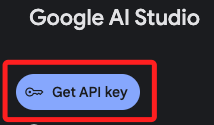
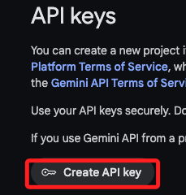
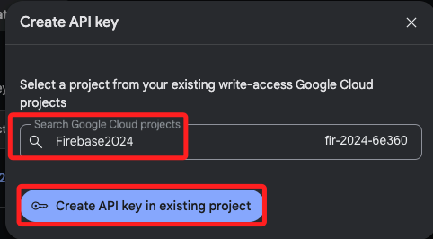
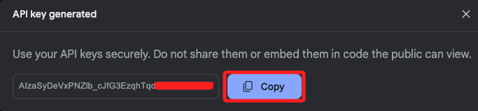
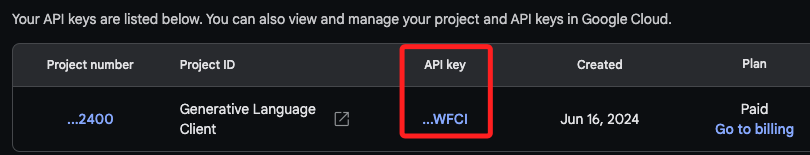

# 申請 Google Gemini API Key

 

## 參考 

1. 進入 [官網](https://ai.google.dev/aistudio?hl=zh-tw) 後，點擊中央的 `登入 Google AI Studio`。

    

 

2. 點擊左邊的 `Get API Key` 進入建立金鑰頁面。

    

 

3. 點擊 `Create API Key`。

    

 

4. 選取現有專案後，點擊 `Create API Key in existing project`。

    

 

5. 點擊 `Copy` 進行複製並保存。

    

 

6. 這個 Key 日後還是可以點擊複製的，並非僅顯示一次的類型。

    

 

___

_END_