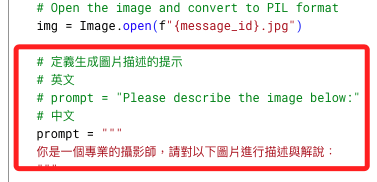
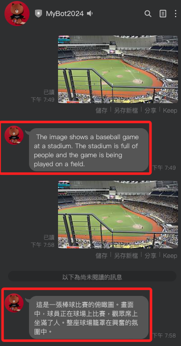

# 修改

1. 進入後點擊。

    

<br>

2. 點擊 `編輯`。

    

<br>

3. 點擊 `程式碼`。

    

<br>

4. 這裡示範將原本的英文 `Prompt` 改為中文。

    ```bash
    prompt = """
    你是一個專業的攝影師，請對以下圖片進行描述與解說：
    """
    ```

    

<br>

5. 點擊 `部署`。

    

<br>

6. 等候函數部署。

    

<br>

7. 可以對比修正前後的回答。

    
<br>

## 補充

1. 目前這個專案還是有不足之處，當機器人解說圖片時，對話並不會儲存，圖片也沒有儲存，以下將繼續進行優化。

<br>

___

_END_