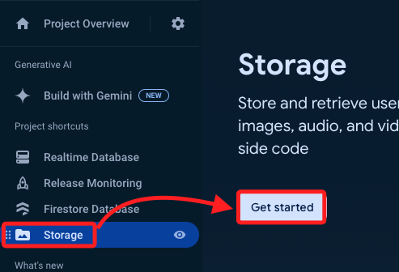
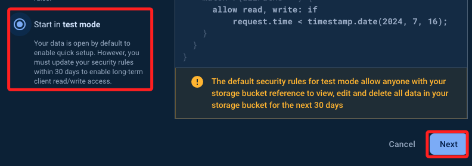
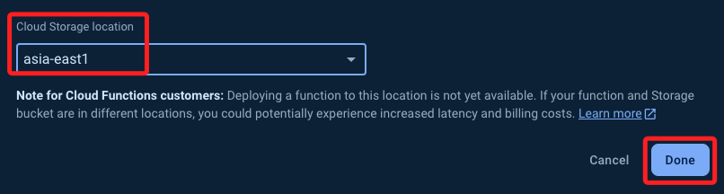
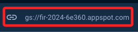
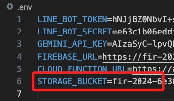
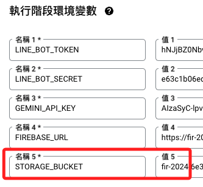
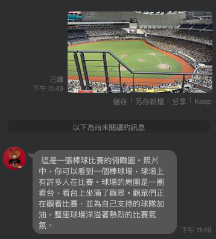
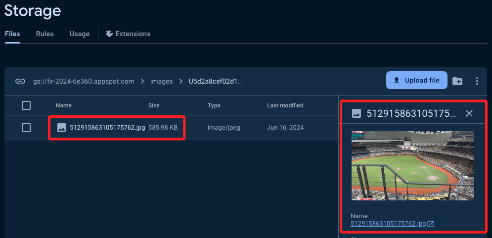

# 儲存圖片到 Firebase 的最佳方式

_之前範例並未儲存圖片訊息中的圖片_

<br>

## 說明

1. 若要儲存訊息中的圖片，使用 `Firebase Storage` 儲存圖片，並在 `Firebase Realtime Database` 中儲存圖片的 `URL` 是一種最佳實踐，因為 `Storage` 適合儲存大文件，如圖片和影片，而 `Realtime Database` 適合儲存結構化數據，包含圖片的 `URL`，尤其它支持實時數據同步，非常適合快速查詢和顯示。

<br>

2. 進行圖片訊息時，也會將圖片訊息的解析儲存進入紀錄。

<br>

3. 執行 `!清空` 指令時，也會同時清空 Storage。

<br>

## STORAGE BUCKET

1. 進入 `Storage`。

    

<br>

2. 先使用 `測試模式` 即可。

    

<br>

3. 區域選擇 `asia-east1`，這區域是 `台灣`。

    

<br>

4. 完成後可複製 Bucket 的 URL，並先寫入 `.env`。

    

<br>

5. 特別注意，寫入環境變數時，不用加上 `gs://`。

    

<br>

6. 接著寫入本地的 `.env`，鍵名為 `STORAGE_BUCKET`。

    ```json
    LINE_BOT_TOKEN=
    LINE_BOT_SECRET=
    GEMINI_API_KEY=
    FIREBASE_URL=
    CLOUD_FUNCTION_URL=
    
    # 添加這個
    STORAGE_BUCKET=
    ```

<br>

## 編輯 Cloud Function

1. 環境變數，添加 `STORAGE_BUCKET`，再次提醒不要寫 `gs://`。

    

<br>

2. 修正 `requirements.txt`，添加 `google-cloud-storage`。

    ```json
    line-bot-sdk
    requests
    git+https://github.com/ozgur/python-firebase
    google.generativeai
    Pillow
    google-cloud-storage
    ```

<br>

3. 添加後可以先 `部署` 一次，確定正確無誤後，再進行腳本修改。

<br>

4. 修正主腳本 `main.py` 添加圖片上傳功能。

    ```python
    from linebot import LineBotApi, WebhookHandler
    from linebot.models import TextSendMessage
    import json
    import os
    from firebase import firebase
    import google.generativeai as genai
    from PIL import Image
    from google.cloud import storage

    # 使用環境變數讀取憑證
    token = os.getenv("LINE_BOT_TOKEN")
    secret = os.getenv("LINE_BOT_SECRET")
    firebase_url = os.getenv("FIREBASE_URL")
    gemini_key = os.getenv("GEMINI_API_KEY")
    storage_bucket = os.getenv("STORAGE_BUCKET")

    # 初始化 Gemini Pro API
    genai.configure(api_key=gemini_key)

    # 初始化 Google Cloud Storage 客戶端
    storage_client = storage.Client()
    bucket = storage_client.bucket(storage_bucket)


    def linebot(request):
        # 取得請求的原始數據並轉換為文本
        body = request.get_data(as_text=True)
        # 將文本數據轉換為 JSON 格式
        json_data = json.loads(body)
        try:
            # 建立 LineBotApi 實例以便與 LINE 平台互動
            line_bot_api = LineBotApi(token)
            # 建立 WebhookHandler 實例以處理 LINE 消息
            handler = WebhookHandler(secret)
            # 取得請求頭中的簽名
            signature = request.headers["X-Line-Signature"]
            # 驗證請求並處理消息
            handler.handle(body, signature)
            # 取得消息事件的第一個事件
            event = json_data["events"][0]
            # 取得回覆令牌
            tk = event["replyToken"]
            # 取得發送消息的用戶 ID
            user_id = event["source"]["userId"]
            # 取得消息類型
            msg_type = event["message"]["type"]
            # 建立 Firebase 應用實例
            fdb = firebase.FirebaseApplication(firebase_url, None)
            # 定義用戶聊天記錄的路徑
            user_chat_path = f"chat/{user_id}"
            # 從 Firebase 取得用戶的聊天記錄
            chatgpt = fdb.get(user_chat_path, None)

            # 假如是文本訊息
            if msg_type == "text":
                # 取得文字消息的文本內容
                msg = event["message"]["text"]

                if chatgpt is None:
                    # 如果沒有聊天記錄，建立空列表
                    messages = []
                else:
                    # 否則，使用已有的聊天記錄
                    messages = chatgpt

                # 檢查是否為 "!清空" 或全形 "！清空"
                if msg.replace("！", "!") == "!清空":
                    # 如果消息是 "!清空"，回覆清空提示
                    reply_msg = TextSendMessage(text="對話歷史紀錄已經清空！")
                    # 刪除用戶的聊天記錄
                    fdb.delete(user_chat_path, None)
                    # 刪除 Google Cloud Storage 中相關圖片
                    blobs = bucket.list_blobs(prefix=f"images/{user_id}/")
                    for blob in blobs:
                        blob.delete()  # 刪除圖片
                else:
                    # 建立 Gemini Pro 模型
                    model = genai.GenerativeModel("gemini-pro")
                    # 將用戶消息加入聊天記錄
                    messages.append({"role": "user", "parts": [msg]})
                    # 使用 Gemini Pro 生成回覆
                    response = model.generate_content(messages)
                    # 將模型回覆加入聊天記錄
                    messages.append({"role": "model", "parts": [response.text]})
                    # 將模型回覆轉換為 LINE 消息
                    reply_msg = TextSendMessage(text=response.text)
                    # 更新 Firebase 中的對話紀錄
                    fdb.put_async(user_chat_path, None, messages)
                # 使用 LINE Bot API 發送回覆消息
                line_bot_api.reply_message(tk, reply_msg)

            elif msg_type == "image":
                # 接收到圖片消息
                print("接收到圖片消息")
                # 取得圖片消息的 ID
                message_id = event["message"]["id"]
                # 取得圖片內容
                message_content = line_bot_api.get_message_content(message_id)

                with open(f"/tmp/{message_id}.jpg", "wb") as fd:
                    # 將圖片內容寫入文件
                    fd.write(message_content.content)

                # 打開圖片並轉換為 PIL 格式
                img = Image.open(f"/tmp/{message_id}.jpg")

                # 上傳圖片到 Firebase Storage
                storage_path = f"images/{user_id}/{message_id}.jpg"
                blob = bucket.blob(storage_path)
                blob.upload_from_filename(
                    f"/tmp/{message_id}.jpg", content_type="image/jpeg"
                )
                blob.make_public()
                image_url = blob.public_url

                # 將圖片 URL 存入 Firebase
                if chatgpt is None:
                    messages = []
                else:
                    messages = chatgpt
                # 添加圖片消息記錄
                messages.append({"role": "user", "type": "image", "url": image_url})
                # 更新 Firebase 中的對話紀錄
                fdb.put_async(user_chat_path, None, messages)

                # 定義生成圖片描述的提示
                prompt = "你是一個專業的攝影師，請對以下圖片進行描述與解說："
                # 建立 Gemini Pro Vision 模型
                model = genai.GenerativeModel("gemini-pro-vision")
                # 生成圖片描述
                response = model.generate_content([prompt, img], stream=True)
                response.resolve()

                # 將生成的圖片描述轉換為 LINE 消息
                reply_msg = TextSendMessage(text=response.text)

                # 將機器人的描述消息也添加到 Firebase
                messages.append({"role": "model", "parts": [response.text]})
                fdb.put_async(user_chat_path, None, messages)

                # 發送回覆訊息
                line_bot_api.reply_message(tk, reply_msg)

            else:
                # 如果消息不是文字或圖片，回覆提示
                reply_msg = TextSendMessage(text="你發送的不是文字或圖片訊息喔！")
                # 使用 LINE Bot API 發送回覆消息
                line_bot_api.reply_message(tk, reply_msg)

        except Exception as e:
            detail = e.args[0]
            print(detail)
        # OK 表示處理完成
        return "OK"
    ```

<br>

4. 再次 `部署`。

    

<br>

## 測試

1. 與機器人進行對話。

    

<br>

2. 圖片會上傳到 `Storage`。

    

<br>

## 關於清空

1. 可透過對機器人以對話下達 `!清空`指令來清除資料庫中的文字及圖片使用 `msg.replace()` 下，無論用戶輸入的是全形還是半形的驚嘆號，程式都能正確識別並進行相應的操作。。

    ```python
    if msg.replace("！", "!") == "!清空":
    ```

<br>

## Firebase 規則

1. 假如要進行設限。

    ```json
    {
    "rules": {
        // 只允許已認證用戶讀取數據
        ".read": "auth != null",
        // 只允許已認證用戶寫入數據
        ".write": "auth != null",
        "chat": {
        "$user_id": {
            ".indexOn": ["timestamp"]
        }
        }
    }
    }
    ```

<br>

___

_END_