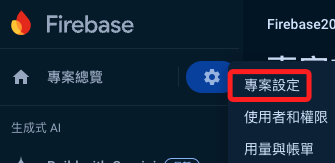
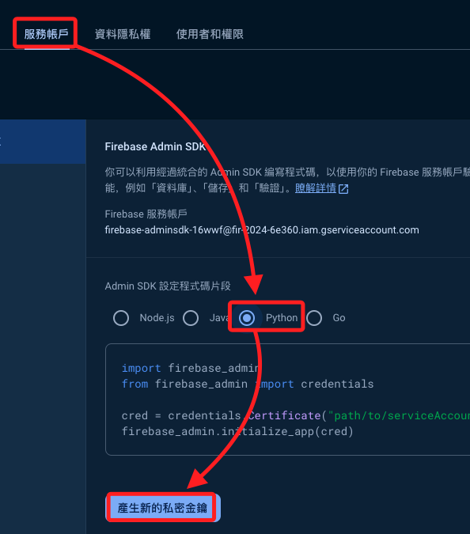
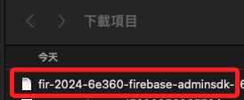
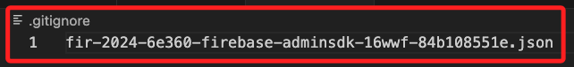
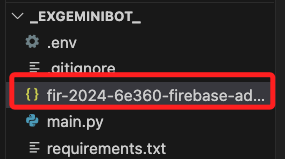
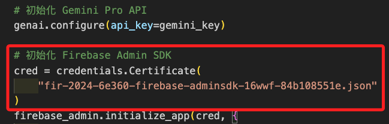
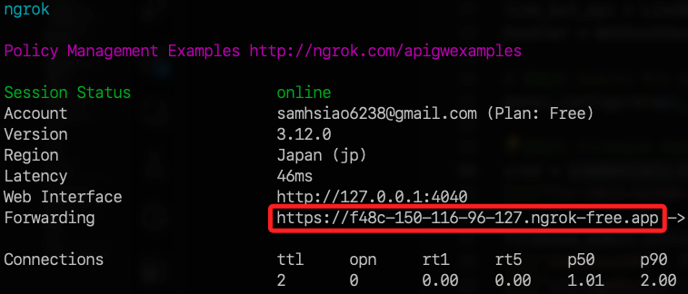
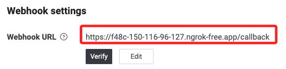

_尚未成功_
# 在本地運行

_將該 Google Function API 的 Line 機器人腳本改寫為在本地運行的範例_

<br>

## 範例

1. 程式碼。

```python
from flask import Flask, request, abort
from linebot.v3 import (
    WebhookHandler
)
from linebot.v3.exceptions import (
    InvalidSignatureError
)
from linebot.v3.messaging import (
    Configuration,
    ApiClient,
    MessagingApi,
    MessagingApiBlob,
    ReplyMessageRequest,
    TextMessage
)
from linebot.v3.webhooks import (
    MessageEvent,
    TextMessageContent,
    ImageMessageContent
)

import google.generativeai as genai
from PIL import Image
from google.cloud import storage
import firebase_admin
from firebase_admin import credentials, db
import os
from dotenv import load_dotenv

load_dotenv()

app = Flask(__name__)

# 使用環境變數讀取憑證
token = os.getenv("LINE_BOT_TOKEN")
secret = os.getenv("LINE_BOT_SECRET")
firebase_url = os.getenv("FIREBASE_URL")
gemini_key = os.getenv("GEMINI_API_KEY")
storage_bucket = os.getenv("STORAGE_BUCKET")

configuration = Configuration(access_token=token)
handler = WebhookHandler(secret)

# 初始化 Firebase Admin SDK
cred = credentials.Certificate(
    "fir-2024-6e360-firebase-adminsdk-16wwf-84b108551e.json"
)
firebase_admin.initialize_app(cred, {
    'databaseURL': firebase_url,
    'storageBucket': storage_bucket
})

# 初始化 Google Cloud Storage 客戶端
storage_client = storage.Client()
bucket = storage_client.bucket(storage_bucket)


@app.route("/callback", methods=['POST'])
def callback():
    # 取得請求的原始數據並轉換為文本
    body = request.get_data(as_text=True)
    # 取得請求頭中的簽名
    signature = request.headers["X-Line-Signature"]

    try:
        # 驗證請求並處理消息
        handler.handle(body, signature)
    except InvalidSignatureError:
        abort(400)

    return 'OK'


# 消息處理函數
@handler.add(MessageEvent, message=TextMessageContent)
def handle_text_message(event):
    user_id = event.source.user_id
    msg = event.message.text
    reply_token = event.reply_token

    # 取得用戶聊天記錄
    user_chat_path = f"chat/{user_id}"
    chatgpt_ref = db.reference(user_chat_path)
    chatgpt = chatgpt_ref.get()
    messages = chatgpt if chatgpt else []

    if msg.replace("！", "!") == "!清空":
        reply_msg = TextMessage(text="對話歷史紀錄已經清空！")
        chatgpt_ref.delete()
        blobs = bucket.list_blobs(prefix=f"images/{user_id}/")
        for blob in blobs:
            blob.delete()
    else:
        model = genai.GenerativeModel("gemini-pro")
        messages.append({"role": "user", "parts": [msg]})
        response = model.generate_content(messages)
        messages.append({"role": "model", "parts": [response.text]})
        reply_msg = TextMessage(text=response.text)
        chatgpt_ref.set(messages)

    with ApiClient(configuration) as api_client:
        line_bot_api = MessagingApi(api_client)
        line_bot_api.reply_message_with_http_info(
            ReplyMessageRequest(
                reply_token=reply_token,
                messages=[reply_msg]
            )
        )


@handler.add(MessageEvent, message=ImageMessageContent)
def handle_image_message(event):
    user_id = event.source.user_id
    reply_token = event.reply_token
    message_id = event.message.id

    # 取得圖片內容
    with ApiClient(configuration) as api_client:
        messaging_api_blob = MessagingApiBlob(api_client)
        message_content = messaging_api_blob.get_message_content(message_id)

    image_path = f"/tmp/{message_id}.jpg"

    with open(image_path, "wb") as fd:
        fd.write(message_content)

    img = Image.open(image_path)

    # 上傳圖片到 Google Cloud Storage
    storage_path = f"images/{user_id}/{message_id}.jpg"
    blob = bucket.blob(storage_path)
    blob.upload_from_filename(image_path, content_type="image/jpeg")
    blob.make_public()
    image_url = blob.public_url

    # 將圖片 URL 存入 Firebase
    chatgpt_ref = db.reference(f"chat/{user_id}")
    chatgpt = chatgpt_ref.get()
    if chatgpt is None:
        messages = []
    else:
        messages = chatgpt

    messages.append({"role": "user", "type": "image", "url": image_url})
    chatgpt_ref.set(messages)

    # 定義生成圖片描述的提示
    prompt = "你是一個專業的攝影師，請對以下圖片進行描述與解說："
    # 建立 Gemini Pro Vision 模型
    model = genai.GenerativeModel("gemini-pro-vision")
    # 生成圖片描述
    response = model.generate_content([prompt, img], stream=True)
    response.resolve()

    # 將生成的圖片描述轉換為 LINE 消息
    reply_msg = TextMessage(text=response.text)

    # 將機器人的描述消息也添加到 Firebase
    messages.append({"role": "model", "parts": [response.text]})
    chatgpt_ref.set(messages)

    with ApiClient(configuration) as api_client:
        line_bot_api = MessagingApi(api_client)
        line_bot_api.reply_message_with_http_info(
            ReplyMessageRequest(
                reply_token=reply_token,
                messages=[reply_msg]
            )
        )


if __name__ == "__main__":
    app.run(port=5000)

```

<br>

## 下載密鑰

1. 進入專案設定。

    

<br>

2. 下載私密金鑰。

    

<br>

3. 複製下載的檔案名稱。

    

<br>

4. 將檔案名稱貼到 `.gitignore` 文件中。

    

<br>

5. 將文件複製到專案資料夾的根目錄內。

    

<br>

6. 修改主腳本，將金鑰文件名稱貼到 `credentials.Certificate` 函數內。

    

<br>

## 運行腳本

1. 安裝必要的 Python 套件，包含管理敏感資訊的套件。

    ```bash
    pip install flask line-bot-sdk firebase-admin google-cloud-storage Pillow google-generativeai python-dotenv
    ```

<br>

2. 安裝管理 Firebase 服務的 Python SDK `firebase-admin`，這個工具專為後端應用設計的，可以用於與 Firebase 的 Realtime Database、Cloud Firestore、Firebase 身份驗證、Cloud Messaging 及其他 Firebase 服務進行互動。

    ```bash
    pip install firebase-admin
    ```

<br>

3. 設定環境變數，在本地建立一個 `.env` 文件，並設置以下環境變數。

    ```env
    LINE_BOT_TOKEN=
    LINE_BOT_SECRET=
    FIREBASE_URL=
    GEMINI_API_KEY=
    STORAGE_BUCKET=
    ```

<br>

4. 運行 Flask 應用程式。

    ```bash
    python main.py
    ```

<br>

5. 使用 ngrok 將本地伺服器公開到到公網，以便在 LINE 平台建立 webhook 進行訪問。

    ```bash
    ngrok http 5000
    ```

    

<br>

6. 更新 LINE 機器人的 Webhook URL，設置為 ngrok 提供的公開 URL，注意要加上 `路由名稱`；特別說明，路由名稱不一定要跟函數名稱相同，在 Flask 框架中，這個被路由指到的函數稱為 `視圖函數」（view function）`，視圖函數負責處理特定 URL 路徑上的請求並返回響應。

    

<br>

___

_END_