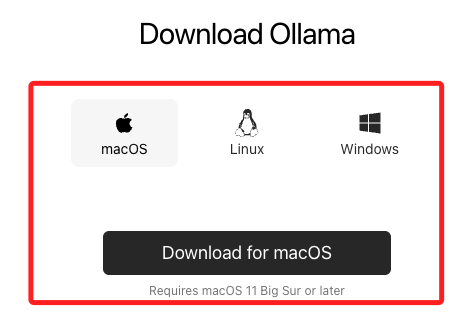
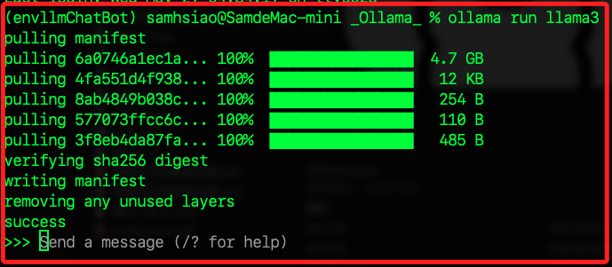
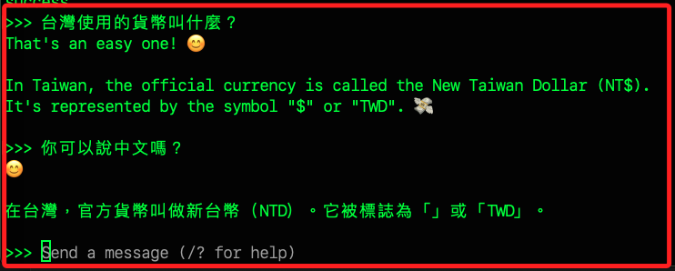
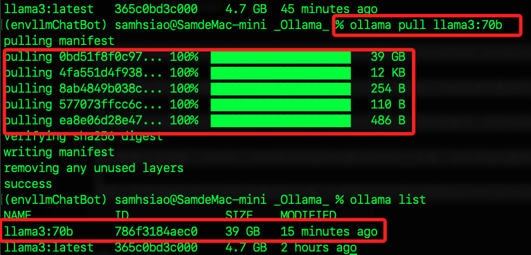
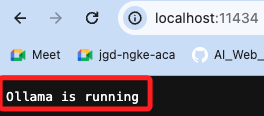

# 起手式

1. _Ollama_ 是一個開源軟體，可以在自己的硬體上運行的大型語言模型（`LLM`）服務。

2. 支援多種作業系統，也提供了 Docker 運行。

3. `Ollama` 將 `模型權重`、`配置` 和 `數據` 打包成一個由 `Modelfile` 定義的單一包，優化了設置和配置細節，包括 GPU 的使用。

<br>

## 參考資料

1. [官網](https://ollama.com/)。 

    

<br>

2. 建立帳號。 

    

<br>

3. 參考 `LangChain` 的 [官網說明](https://python.langchain.com/v0.1/docs/integrations/llms/ollama/)。

    

<br>

4. [下載](https://ollama.com/download/mac)

    

<br>

## 設置

_以下步驟設置並運行本地的 Ollama 實例_

<br>

1. [下載](https://ollama.com/download/mac) 並安裝 Ollama 到支持的平台，這裡是示範使用 MacOS。

<br>

2. 下載完成進行解壓縮，就會看到一個 `.app` 文件，運行後會提示移動到 `Applications`。

    

<br>

3. 開啟桌面應用。

    

<br>

4. 安裝命令行工具。

    

<br>

5. 完成。

    

<br>

6. 依照提示運行 `llama3` 模型。

    ```bash
    ollama run llama3
    ```

<br>

7. 會開始進行下載。

    

<br>

8. 完成後會顯示。

    

<br>

9. 可直接在終端機進行互動。

    

<br>

## 終端機操作

1. `ollama run` 運行模型，如果模型尚未下載，會自動先進行下載然後再運行；透過這個指令運行會先進行 `pulling manifest`，`manifest` 是模型的描述文件，包含模型的版本、依賴關係、大小等訊息，這需要花一點時間。

    ```bash
    ollama run llama3
    ```

<br>

2. `ollama pull` 下載 LLM 模型，如同前面的操作，執行指令後會將模型文件保存在系統中，使其可以隨時被調用；另外，`llama3` 屬於 `LLaMA` 聊天模型，啟動後可以使用 `ChatOllama` 界面，這包括系統消息和用戶輸入的特殊標記。

    ```bash
    ollama pull llama3
    ```

    

<br>

3. 假如要下載完整的 40GB 模型，可加入參數 `70b`。

    ```bash
    ollama pull llama3:70b
    ```

    

<br>

4. 列出本地下載的模型列表。

    ```bash
    ollama list
    ```

<br>

5. 運行中的模型。

    ```bash
    ollama ps
    ```

<br>

6. 停止並刪除運行中的模型，特別注意，這個指令不僅僅是關閉模型，還會徹底將模型從本地刪除。

    ```bash
    ollama rm <模型名稱>
    ```

<br>

7. 查詢下載路徑，模型預設會下載標記為 `最新` 和 `最小` 的版本，在 MacOS 上，模型將下載到 `~/.ollama/models` 資料夾中。

    ```bash
    ls ~/.ollama/models
    ```

<br>

## 模型互動方式

1. 終端機：所有本地模型會自動在端口 `localhost:11434` 啟動服務，透過終端機指令 `ollama run <模型名稱>` 可進行互動。

    

<br>

2. 使用 API：可透過如下指令向 Ollama 的 API 端點發送 `application/json` 請求。
    ```bash
    curl http://localhost:11434/api/generate -d '{
    "model": "llama3",
    "prompt":"Why is the sky blue?"
    }'
    ```

<br>

## 使用 Python 運行

1. 安裝套件。

    ```bash
    pip install langchain-community
    ```

<br>

2. 可在 Python 專案中結合 LangChain 使用 Ollama 聊天模型。

    ```python
    from langchain_community.llms import Ollama

    llm = Ollama(model="llama3")
    llm.invoke("Tell me a joke")
    ```

    _輸出如下_

    ```python
    "Here's one:\n\nWhy couldn't the bicycle stand up by itself?\n\n(wait for it...)\n\nBecause it was two-tired!\n\nHope that made you smile! Do you want to hear another one?"
    ```

<br>

3. 優化輸出格式。

    ```python
    from langchain_community.llms import Ollama

    # 初始化模型
    llm = Ollama(model="llama3")

    # 調用模型產生笑話
    response = llm.invoke("Tell me a joke")

    # 清理和格式化輸出，去掉多餘的換行
    cleaned_response = response.replace("\n\n", "\n").strip()

    # 將結果按行列印，讓輸出更易讀
    for line in cleaned_response.split("\n"):
        print(line)
    ```

    _優化的輸出如下_

    ```python
    Here's one:
    Why couldn't the bicycle stand up by itself?
    (wait for it...)
    Because it was two-tired!
    Hope that made you laugh!
    ```

<br>

4. 也可使用 `流式輸出`，僅需在專案中使用 `.stream(...)` 方法，以下範例展示使用繁體中文提問，並提示回答為繁體中文；特別注意，使用中文的時候，因為中英文在輸出時，對於單字間是否間隔並不相同，所以使用中文會有間隔問題。

    ```python
    from langchain_community.llms import Ollama

    # 初始化模型
    llm = Ollama(model="llama3")

    # 要請求的文本
    query = "請使用繁體中文，講一個笑話給我聽。"

    # 初始設定緩存變數來存儲輸出的內容
    buffer = ""

    # 流式處理每個塊（chunk）
    for chunk in llm.stream(query):
        # 移除首尾空白
        chunk = chunk.strip()  
        if chunk:
            # 如果緩存不為空且不以中文標點結尾且新塊不以標點開始，則添加空格（僅對非中文字元）
            if buffer and not buffer[-1].isspace() and not buffer[-1] in '，。？！：“”‘’；' and not chunk[0] in '，。？！：“”‘’；':
                print(" ", end='')  # 如果需要，手動添加空格
            
            # 輸出新接收到的文本塊
            print(chunk, end='', flush=True)
            # 更新緩存為最新的完整文本
            buffer = chunk  

    # 最後換行，讓終端顯示更整潔
    print()  
    ```

    _結果輸出如下_

    ```txt
    哈 哈！好！以下 是一 個 笑 話：有一 個人 去 醫 院 做 了 傷 口 檢 查，醫 生 說：「 你的 傷 口 很 嚴 重，我 們 需要 進行 手 術。」 那 人 問：「 手 術？我 不 太 高 興！」 醫 生 回答：「 不 高 興？這 是 醫 院 不是 夜 店！」 （ laughed ）
    ```

<br>

5. 進一步優化，在中文與英文答案使用不同格式。

    ```python
    from langchain_community.llms import Ollama
    import re

    # 初始化模型
    llm = Ollama(model="llama3")

    # 要請求的文本
    query = "請使用繁體中文，講一個笑話給我聽。"

    # 初始設定緩存變數來存儲輸出的內容
    buffer = ""

    # 定義正則表達式來檢查中文字元
    chinese_regex = re.compile(r'[\u4e00-\u9fff]')

    # 流式處理每個塊（chunk）
    for chunk in llm.stream(query):
        # 移除首尾空白
        chunk = chunk.strip()  
        if chunk:
            # 檢查是否應該添加空格
            if buffer:
                last_char = buffer[-1]
                first_char = chunk[0]
                
                # 判斷是否在非中文字元之間需要添加空格
                if not chinese_regex.match(last_char) and not chinese_regex.match(first_char):
                    print(" ", end='')

            # 輸出新接收到的文本塊
            print(chunk, end='', flush=True)
            
            # 更新緩存為最新的完整文本
            buffer = chunk  

    # 最後換行，讓終端顯示更整潔
    print()  
    ```

    _輸出如下_

    ```txt
    😄有一個學生問老師：「老師，你知道嗎？ 『貓』和『狗』的英文都是什麼？」老師回答：「 Ah , yes ! Cat is ' cat ' in English , and Dog is also ' dog ' in English ... 😊 」學生聽了後，說：「真的嗎？那麼『貓狗』的英文是什麼？」老師沉默了一下，然後說：「 Um ... I think it 's ... um ... ' me ow g '? 🐈 🐕 」
    ```

<br>

## 多模態

1. 所謂 `多模態` 是指這些模型可以處理不同類型的數據，包含文本、圖像、音頻等，`Ollama` 支持的多模態 `LLMs` 有 `Bakllava`、`Llava` 等，同樣是需要下載的。

    ```bash
    ollama pull bakllava
    ```

    

<br>

2. 跟 `llama3` 一樣是 `4.7 GB`。

    

<br>

3. 安裝套件。

    ```bash
    pip install streamlit
    ```

<br>

4. 多模態簡單範例。

    ```python
    import streamlit as st
    from langchain_community.llms import Ollama
    import base64

    # 初始化 Bakllava 模型
    bakllava_model = Ollama(model="bakllava")

    # Streamlit 標題
    st.title("多模態範例")
    st.write("這是 Streamlit 和 Bakllava 的多模態 LLM 應用範例。")

    # 上傳圖片
    uploaded_file = st.file_uploader(
        "選擇一個圖片文件", type=["jpg", "png", "jpeg"]
    )

    # 文本輸入
    user_input = st.text_input("文本輸入：", "")

    # 當用戶上傳圖像並輸入文本後進行處理
    if uploaded_file and user_input:
        with st.spinner("模型正在生成回應 ..."):
            # 讀取圖像
            image_data = uploaded_file.read()
            # 將圖像數據進行 base64 編碼
            image_data_encoded = base64.b64encode(image_data).decode("utf-8")

            # 使用 Bakllava 模型進行多模態推理
            try:
                response = bakllava_model.invoke(
                    input=user_input, image=image_data_encoded
                )
                # 顯示結果，確保是正確的文本格式
                response_text = (
                    response if isinstance(response, str) else response.decode("utf-8")
                )
                st.write(f"模型回應：{response_text}")
            except Exception as e:
                st.error(f"模型處理過程中出現錯誤：{e}")

    # 清除按鈕
    if st.button("清除"):
        st.experimental_rerun()

    ```

<br>

5. 運行腳本。

    ```bash
    streamlit run 腳本名稱.py
    ```

<br>

6. 點擊 `Browse files` 可以上傳相片。

    

<br>

7. 選取一張籃球架的相片然後上傳。

    

<br>

8. 提問 `What sport is the equipment in the photo used?`，感覺這模型有點笨，也或許是我的英文太差 >.<。

    

<br>

## 開發指引

_通過以下步驟來集成 Ollama 和 LangChain_

<br>

1. 設置環境：下載並配置需要的模型。

<br>

2. 整合模型到 LangChain，使用 LangChain 提供的 API 方法與模型進行互動，如 `invoke` 和 `stream`。

<br>

3. 程式碼

    ```python
    from langchain_community.llms import Ollama

    # 初始化模型
    llm = Ollama(model="llama3")

    # 直接調用模型
    response = llm.invoke("請說明中華民國為何退居台灣？請以繁體中文回答。")
    print(response)

    # 流式輸出
    query = "Tell me a joke"
    for chunk in llm.stream(query):
        print(chunk)
    ```

<br>

4. 結果。

    ```bash
    中華民國（Republic of China）於1949年將政府遷座（Government-in-Exile）到台灣，是因為以下幾個原因：

    一、中國大陸的共產黨政府建立：1949年，中共在中國大陸發動人民解放軍攻擊國民黨政權，導致國民黨政府敗退。這時候，中華民國政府認為自己已經失去大陸政權的控制權，因此決定將政府遷座到台灣。

    二、台灣成為民主政府的避難所：1949年，台灣成為了民主政府的避難所，是因為美國和其他西方國家認為台灣是自由世界的最後堡壘。這些國家希望中華民國政府能夠在台灣繼續存在，以抗衡共產黨中國大陸的影響。

    三、國際承認問題：1949年，中共政府已經在中國大陸控制了政權，並且開始向國際社會展開外交活動。這時候，中華民國政府感到自己的國際地位受到威脅，因為許多國家開始承認中共政府，而不是中華民國政府。

    因此，中華民國政府決定將政府遷座到台灣，以避免中共政府的控制和international recognition問題。這個決定的結果就是中華民國政府在1949年將政府遷座到台灣，並且繼續存在為一個國際社會承認的政府。
    ```

<br>

## 流式輸出

1. 將大型數據集或訊息分批處理和傳送，而不是一次性傳輸全部數據，這在處理大規模數據或需要實時輸出的情況下非常有用，因為它可以減少延遲並提高性能。

<br>

2. 在以上的腳本中使用 `llm.stream(query)` 代表從一個大型語言模型（如 `llm`）進行查詢，並以 `流` 的形式 `逐塊接收回應`，也就是切割為小塊逐個傳輸和處理數據，而不是一次性接收整個回應，如此可在傳輸的同時繼續處理數據，從而減少等待時間。

<br>

3. 範例程式碼。

    ```python
    # 流式輸出
    query = "請以繁體中文說明當前國際金融局勢。"

    # 向語言模型發送查詢，並請求以流的形式返回結果
    for chunk in llm.stream(query):
        print(chunk)
    ```

<br>

4. 輸出。

    ```bash
    **
    202
    3
    年
    的
    國際
    金融
    局
    勢
    **


    在
    
    202
    2
    年
    末
    ，
    全球
    經
    濟
    面
    臨
    著
    # 以下省略 ...
    ```

<br>

___

_END_