# Gemini Chat Bot

<br>

## 說明

1. 基於 `Google Cloud Function`，進一步結合 `LINE Bot` 與 `Google Gemini Pro API` 製作可記憶的聊天機器人，另外並使用 `Firebase` 作為資料儲存。

<br>

2. 這個機器人能夠處理文本消息和圖片消息，並將處理結果回傳給用戶。

<br>

## 使用

1. Python Cloud Function。

<br>

2. LINE Bot。

<br>

3. Google Gemini Pro。

<br>

4. Firebase Database。

<br>

## 建立本地專案

_先建立本地專案，如此若有敏感資訊也可以先寫入 .env 文件中做紀錄_

<br>

1. 建立專案資料夾 `_exGeminiBot_`，接著開啟 VSCode。

<br>

2. 建立四個文件 `requirements.txt`、`main.py`、`.env`、`.gitignore`；無論是否沿用前小節的資料夾，皆可直接運行以下指令。

    ```bash
    touch requirements.txt main.py .env .gitignore
    ```

<br>

3. 首先在 `.gitignore` 中將 `.env` 寫入，姑且不論之後是否進行本地部署或同步，這都是一個良好的習慣。

<br>

4. 編輯 `requirements.txt`。

    ```bash
    line-bot-sdk
    requests
    git+https://github.com/ozgur/python-firebase
    google.generativeai
    Pillow
    ```

<br>

5. 編輯 `.env` 文件，可將腳本中使用到的敏感資訊與常數設定都寫入，並在後續步驟中陸續將值填入；同樣的，無論之後是否直接部署，這些資訊皆可用於在其他服務中設定環境變數。

    ```json
    LINE_BOT_TOKEN=
    LINE_BOT_SECRET=
    GEMINI_API_KEY=
    FIREBASE_URL=
    CLOUD_FUNCTION_URL=
    ```

<br>

## 主腳本

1. 編輯主腳本 `main.py`。

    ```python
    from linebot import LineBotApi, WebhookHandler
    from linebot.models import TextSendMessage
    import json
    import os
    from firebase import firebase
    import google.generativeai as genai
    from PIL import Image

    # 使用環境變數讀取憑證
    token = os.getenv("LINE_BOT_TOKEN")
    secret = os.getenv("LINE_BOT_SECRET")
    firebase_url = os.getenv("FIREBASE_URL")
    gemini_key = os.getenv("GEMINI_API_KEY")


    # 初始化 Gemini Pro API
    genai.configure(api_key=gemini_key)


    def linebot(request):
        # 取得請求的原始數據並轉換為文本
        body = request.get_data(as_text=True)
        # 將文本數據轉換為 JSON 格式
        json_data = json.loads(body)
        try:
            # 建立 LineBotApi 實例以便與 LINE 平台互動
            line_bot_api = LineBotApi(token)
            # 建立 WebhookHandler 實例以處理 LINE 消息
            handler = WebhookHandler(secret)
            # 取得請求頭中的簽名
            signature = request.headers["X-Line-Signature"]
            # 驗證請求並處理消息
            handler.handle(body, signature)
            # 取得消息事件的第一個事件
            event = json_data["events"][0]
            # 取得回覆令牌
            tk = event["replyToken"]
            # 取得發送消息的用戶 ID
            user_id = event["source"]["userId"]
            # 取得消息類型
            msg_type = event["message"]["type"]
            # 建立 Firebase 應用實例
            fdb = firebase.FirebaseApplication(firebase_url, None)
            # 定義用戶聊天記錄的路徑
            user_chat_path = f"chat/{user_id}"
            # 註釋掉的用戶聊天狀態路徑
            # chat_state_path = f"state/{user_id}"
            # 從 Firebase 取得用戶的聊天記錄
            chatgpt = fdb.get(user_chat_path, None)

            # 假如是文本訊息
            if msg_type == "text":
                # 取得文字消息的文本內容
                msg = event["message"]["text"]

                if chatgpt is None:
                    # 如果沒有聊天記錄，建立空列表
                    messages = []
                else:
                    # 否則，使用已有的聊天記錄
                    messages = chatgpt

                if msg == "!清空":
                    # 如果消息是 "!清空"，回覆清空提示
                    reply_msg = TextSendMessage(text="對話歷史紀錄已經清空！")
                    # 刪除用戶的聊天記錄
                    fdb.delete(user_chat_path, None)
                else:
                    # 建立 Gemini Pro 模型
                    model = genai.GenerativeModel("gemini-pro")
                    # 將用戶消息加入聊天記錄
                    messages.append({"role": "user", "parts": [msg]})
                    # 使用 Gemini Pro 生成回覆
                    response = model.generate_content(messages)
                    # 將模型回覆加入聊天記錄
                    messages.append({
                        "role": "model",
                        "parts": [response.text]
                    })
                    # 將模型回覆轉換為 LINE 消息
                    reply_msg = TextSendMessage(text=response.text)
                    # 更新firebase中的對話紀錄
                    fdb.put_async(user_chat_path, None, messages)
                # 使用 LINE Bot API 發送回覆消息
                line_bot_api.reply_message(tk, reply_msg)

            elif msg_type == "image":
                # 接收到圖片消息
                print("接收到圖片消息")
                # 取得圖片消息的 ID
                message_id = event["message"]["id"]
                # 取得圖片內容
                message_content = line_bot_api.get_message_content(message_id)

                with open(f"{message_id}.jpg", "wb") as fd:
                    # 將圖片內容寫入文件
                    fd.write(message_content.content)

                # 打開圖片並轉換為 PIL 格式
                img = Image.open(f"{message_id}.jpg")

                # 定義生成圖片描述的提示
                prompt = "Please describe the image below:"
                # 建立 Gemini Pro Vision 模型
                model = genai.GenerativeModel("gemini-pro-vision")
                # 生成圖片描述
                response = model.generate_content(
                    [prompt, img],
                    stream=True
                )
                # 解決流式輸出
                response.resolve()

                # 將生成的圖片描述轉換為 LINE 消息
                reply_msg = TextSendMessage(text=response.text)

                # 發送回覆訊息
                line_bot_api.reply_message(tk, reply_msg)

            else:
                # 如果消息不是文字或圖片，回覆提示
                reply_msg = TextSendMessage(text="你發送的不是文字或圖片訊息喔！")
                # 使用 LINE Bot API 發送回覆消息
                line_bot_api.reply_message(tk, reply_msg)

        except Exception as e:
            detail = e.args[0]
            print(detail)
        # OK 表示處理完成
        return "OK"
    ```

<br>

## 建立 LINE Bot 帳號

1. 前往 [LINE Developer Console](https://developers.line.biz/console/)。

<br>

2. 建立一個新的 Messaging API Channel：取得 `Channel secret`、`Channel access token`。

<br>

## 設置 Firebase

1. 前往 [Firebase Console](https://console.firebase.google.com/)。

<br>

2. 建立或使用現有的 `Firebase 專案`，點選左側 `Realtime Database`；建立或使用現有的資料庫，並將 `安全規則 Rules` 設置為 `公開` 以便測試，設定參數如下。

    ```json
    {
        "rules": {
            ".read": true,
            ".write": true
        }
    }
    ```

<br>

3. 取得資料庫的 `URL`，位在 `Data` 頁籤下方，格式如 `https://<專案 ID>.firebaseio.com/`，複製後貼到 `.env` 中。

    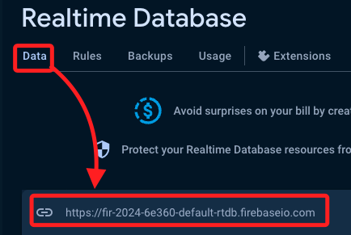

<br>

## 設置 Google Cloud Function

_延續之前步驟，服務已經啟用了_

<br>

1. 前往 [Google Cloud Console](https://console.cloud.google.com/)，選取 `API 和服務`。

    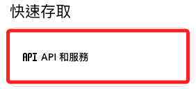

<br>

2. 點擊左上角 `三` 條線選單，假如 `Cloud Function` 還未被釘選，點擊最下方的 `查看所有產品`。

    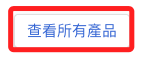

<br>

3. 在 `無伺服器` 分類中將其釘選並點擊進入。

    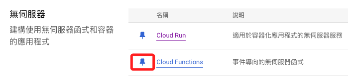

<br>

4. 比照之前的程序，先點擊 `+ 建立函式`。

    

<br>

5. 在 `基本設置` 頁面，分別設置 `函式名稱`、`地區`、`驗證`，其中將 Cloud Function 命名為 `linebot`，另外，可先將觸發條件中的 URL 先寫入本地的 `.env` 文件中，鍵名為 `CLOUD_FUNCTION_URL`。

    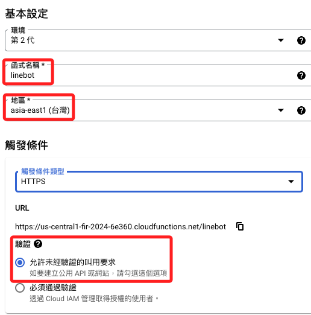

<br>

6. 展開 `執行階段環境變數`，點擊 `+ 新增變數`，將紀錄本地 `.env` 文件中的內容逐一寫入。

    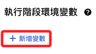

<br>

## 關於 Google Cloud 環境變數

1. `GEMINI_API_KEY`：這是 [Google AI Studio](https://aistudio.google.com/app/apikey) 的 `API Key`。

<br>

2. `LINE_BOT_TOKEN`、`LINE_BOT_SECRET`：這是 [LINE Developers](https://developers.line.biz/console/channel) 的 `Channel access token` 與 `Channel secret`。

<br>

3. `FIREBASE_URL`：這是 [Firebase Realtime Database](https://console.firebase.google.com/) 的 `URL`。

<br>

4. 其中 `CLOUD_FUNCTION_URL` 是要寫入 `Line Develops` 的 `Webhook`，這裡可省略。

    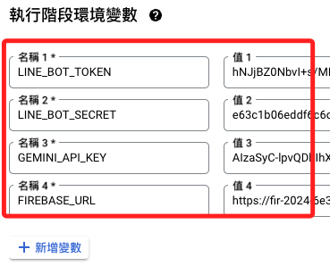

<br>

## 繼續 Cloud Function 設定

1. 接著點擊 `下一步` 進入設定畫面，先切換 `執行階段` 為 `Python 3.11`。

    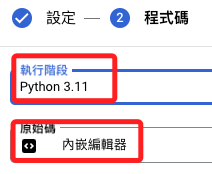

<br>

2. 修改 `requirements.txt`，將紀錄在本地文件的內容寫入。

    ```json
    line-bot-sdk
    requests
    git+https://github.com/ozgur/python-firebase
    google.generativeai
    Pillow
    ```

<br>

3. 修改`main.py` 腳本，同樣將本地的 `main.py` 複製貼上，並將上方的 `進入點` 改為 `linebot`；特別注意，這是腳本中的函數名稱，不是 `Cloud Function` 的名稱。

    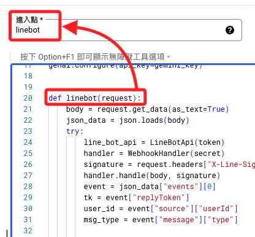

<br>

3. 點擊 `測試函數`。

    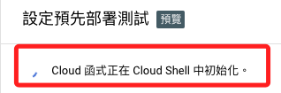

<br>

4. 左下角的終端畫面中會顯示準備及建置。

    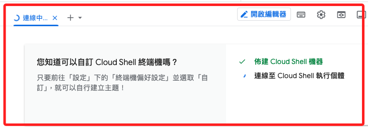

<br>

5. 過一陣子會顯示 `無法正常運作`。

    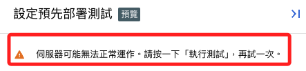

<br>

## 設定 Webhook

_再次測試之前，先設定 Webhook_

<br>

1. 回到 [LINE Developers](https://developers.line.biz/console/) 的  Console，在 `Messaging API` 頁籤中，將 `Webhook URL` 設為剛剛記錄的 `Cloud Function URL`。

    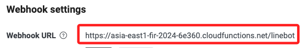

<br>

## 繼續回到 Cloud Function 設定

1. 再次測試，若跳出視窗則點擊 `授權` 即可。

    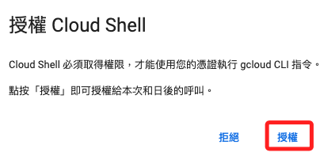

<br>

2. 過段時間會顯示如下訊息。

    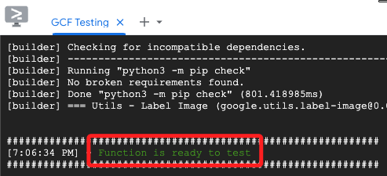

<br>

3. 點擊 `部署`。

    

<br>

4. 自動跳回主控台，通知會顯示環狀進度條。

    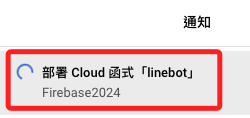

<br>

5. 等候部署完成會顯示。

    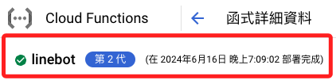

<br>

## 檢查 Webhook settings

1. 部署完成後，可回到 Line Developers 進行驗證。

    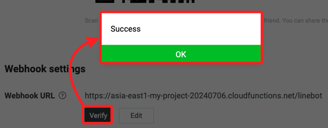

<br>

2. 透過 Line 聊天可詢問最新發生的問題，測試日期為 `2024/07/04`。

    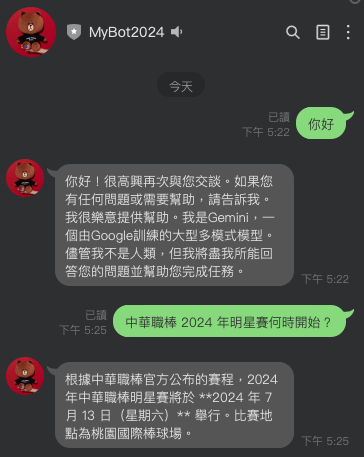


<br>

___

_END_