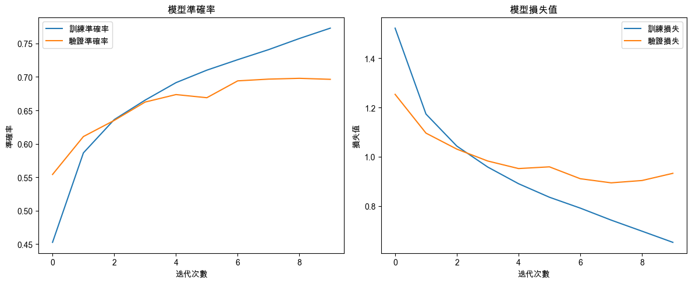

# 深度學習 III

_影像分類範例_

<br>

## 說明

1. 在深度學習的基礎範例中，除了房價預測和手寫數字識別外，另一個常見且重要的範例是影像分類。

<br>

2. 影像分類通常使用 `卷積神經網絡（Convolutional Neural Network, CNN）` 來處理和分類影像數據。

<br>

3. `CIFAR-10` 是一個常用的影像數據集，包括 `10` 個不同類別，如飛機、汽車、鳥、貓等的彩色影像，每個類別有 `6000` 張 `32x32` 像素的影像。

<br>

## 範例

_使用CIFAR-10數據集進行影像分類_

<br>

1. 以下範例展示使用深度學習框架 Keras 建立 CNN 進行影像分類。

    ```python
    import numpy as np
    import matplotlib.pyplot as plt
    from tensorflow.keras.datasets import cifar10
    from tensorflow.keras.models import Sequential
    from tensorflow.keras.layers import(
        Conv2D, MaxPooling2D, Flatten, Dense
    )
    from tensorflow.keras.utils import to_categorical

    # 讀取 CIFAR-10 數據集
    (X_train, y_train), (X_test, y_test) = cifar10.load_data()

    # 資料標準化（將影像像素值從0-255縮放到0-1範圍內）
    X_train = X_train.astype('float32') / 255.0
    X_test = X_test.astype('float32') / 255.0

    # 將類別標籤進行One-hot編碼
    y_train = to_categorical(y_train, 10)
    y_test = to_categorical(y_test, 10)

    # 建立卷積神經網絡模型
    model = Sequential()

    # 第一個卷積層和池化層
    model.add(
        Conv2D(32, (3, 3),
        activation='relu',
        # 32個3x3卷積核
        input_shape=(32, 32, 3))
    )
    # 2x2的池化層
    model.add(MaxPooling2D((2, 2)))  

    # 第二個卷積層和池化層
    model.add(
        # 64個3x3卷積核
        Conv2D(64, (3, 3), activation='relu')
    )
    # 2x2的池化層
    model.add(MaxPooling2D((2, 2)))

    # 展平層和全連接層
    # 將多維特徵圖展平為一維向量
    model.add(Flatten())
    # 全連接層
    model.add(Dense(64, activation='relu'))
    # 輸出層使用softmax進行10類分類
    model.add(Dense(10, activation='softmax'))

    # 編譯模型
    model.compile(
        optimizer='adam',
        loss='categorical_crossentropy',
        metrics=['accuracy']
    )

    # 訓練模型
    history = model.fit(
        X_train, y_train,
        epochs=10, batch_size=64,
        validation_data=(X_test, y_test)
    )

    # 預測測試集中的影像分類
    y_pred = model.predict(X_test)

    # 可視化訓練過程中的準確率和損失值變化
    plt.figure(figsize=(12, 5))

    # 準確率（Accuracy）可視化
    plt.subplot(1, 2, 1)
    plt.plot(history.history['accuracy'], label='訓練準確率')
    plt.plot(history.history['val_accuracy'], label='驗證準確率')
    plt.title('模型準確率')
    plt.xlabel('迭代次數')
    plt.ylabel('準確率')
    plt.legend()

    # 損失值（Loss）可視化
    plt.subplot(1, 2, 2)
    plt.plot(history.history['loss'], label='訓練損失')
    plt.plot(history.history['val_loss'], label='驗證損失')
    plt.title('模型損失值')
    plt.xlabel('迭代次數')
    plt.ylabel('損失值')
    plt.legend()

    plt.tight_layout()
    plt.show()

    # 評估模型性能
    test_loss, test_acc = model.evaluate(X_test, y_test)
    print(f'測試集上的準確率：{test_acc:.2f}')
    ```

    

<br>

## 範例步驟簡介

1. 使用 Keras 提供的 `cifar10.load_data()` 函數讀取 `CIFAR-10` 數據集，將影像數據標準化，從 `0-255` 縮放到 `0-1` 範圍內，這有助於加快神經網絡的訓練，然後將類別標籤進行`One-hot` 編碼，以便神經網絡進行多類別分類。

<br>

2. 使用 `Sequential` 模型來構建一個簡單的卷積神經網絡，先添加兩個卷積層（Conv2D）和池化層（MaxPooling2D）來提取影像特徵。再添加一個展平層（Flatten）將多維特徵圖轉為一維向量，然後是全連接層（Dense）。最後一層是 `Softmax` 激活的全連接層，用於輸出 `10`個類別的機率。

<br>

3. 編譯模型時使用 `adam` 優化器和 `categorical_crossentropy` 損失函數。訓練模型並保存訓練過程中的準確率和損失值，以便後續可視化。

<br>

___

_END_

