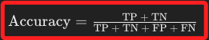
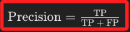
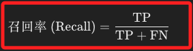
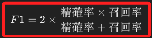
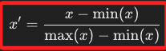
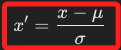

# 機器學習的重要觀念

 

## 準確率（Accuracy）

1. 在 `所有樣本` 中，模型 `正確預測` 的比例；適用於類別分佈均衡的情況。

2. 公式。

    

 

## 精確率（Precision）

1. 在模型 `預測為正例的樣本` 中，`實際為正例` 的比例；適用於關注假陽性數量的情況，如垃圾郵件檢測。

2. 公式。

    

 

## 召回率（Recall）

1. 召回率表示實際為正類的樣本中被模型正確預測為正類的比例。

2. 公式。 

    

 

## F1分數（F1 Score）

1. 精確率和召回率的調和平均，平衡這兩者的權重；適用於需要平衡精確率和召回率的情況。

2. 公式。

    

 

## AUC-ROC 曲線

_Area Under Curve - Receiver Operating Characteristic_

 

1. ROC 曲線下的面積，用於衡量分類模型的區分能力；AUC 接近 1 表示模型具有良好的區分能力，0.5 表示效果與隨機猜測相同。

2. 適用於評估分類模型的整體性能，特別是當類別不平衡時。

 

## `過度擬合（Overfitting）` 與 `擬合不足（Underfitting）`

1. 過度擬合是指模型在訓練數據上表現良好，但在測試數據上表現不佳，因為它過度擬合了訓練數據中的噪聲或細節，此時可使用正則化、交叉驗證、增加數據量、簡化模型等方式排除。

2. 相反的，當模型過於簡單，無法捕捉訓練數據中的模式或結構，因此在訓練和測試數據上都表現不佳時屬於擬合不足，可透過增加模型複雜度、選擇更適合的模型、增加特徵等排除。

 

## 交叉驗證（Cross-Validation）

1. 將數據集分成多個子集，依次使用其中一個子集作為測試集，其他子集作為訓練集，反覆多次驗證模型性能。

2. 主要用於防止過度擬合和更可靠地評估模型的泛化能力。

 

## 正則化（Regularization）

1. 在模型中引入懲罰項以防止過擬合，常見的有 `L1 正則化（Lasso）`和 `L2 正則化（Ridge）`。

 

## 特徵縮放（Feature Scaling）

1. 將特徵值縮放到一個特定範圍，如 `0 到 1` 或 `-1 到 1`，用以提高模型訓練效率和性能。

2. 常用的有標準化（Standardization）和最小-最大縮放（Min-Max Scaling）。

 

## 梯度下降（Gradient Descent）

1. 這是個優化算法，用於通過最小化損失函數來更新模型參數，直到找到最優解。

2. 有批量梯度下降（Batch Gradient Descent）、隨機梯度下降（Stochastic Gradient Descent, SGD）和小批量梯度下降（Mini-Batch Gradient Descent）。

 

## 歸ㄧ化

_Normalization_

 

1. 是機器學習和深度學習中常用的數據預處理步驟，目的是將不同特徵的數據值縮放到相同的範圍內，通常是 `[0, 1] ` 或 `[-1, 1]`。

2. 歸一化在處理不同尺度的特徵時尤為重要，例如，當數據集中的特徵值範圍相差很大時，歸一化可以有效地改善模型的性能。

3. 通過將特徵數據縮放到相同範圍內，可減少 `梯度下降` 過程中的振蕩，從而加快模型的收斂速度。

4. 對於使用梯度下降等數值方法的模型，歸一化有助於避免數值上的不穩定性。

5. 將數據縮放到 [0, 1] 範圍內也稱為 `Min-Max 歸一化`，公式如下。

    

 

6. 另外，可將數據轉換為平均數為 `0`、標準差為 `1` 的數據集合，稱為 `Z-score 標準化`，公式如下。

    

 

___

_未完_