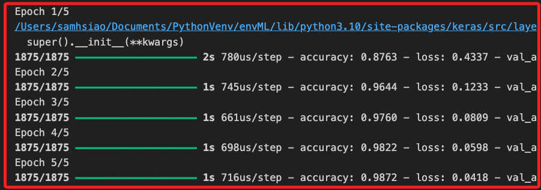
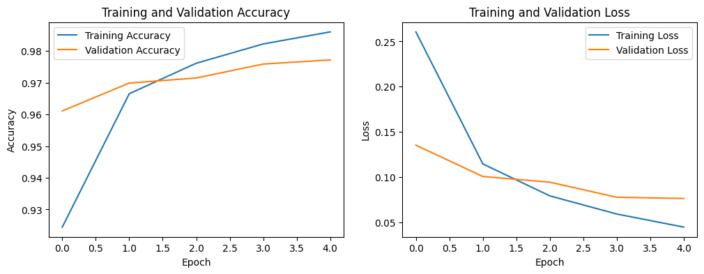
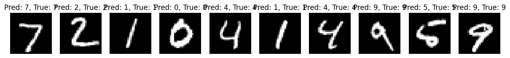
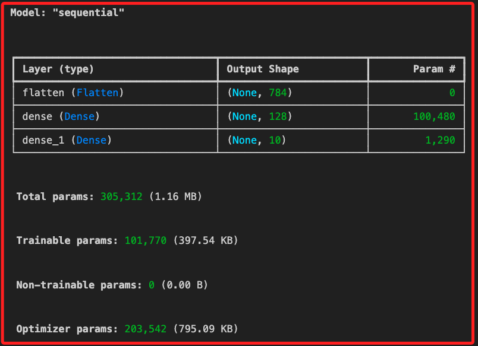

# 深度學習

_從簡單的範例開始，使用 `Keras` 構建一個 `多層感知機（MLP, Multi-Layer Perceptron）` 來解決分類問題_

<br>

## 準備工作

1. 安裝必要套件，其中 `TensorFlow` 包含了 `Keras`，這是深度學習的框架，而 `Matplotlib` 用於數據可視化的庫。

    ```bash
    pip install tensorflow matplotlib
    ```

<br>

## 範例

1. 以下範例中使用基於 `TensorFlow` 的高階 API 的 `Keras` 來構建一個 `MLP` 模型，該模型將被訓練來分類常用的 `手寫數字 MNIST數據集`，這個數據集包含了 `28x28` 像素的手寫數字圖片（0-9）共 `10` 個類別。

    ```python
    # 導入必要庫
    import tensorflow as tf
    # 模型構建函數，用於建構逐層堆疊的神經網路模型
    from tensorflow.keras.models import Sequential
    # Dense 層是全連接層
    # Flatten 層用於將多維輸入展平為一維向量
    from tensorflow.keras.layers import Dense, Flatten
    # 數據集
    from tensorflow.keras.datasets import mnist
    import matplotlib.pyplot as plt

    # 加載MNIST數據集
    (X_train, y_train), (X_test, y_test) = mnist.load_data()

    # 數據預處理
    # 將像素值歸一化到0-1之間，並確保數據類型為float32
    X_train = X_train.astype('float32') / 255.0
    # 將像素值歸一化到0-1之間，並確保數據類型為float32
    X_test = X_test.astype('float32') / 255.0


    # 構建MLP模型
    model = Sequential([
        # 將28x28的圖片攤平為784維的向量
        Flatten(input_shape=(28, 28)),
        # 第一個全連接層，有128個神經元，使用ReLU激活函數
        Dense(128, activation='relu'),
        # 第二個全連接層是輸出層
        # 有10個神經元，對應10個類別，使用Softmax激活函數
        Dense(10, activation='softmax')
    ])

    # 編譯模型
    model.compile(
        optimizer='adam',
        loss='sparse_categorical_crossentropy',
        metrics=['accuracy']
    )

    # 訓練模型
    history = model.fit(
        X_train, y_train,
        epochs=5,
        validation_data=(X_test, y_test)
    )

    # 可視化訓練過程
    def plot_training_history(history):
        plt.figure(figsize=(12, 4))

        # 準確率圖
        plt.subplot(1, 2, 1)
        plt.plot(
            history.history['accuracy'],
            label='Training Accuracy'
        )
        plt.plot(
            history.history['val_accuracy'],
            label='Validation Accuracy'
        )
        plt.title('Training and Validation Accuracy')
        plt.xlabel('Epoch')
        plt.ylabel('Accuracy')
        plt.legend()

        # 損失圖
        plt.subplot(1, 2, 2)
        plt.plot(
            history.history['loss'],
            label='Training Loss'
        )
        plt.plot(
            history.history['val_loss'],
            label='Validation Loss'
        )
        plt.title('Training and Validation Loss')
        plt.xlabel('Epoch')
        plt.ylabel('Loss')
        plt.legend()

        plt.show()

    # 調用函數可視化訓練歷史
    plot_training_history(history)

    # 評估模型
    test_loss, test_acc = model.evaluate(
        X_test, y_test, verbose=2
    )
    print(f"Test Accuracy: {test_acc * 100:.2f}%")

    # 可視化部分測試數據的預測結果
    def plot_sample_predictions(
        model, X_test, y_test, num_samples=10):
        # 取得模型的預測結果
        predictions = model.predict(X_test)
        plt.figure(figsize=(15, 5))

        for i in range(num_samples):
            plt.subplot(1, num_samples, i + 1)
            # 顯示手寫數字圖像
            plt.imshow(X_test[i], cmap='gray')
            plt.title(f"Pred: {predictions[i].argmax()}, True: {y_test[i]}")  # 顯示預測標籤和真實標籤
            plt.axis('off')

        plt.show()

    # 調用函數可視化測試數據的預測結果
    plot_sample_predictions(model, X_test, y_test)
    ```

<br>

1. 會先看到訓練的過程。

    

<br>

3. 訓練結果。

    

<br>

4. 判斷，中間僅出現一次錯誤。

    

<br>

## 代碼詳細說明

1. 範例使用 `mnist.load_data()` 來加載 MNIST 數據集，這個數據集包含在 Keras 庫中，訓練前將數據集的像素值進行歸一化，也就是將 `0-255` 的值轉換到 `0-1`，以便於神經網絡更快地收斂。

<br>

2. 模型構建部分，使用 `Sequential` 模型來構建一個簡單的多層感知機（MLP），第一層是 `Flatten` 層，將 `28x28` 的圖片展平為 `784` 維的向量；第二層是 `隱藏層（Dense）`，有 `128`個神經元，激活函數使用 `ReLU`，最後一層是 `輸出層`，有 `10` 個神經元，對應於 `0-9` 的手寫數字類別，激活函數使用 `Softmax`。

<br>

3. 模型的編譯使用了 Adam 優化器。使用 `sparse_categorical_crossentropy` 作為損失函數，適合多類別分類問題。設定評估指標為準確率（`accuracy`）。

<br>

4. 模型訓練使用 `fit()` 函數進行模型訓練，並記錄訓練歷史。

<br>

5. 在可視化分析部分，準確率和損失圖展示模型在訓練和驗證數據集上的準確率和損失隨著訓練輪數（epochs）的變化。如果訓練和驗證準確率持續增長且最終接近，並且損失減小，則模型訓練效果較好。

<br>

## 模型資訊

1. 若要查看模型細節，可使用 Keras 中的 `model.summary()` 方法，這個方法會輸出模型的架構，包括每一層的名稱、輸出形狀、參數數量等訊息，便於了解模型的結構和參數量；在模型建立後任意處添加以下代碼即可。

    ```python
    # 查看模型架構
    model.summary()
    ```

<br>

2. 輸出資訊如下，其中形狀（Output Shape）就是將輸入展平為一為向量，例如 `(None, 784)` 就是將 28x28 像素的圖像展平成 784 維的一維向量，None 表示批次大小可以是任意的；`Param` 表示每一層中可訓練參數的總數量，`Flatten 層` 不涉及任何學習參數，因此其參數數量為 `0`。

    

<br>

3. `dense` 是一個 `全連接層（隱藏層）`，輸出形狀的 `128` 表示每個輸入樣本將被轉換成一個 128 維的向量，也就是有 128 個神經元，這個數字是在設計模型時手動設定的，不是通過計算得出的；Param 有 `100,480` 個，計算式是 `(784 + 1) * 128 = 100,480`，`加上 1` 是因為每個神經元還有一個 `偏置參數 bias`。

<br>

4. `dense_1` 是輸出層，有 10 個神經元，對應於 10 個類別，也就是手寫數字的 `0~9`，參數 `1,290` 計算式為 `(128 + 1) * 10 = 1,290`

<br>

5. 其中模型參數總量是 `Trainable params: 101,770`，而 `Total params: 305,312` 是模型參數加上優化器參數 `Optimizer params: 203,542` 的總量；特別注意，因為優化器參數的計算涉及到內部算法的實現細節，例如 `Adam` 優化器中的動量和二階動量計算，所以用戶是無法查看的，根本原因很多原，例如框架的抽象設計、性能考量，或是基於優化模型的一致性與穩定性而拒絕了用戶的訪問與修改等。

<br>

___

_END_