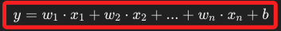
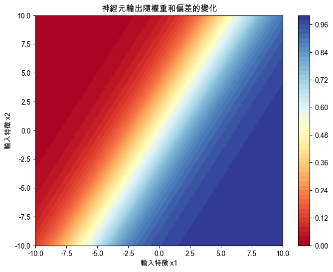

# 權重與偏差

_`Weights` & `Bias`，在神經網絡中，權重和偏差是兩個核心概念_

<br>

##  權重

1. 權重是用於控制輸入特徵對神經元輸出的影響，權重的數值決定了每個輸入特徵的重要性；例如，在一個簡單的神經元中，輸入特徵乘以各自的權重後再求和，這個和將決定神經元的輸出。

<br>

2. 在神經網絡中，權重是 `隨機初始化` 的，隨著訓練過程的進行，這些權重會被調整，以最小化預測錯誤，也就是 `最小化損失`。

<br>

## 偏差

1. 偏差是另一個 `可訓練` 的參數，它的作用是幫助模型在沒有輸入信號的情況下進行激活；偏差允許模型在初始狀態時有一個偏移量，以便模型能更好地擬合數據。

<br>

## 數學表示

1. 公式。

    

<br>

2. 參數說明。

    

<br>

## 範例

1. 程式碼。

    ```python
    import numpy as np
    import matplotlib.pyplot as plt

    # 設定支持中文的字體，避免顯示錯誤
    plt.rcParams['font.sans-serif'] = ['Arial Unicode MS']
    # 用來正常顯示負號
    plt.rcParams['axes.unicode_minus'] = False

    # 定義激活函數（例如 Sigmoid 函數）
    def sigmoid(x):
        return 1 / (1 + np.exp(-x))

    # 計算神經元輸出
    def neuron_output(weights, bias, inputs):
        # 輸入乘以權重並加上偏差
        # 使用 NumPy 的 `dot` 函數計算輸入和權重的內積
        # 然後加上偏差，再經過激活函數的處理得到最終輸出
        linear_combination = np.dot(weights, inputs) + bias
        # 使用 Sigmoid 函數作為激活函數
        # 將線性組合的結果轉換為非線性輸出
        output = sigmoid(linear_combination)
        return output

    # 假設有兩個輸入特徵 x1 和 x2
    x1 = np.linspace(-10, 10, 100)
    x2 = np.linspace(-10, 10, 100)

    # 建立一個網格，用於計算輸出
    X1, X2 = np.meshgrid(x1, x2)
    inputs = np.array([X1.ravel(), X2.ravel()])

    # 設定初始的權重和偏差
    # 權重 w1 和 w2
    weights = np.array([0.5, -0.3])
    # 偏差 b
    bias = 0.1

    # 計算網格中每個點的輸出
    outputs = neuron_output(weights, bias, inputs)
    outputs = outputs.reshape(X1.shape)

    # 可視化輸出
    plt.figure(figsize=(8, 6))
    # 使用 `contourf` 函數繪製神經元輸出的等高線圖
    # 顯示輸入特徵變化對神經元輸出的影響
    plt.contourf(
        X1, X2, outputs, cmap='RdYlBu', levels=50
    )
    plt.colorbar()
    plt.title('神經元輸出隨權重和偏差的變化')
    plt.xlabel('輸入特徵 x1')
    plt.ylabel('輸入特徵 x2')
    plt.show()
    ```

<br>

2. 可視化。

    

<br>

___

_END_