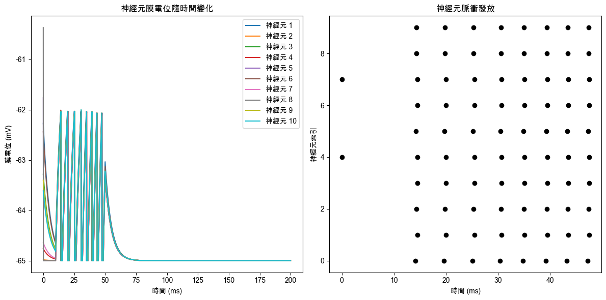
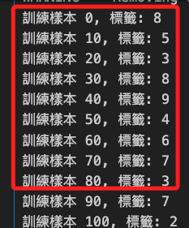
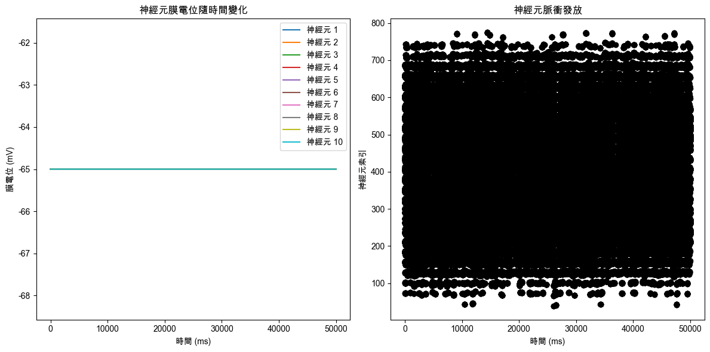

# SNN

_脈衝神經網絡，Spiking Neural Networks_

## 說明

1. SNN 是一種受到生物神經系統啟發的計算模型，在機器學習中用於處理 `時序數據` 和 `事件驅動` 的應用場景。

<br>

2. 安裝必要的 Python 套件 `Brian2`，這是專為 SNN 模擬設計的 Python 庫，它提供了強大的工具集，用於進行神經科學研究中的神經動力學模擬。

    ```bash
    pip install brian2
    ```

<br>

3. 在以下的模擬中，設置一個簡單的 `LIF（Leak Integrate-and-Fire）` 模型，其中時間常數（`tau`） 影響膜電位變化的速度，時間常數越小，膜電位變化越快；靜息膜電位（`v_rest`） 和重置膜電位（`v_reset`）決定了神經元在無刺激和脈衝發放後的狀態；膜電位閾值（`v_thresh`）一旦達到，神經元就會發放脈衝；在不應期（`refractory_period`）內，神經元無法再次發放脈衝，這模擬了生物神經元的脈衝發放後的恢復期。

<br>

4. 簡單說，在這個模擬中觀察了隨著時間變化的神經元膜電位以及脈衝發放的情況，可以看到當電流輸入強度足夠時，神經元膜電位會上升並超過閾值，隨後發放脈衝。

<br>

## 範例

1. 以下範例使用 Brian2 模擬一個基本 SNN。

    ```python
    import numpy as np
    import matplotlib.pyplot as plt
    from brian2 import *

    # 設定支持中文的字體，避免顯示錯誤
    plt.rcParams['font.sans-serif'] = ['Arial Unicode MS']
    # 用來正常顯示負號
    plt.rcParams['axes.unicode_minus'] = False

    # 設定仿真參數，這裡開始一個新的仿真環境
    start_scope()

    # 定義神經元模型參數
    # 時間常數，決定了膜電位變化的速度
    tau = 5 * ms
    # 靜息膜電位，神經元未受刺激時的電位
    v_rest = -65 * mV
    # 重置膜電位，每次脈衝發放後的電位
    v_reset = -65 * mV
    # 膜電位閾值，達到此電位時神經元發放脈衝
    v_thresh = -62 * mV
    # 不應期，在這段時間內神經元無法再次發放脈衝
    refractory_period = 1 * ms
    # 電阻，用於將電流轉換為電壓
    R = 1 * Mohm

    # 定義輸入電流，這裡使用定時電流陣列來刺激神經元
    input_current = TimedArray(
        np.array([0, 5, 5, 6, 6.5, 0]) * nA,
        dt=10*ms
    )

    # 定義神經元模型的微分方程
    # dv/dt 表示膜電位的變化率，受靜息電位、外部電流的影響
    eqs = '''
    dv/dt = (v_rest - v) / tau + (R * input_current(t)) / tau : volt (unless refractory)
    '''

    # 建立神經數組，包含 10 個神經元，應用上面定義的動力學方程
    neuron_group = NeuronGroup(
        10, 
        model=eqs, 
        threshold='v > v_thresh', 
        reset='v = v_reset', 
        refractory=refractory_period, 
        method='exact'
    )

    # 設置神經元的初始膜電位為靜息膜電位加上一點隨機偏移，模擬生物神經元的多樣性
    neuron_group.v = v_rest + (np.random.rand(10) * 5) * mV

    # 建立監視器來記錄神經元膜電位隨時間的變化
    state_monitor = StateMonitor(neuron_group, 'v', record=True)
    # 建立脈衝監視器來記錄神經元的脈衝發放事件
    spike_monitor = SpikeMonitor(neuron_group)

    # 運行仿真 200 毫秒
    run(200 * ms)

    # 可視化結果
    plt.figure(figsize=(12, 6))

    # 圖1: 顯示神經元膜電位隨時間變化的曲線
    plt.subplot(121)
    plt.title('神經元膜電位隨時間變化')
    plt.xlabel('時間 (ms)')
    plt.ylabel('膜電位 (mV)')
    for i in range(10):
        plt.plot(
            state_monitor.t/ms, 
            state_monitor.v[i]/mV, 
            label=f'神經元 {i+1}'
        )
    plt.legend()

    # 圖2: 顯示神經元脈衝發放事件
    plt.subplot(122)
    plt.title('神經元脈衝發放')
    plt.xlabel('時間 (ms)')
    plt.ylabel('神經元索引')
    plt.plot(spike_monitor.t/ms, spike_monitor.i, 'ok')

    plt.tight_layout()
    plt.show()
    ```

<br>

2. 結果。

    

<br>

## 應用範圍

_基於 SNN 的模擬可以應用於多種場景_

<br>

1. 時序數據處理：如語音識別、手勢識別等需要處理連續時間數據的任務。

<br>

2. 事件驅動計算：用於感知和反應事件的智能設備中，特別適合嵌入式和物聯網設備。

<br>

3. 神經科學研究：模擬和分析生物神經系統的行為，以更好地理解大腦功能。

<br>

## 基於 SNN 在 MNIST 上的應用

1. 代碼。

    ```python
    import numpy as np
    import matplotlib.pyplot as plt
    from brian2 import *
    from torchvision import datasets, transforms
    # 導入 DataLoader
    from torch.utils.data import DataLoader
    # 可用於限制數據集大小
    from torch.utils.data import Subset

    # 設定支持中文的字體，避免顯示錯誤
    plt.rcParams['font.sans-serif'] = ['Arial Unicode MS']
    # 用來正常顯示負號
    plt.rcParams['axes.unicode_minus'] = False

    # 設定仿真參數
    start_scope()

    # 參數設置
    # 時間常數
    tau = 10 * ms
    # 靜息膜電位
    v_rest = -65 * mV
    # 重置膜電位
    v_reset = -65 * mV
    # 調整的膜電位閾值
    v_thresh = -50 * mV
    # 不應期
    refractory_period = 5 * ms
    # 電阻，用於將電流轉換為電壓
    R = 1 * Mohm
    # 每個輸入脈衝的持續時間
    # 減少輸入脈衝的持續時間可加快速度
    input_duration = 50 * ms

    # 設置脈衝轉換為電流的比例常數（例如 1 Hz = 1 nA）
    # 這裡可以調整轉換比例
    spike_to_current = 1 * nA

    # 載入 MNIST 數據集
    transform = transforms.Compose([
        transforms.ToTensor(),
        # 展平圖像
        transforms.Lambda(lambda x: x.view(-1))
    ])

    # 數據集
    mnist_train = datasets.MNIST(
        root='./data', 
        train=True, 
        transform=transform, 
        download=True
    )
    # 限制數據集大小，例如只使用前 1000 個樣本
    mnist_subset = Subset(
        mnist_train, range(1000)
    )
    data_loader = DataLoader(
        mnist_train,
        # 增大批次大小可加快速度
        batch_size=1, 
        shuffle=True
    )

    # 定義神經元模型的微分方程
    eqs = '''
    dv/dt = (v_rest - v) / tau + (R * I) / tau : volt (unless refractory)
    I : amp  # 電流作為外部輸入
    '''

    # 建立神經數組
    neuron_group = NeuronGroup(
        784, 
        model=eqs, 
        threshold='v > v_thresh', 
        reset='v = v_reset', 
        refractory=refractory_period, 
        method='exact'
    )

    # 設置初始膜電位
    neuron_group.v = v_rest

    # 建立監視器
    state_monitor = StateMonitor(
        neuron_group, 
        'v', 
        record=True
    )
    spike_monitor = SpikeMonitor(neuron_group)

    # 訓練神經網絡
    for epoch in range(1):  # 訓練一個 epoch
        for i, (images, labels) in enumerate(data_loader):
            # 限制訓練樣本數量可壓縮訓練耗時
            if i >= 1000:
                break

            images = images.numpy().flatten()

            # 將圖像數據轉換為脈衝頻率
            # 假設最大像素值為 1，轉換為脈衝頻率
            spike_rates = images * 50 * Hz

            # 將脈衝頻率轉換為電流
            # 轉換為每秒脈衝所對應的電流
            input_currents = (spike_rates / Hz) * spike_to_current

            # 設置外部電流
            neuron_group.I = input_currents

            # 運行 SNN 模擬
            run(input_duration)

            # 輸出一些訊息
            if i % 100 == 0:
                print(f'訓練樣本 {i}, 標籤: {labels.item()}')

            # 休息一下，重置電壓
            neuron_group.v = v_rest

            # 在這裡可以加入基於脈衝的學習規則（例如 STDP）
        
        # 每個 epoch 結束後可以評估模型性能
        print(f'Epoch {epoch+1} 完成')

    # 可視化結果
    plt.figure(figsize=(12, 6))

    plt.subplot(121)
    plt.title('神經元膜電位隨時間變化')
    plt.xlabel('時間 (ms)')
    plt.ylabel('膜電位 (mV)')
    for i in range(10):
        plt.plot(
            state_monitor.t/ms, 
            state_monitor.v[i]/mV, 
            label=f'神經元 {i+1}'
        )
    plt.legend()

    plt.subplot(122)
    plt.title('神經元脈衝發放')
    plt.xlabel('時間 (ms)')
    plt.ylabel('神經元索引')
    plt.plot(spike_monitor.t/ms, spike_monitor.i, 'ok')

    plt.tight_layout()
    plt.show()
    ```

<br>

2. 關於以下的警告訊息，內容表示 Brian2 在生成 C++ 代碼時發現 -march=native 這個編譯器標誌不被當前的編譯器支持，因此已自動移除該標誌；這可能是由於 Brian2 內部設置了這個標誌來優化代碼，但由於某些原因如平台、編譯器版本等因素不被支持，所以它被移除，而這個警告通常不會影響程序的正常運行，但可能會使生成的代碼性能略低。

    ```json
    WARNING Removing unsupported flag '-march=native' from compiler flags. [brian2.codegen.cpp_prefs]
    ```

<br>

3. 關於以下警告訊息，主要是提醒要正確管理仿真對象，確保它們被 Brian2 正確使用。通過將所有的仿真對象明確地添加到一個 Network 中，可以避免這些警告，並保證仿真能夠按預期運行。

    ```json
    WARNING    The object 'neurongroup' is getting deleted, but was never included in a network. This probably means that you did not store the object reference in a variable, or that the variable was not used to construct the network.
    The object was created here (most recent call only):
    File '/var/folders/vm/_zft15050r7cfh47y6v5z4k40000gn/T/ipykernel_74055/3363387120.py', line 46, in <module>
        neuron_group = NeuronGroup( [brian2.core.base.unused_brian_object]
    ```

<br>

4. 在訓練進度訊息 中，`訓練樣本 X、標籤: Y` 表示正在處理來自於 MNIST 數據集樣本的第 X 個訓練樣本，其對應的真實標籤為 Y，數據集中的每個樣本是一個 28x28 的灰度圖像，表示手寫數字（0-9）；模型正在按照預期逐個處理數據樣本，並且在每 100 個樣本會輸出一次進度，以便於用戶了解訓練狀態；若無特殊設定，模型會訓練到所有 `60,000` 個 MNIST 訓練樣本，或透過如上代碼來限制訓練的規模。

    

<br>

5. 當前結果，特別注意，這樣的結果並不符合預期。

    

<br>

6. 另外，當前的腳本訓練出的模型並不能直接被儲存和再利用，因為並沒有實現任何形式的權重更新或學習規則，它只是在運行脈衝神經網絡的模擬，沒有持久化的學習參數，因此訓練結果無法儲存為可重用的模型文件；如果需要儲存並重新利用模型，需要實現突觸權重更新和儲存網絡狀態的功能。

<br>

___

_未完_