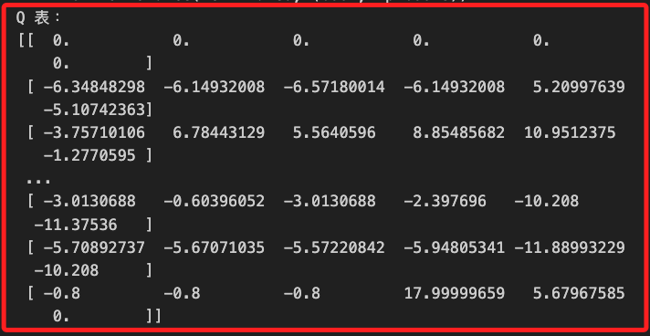
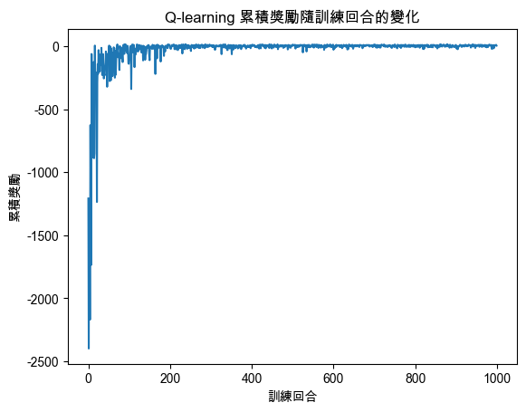

# Q-learning

_`Q-learning` 是一種 `無模型` 的強化學習算法，用於在給定環境中學習最佳策略，通過反覆試探和環境互動找到一個策略，使得在每個狀態下選擇行動時獲得的累積獎勵最大化。_

<br>

## 說明

1. `Q-learning` 通過學習 Q 值函數來實現決策，這個 `Q 值` 表示在給定狀態下採取某一行動後，能夠得到的最大累積回報。

<br>

2. Q-learning 適用於不同的強化學習場景，如遊戲 AI、機器人導航等，它在計算上相對簡單，適合離散的狀態和行動空間。

<br>

## 範例

1. 以下使用 `OpenAI Gym` 庫中的 `Taxi-v3` 環境來實現 Q-learning。這個環境的目標是讓出租車接到乘客並將其送至目的地，具有離散的狀態和行動空間。

    ```python
    # 引入所需的庫
    import numpy as np
    import gym
    import matplotlib.pyplot as plt

    # 設定支持中文的字體，避免顯示錯誤
    plt.rcParams['font.sans-serif'] = ['Arial Unicode MS']
    # 用來正常顯示負號
    plt.rcParams['axes.unicode_minus'] = False

    # 建立 Taxi 環境
    env = gym.make("Taxi-v3")

    # 初始化 Q 表
    Q = np.zeros([env.observation_space.n, env.action_space.n])

    # 設置參數
    alpha = 0.8  # 學習速率
    gamma = 0.95  # 折扣因子
    epsilon = 0.1  # 探索機率
    episodes = 1000  # 訓練的回合數

    # 存儲每回合的總獎勵
    reward_list = []

    # 訓練 Q-learning 模型
    for i in range(episodes):
        # 初始化狀態
        state = env.reset()

        # 如果 state 是 tuple，取第一個元素
        if isinstance(state, tuple):
            state = state[0]
        
        total_reward = 0
        done = False

        while not done:
            # 探索或利用
            if np.random.rand() < epsilon:
                # 隨機選擇行動（探索）
                action = env.action_space.sample()
            else:
                # 選擇 Q 表中最優的行動（利用）
                action = np.argmax(Q[state, :])

            # 執行行動並獲得結果
            result = env.step(action)

            # 處理返回的結果
            if len(result) == 5:
                next_state, reward, done, truncated, info = result
            else:
                next_state, reward, done, info = result[:4]
                truncated = False

            # 如果 next_state 是 tuple，取第一個元素
            if isinstance(next_state, tuple):
                next_state = next_state[0]

            # 更新 Q 表
            Q[state, action] = Q[state, action] + alpha * (
                reward + gamma * np.max(Q[next_state, :]) - Q[state, action]
            )

            # 累加回合獎勵
            total_reward += reward

            # 轉移到下一狀態
            state = next_state

        reward_list.append(total_reward)

    # 訓練完成後，顯示 Q 表
    print("Q 表：")
    print(Q)

    # 可視化回合的獎勵變化
    plt.plot(range(episodes), reward_list)
    plt.xlabel('訓練回合')
    plt.ylabel('累積獎勵')
    plt.title('Q-learning 累積獎勵隨訓練回合的變化')
    plt.show()
    ```

<br>

2. 輸出 Q 表。

    

<br>

3. 累積獎勵，訓練過程中，Q 表逐漸收斂，代表代理逐漸學會在不同狀態下選擇最優行動以獲得最大回報，訓練完成後可以測試模型在環境中的表現。

    

<br>

## 測試訓練後的模型

1. 若要測試模型表現，可使用訓練好的 `Q 表` 來執行策略，並輸出出獲得的總獎勵；具體來說，這個 `Q 表` 包含了每個狀態下各個行動的 `Q 值`，這些 `Q 值` 表示的是在給定狀態下選擇某個行動後可能獲得的累積獎勵。

<br>

2. 在以下的測試代碼中，會從初始狀態開始不斷按照 `Q 表` 中最高的 `Q 值` 所對應的行動來決策，直到達到終止狀態，也就是 `done` 變為 `True`，這樣便可模擬一個完整的回合，並記錄這個回合中獲得的總獎勵。

    ```python
    # 測試訓練後的模型
    state = env.reset()

    # 確保 state 是整數
    if isinstance(state, tuple):
        state = state[0]

    done = False
    total_reward = 0

    while not done:
        action = np.argmax(Q[state, :])

        # 執行行動並獲得結果
        result = env.step(action)

        if len(result) == 5:
            next_state, reward, done, truncated, info = result
        else:
            next_state, reward, done, info = result[:4]
            truncated = False

        # 確保 next_state 是整數
        if isinstance(next_state, tuple):
            next_state = next_state[0]

        total_reward += reward
        state = next_state

    print(f"Total reward: {total_reward}")
    ```

<br>

3. 最終看到 `Total reward: 6` 這個輸出表示在測試回合中，模型通過執行策略最終獲得了 `6 分` 的總獎勵，這個數字反映了模型在這個回合中的表現——得分越高，表示模型的決策策略越有效，越能達到目標；在 `Taxi-v3` 環境中，每次模型成功地完成一項任務，如接送乘客到目的地，通常會獲得正向的獎勵；反之，採取無效行動或導致失敗的行動則可能導致負向的獎勵；因此，最終的 `Total reward` 是對該回合中所有行動的累積評估。

    ```bash
    Total reward: 6
    ```

<br>

___

_未完_