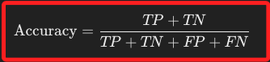
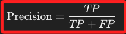
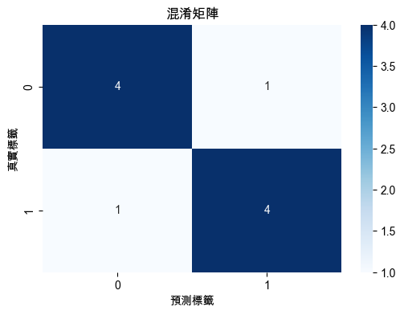
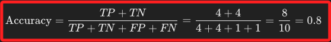
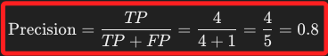

#  正確率 & 精確率

_衡量分類模型性能的重要指標，兩個指標各自反映模型在分類問題中的不同性能__

<br>

## 正確率

_Accuracy_

<br>

1. 正確率是模型的所有正確預測佔所有預測的比例。

    

<br>

2. 正確率適合在類別分佈均衡的情況下使用，如果數據集不平衡，例如大部分為正例或負例，正確率可能會掩蓋模型對少數類別的性能。

<br>

## 精確率

_Precision_

<br>

1. 精確率是模型預測為正例的樣本中，確實為正例的比例。

    

<br>

2. 精確率適合在偽陽（FP）成本很高的情況下使用，例如在垃圾郵件檢測中，如果模型標記了一封正常郵件為垃圾郵件（FP），可能會造成用戶訊息的丟失，因此需要高精確率。

<br>

## 範例

1. 在 Scikit-Learn 庫中有相對應的函數可直接用來計算正確率和精確率，以下進行簡單的代碼範例。

    ```python
    import numpy as np
    import matplotlib.pyplot as plt
    import seaborn as sns
    from sklearn.metrics import (
        accuracy_score, 
        precision_score, 
        confusion_matrix
    )

    # 設定支持中文的字體，避免顯示錯誤
    plt.rcParams['font.sans-serif'] = ['Arial Unicode MS']
    # 用來正常顯示負號
    plt.rcParams['axes.unicode_minus'] = False

    # 真實標籤（y_true）
    y_true = np.array([0, 1, 1, 0, 1, 0, 1, 0, 0, 1])

    # 預測標籤（y_pred）
    y_pred = np.array([0, 1, 0, 0, 1, 1, 1, 0, 0, 1])

    # 計算正確率（Accuracy）
    accuracy = accuracy_score(y_true, y_pred)
    print(f"正確率（Accuracy）: {accuracy:.2f}")

    # 計算精確率（Precision）
    precision = precision_score(y_true, y_pred)
    print(f"精確率（Precision）: {precision:.2f}")

    # 計算混淆矩陣
    conf_matrix = confusion_matrix(y_true, y_pred)

    # 繪製混淆矩陣
    plt.figure(figsize=(6, 4))
    sns.heatmap(
        conf_matrix, 
        annot=True, 
        fmt='d', 
        cmap='Blues'
    )
    plt.title('混淆矩陣')
    plt.xlabel('預測標籤')
    plt.ylabel('真實標籤')
    plt.show()
    ```

<br>

2. 混淆矩陣。

    

<br>

3. 正確率 `0.80`，即模型在所有樣本中有 80% 的預測是正確的。

    

<br>

4. 精確率 `0.80`，表示在模型預測為正例的樣本中，只有 80% 是真實的正例。

    

<br>

___

_END_
