# 激活函數

_Activation Functions；在機器學習和深度學習中，激活函數是神經網絡中非常重要的一部分。_

<br>

## 主要功能

1. 引入非線性：激活函數的主要功能是為神經網絡引入 `非線性特性`，使得神經網絡能夠學習和表示複雜的非線性映射。如果沒有激活函數，神經網絡層與層之間僅是 `線性變換`，無法有效學習複雜數據的特徵。

<br>

2. 影響梯度流動：激活函數影響著 `反向傳播` 時 `梯度` 的流動，選擇合適的激活函數可以`避免梯度消失` 或 `梯度爆炸`，從而有助於模型的穩定訓練。

<br>

3. 控制輸出範圍：不同的激活函數有不同的輸出範圍，例如 `Sigmoid` 和 `Tanh` 函數壓縮輸出到特定範圍內，適合於特定的應用場景，如 `二分類`。

<br>

4. 提高模型的表達能力：使用合適的激活函數可以提高神經網絡的表達能力，從而使得模型能夠學習到數據的複雜模式。

<br>

5. 激活函數的選擇通常取決於具體的應用場景、數據特性和神經網絡結構，選擇合適的激活函數對於構建有效的深度學習模型至關重要。

<br>

## Sigmoid 函數

1. 公式如下。  

    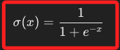

<br>

2. 將輸入壓縮到範圍（0 到 1）之間，常用於 `二元分類問題` 的 `輸出層`，在存在極端值時，梯度接近於零，會導致 `梯度消失` 問題，從而減慢神經網絡的訓練。

<br>

3. 程式碼。

    ```python
    import numpy as np
    import matplotlib.pyplot as plt

    # 定義 Sigmoid 函數
    def sigmoid(x):
        return 1 / (1 + np.exp(-x))

    # 建立輸入數據
    x = np.linspace(-10, 10, 100)

    # 計算 Sigmoid 的輸出
    y = sigmoid(x)

    # 可視化 Sigmoid 函數
    plt.plot(x, y)
    plt.title('Sigmoid 函數')
    plt.xlabel('輸入')
    plt.ylabel('輸出')
    plt.grid()
    plt.show()
    ```

    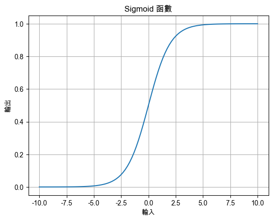

<br>

## Tanh 函數

_雙曲正切函數_

<br>

1. 公式如下。

    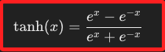

<br>

2. 將輸入壓縮到 (-1, 1) 之間，與 Sigmoid 函數相比，Tanh 函數的輸出範圍更大，因此在 Sigmoid 函數的範圍內有更強的梯度，也會遇到梯度消失問題，但通常比 Sigmoid 更好。

<br>

3. 程式碼。

    ```python
    import numpy as np
    import matplotlib.pyplot as plt

    # 使用支持中文的字體
    plt.rcParams['font.sans-serif'] = ['Arial Unicode MS']
    # 用來正常顯示負號
    plt.rcParams['axes.unicode_minus'] = False

    # 定義 Tanh 函數
    def tanh(x):
        return np.tanh(x)

    # 計算 Tanh 的輸出
    y = tanh(x)

    # 可視化 Tanh 函數
    plt.plot(x, y)
    plt.title('Tanh 函數')
    plt.xlabel('輸入')
    plt.ylabel('輸出')
    plt.grid()
    plt.show()
    ```

    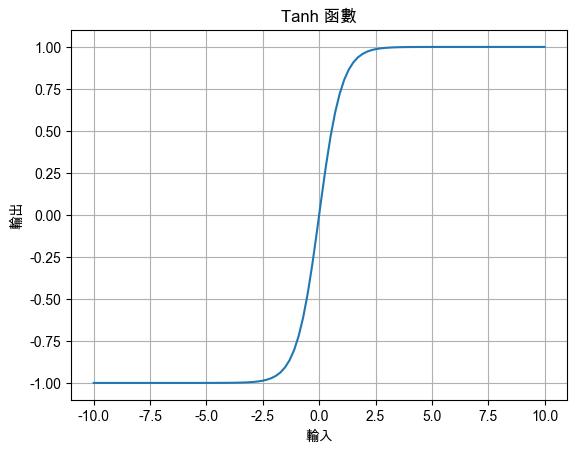

<br>

## ReLU 函數

_Rectified Linear Unit_

<br>

1. 公式如下。  

    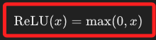

<br>

2. 將所有負數輸入壓縮為0，正數輸入保持不變，數學表示為 [0, ∞)；具備了計算的效率高，廣泛應用於 `隱藏層`，同時可避免 `Sigmoid` 和 `Tanh` 函數的 `梯度消失` 問題。

<br>

3. 可能會遇到死亡 ReLU問題，也就是當輸入一直為負時，神經元的權重無法更新，導致神經元 `死亡`。

<br>

4. 程式碼。

    ```python
    import numpy as np
    import matplotlib.pyplot as plt

    # 使用支持中文的字體
    plt.rcParams['font.sans-serif'] = ['Arial Unicode MS']
    # 用來正常顯示負號
    plt.rcParams['axes.unicode_minus'] = False

    # 定義 ReLU 函數
    def relu(x):
        return np.maximum(0, x)

    # 計算 ReLU 的輸出
    y = relu(x)

    # 可視化 ReLU 函數
    plt.plot(x, y)
    plt.title('ReLU 函數')
    plt.xlabel('輸入')
    plt.ylabel('輸出')
    plt.grid()
    plt.show()
    ```

    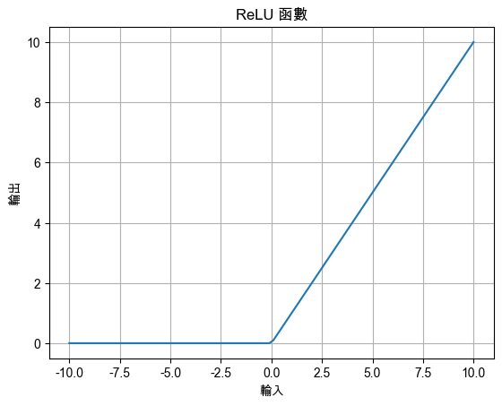

<br>

## Leaky ReLU 函數

1. 公式如下。

    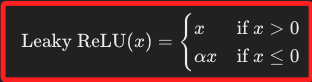

<br>

2. 是 ReLU 的變體，為負輸入引入了一個小斜率，通常是 0.01，旨在解決 ReLU 的 `死亡神經元` 問題，數學表達為 (-∞, ∞)。

<br>

3. 程式碼。

    ```python
    import numpy as np
    import matplotlib.pyplot as plt

    # 使用支持中文的字體
    plt.rcParams['font.sans-serif'] = ['Arial Unicode MS']
    # 用來正常顯示負號
    plt.rcParams['axes.unicode_minus'] = False

    # 定義 Leaky ReLU 函數
    def leaky_relu(x, alpha=0.01):
        return np.where(x > 0, x, alpha * x)

    # 計算 Leaky ReLU 的輸出
    y = leaky_relu(x)

    # 可視化 Leaky ReLU 函數
    plt.plot(x, y)
    plt.title('Leaky ReLU 函數')
    plt.xlabel('輸入')
    plt.ylabel('輸出')
    plt.grid()
    plt.show()
    ```

    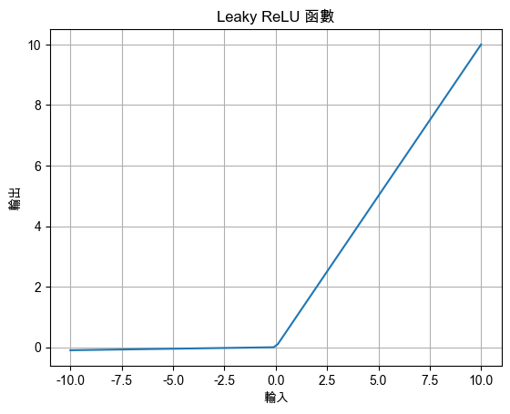

<br>

## Parametric ReLU 函數

_PReLU_

<br>

1. 公式如下。

    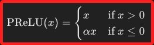

<br>

2. 範圍 (-∞, ∞)，與 Leaky ReLU 類似，但 α 是可訓練的參數，能夠學習最佳的負斜率，提供更多的靈活性。

<br>

3. 程式碼。

    ```python
    import numpy as np
    import matplotlib.pyplot as plt

    # 使用支持中文的字體
    plt.rcParams['font.sans-serif'] = ['Arial Unicode MS']
    # 用來正常顯示負號
    plt.rcParams['axes.unicode_minus'] = False

    # 定義 Parametric ReLU 函數
    def prelu(x, alpha=0.1):
        return np.where(x > 0, x, alpha * x)

    # 計算 PReLU 的輸出
    y = prelu(x)

    # 可視化 PReLU 函數
    plt.plot(x, y)
    plt.title('Parametric ReLU (PReLU) 函數')
    plt.xlabel('輸入')
    plt.ylabel('輸出')
    plt.grid()
    plt.show()
    ```

    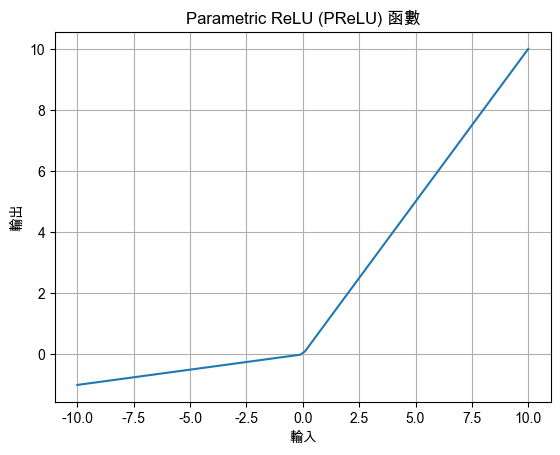

<br>

## Softmax 函數

1. 公式如下。

    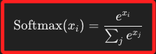

<br>

2. 範圍 (0, 1)，將輸入轉換為機率分佈，使得輸出的所有數值加起來等於 `1`，常用於多分類問題的輸出層。

<br>

3. 程式碼。

    ```python
    import numpy as np
    import matplotlib.pyplot as plt

    # 使用支持中文的字體
    plt.rcParams['font.sans-serif'] = ['Arial Unicode MS']
    # 用來正常顯示負號
    plt.rcParams['axes.unicode_minus'] = False

    # 定義 Softmax 函數
    def softmax(x):
        # 為了穩定性，減去最大值
        e_x = np.exp(x - np.max(x))
        return e_x / e_x.sum()

    # 輸入數據
    x = np.array([1.0, 2.0, 3.0])

    # 計算 Softmax 的輸出
    y = softmax(x)

    # 顯示 Softmax 函數的結果
    print('Softmax 輸出:', y)
    ```

<br>

4. 輸出結果如下，Softmax 函數無法像其他激活函數那樣進行簡單的可視化，因為它是一個多輸入、多輸出的函數，而不是單輸入、單輸出的函數；進一步說，輸入是一個向量，表示每個輸入值的機率，輸出也是一個向量，是一組數值的機率分佈，而不是單個值的變化曲線，因為是一個機率分佈，所有輸出值的和為 1，這種特性使得在繪圖時沒有一個明確的 y 軸來表示輸出的範圍，因為輸出的範圍是所有輸出值的總和而非單個值。

    ```bash
    Softmax 輸出: [0.09003057 0.24472847 0.66524096]
    ```

<br>

5. 通常，Softmax 的應用場景在於表示分類問題中不同類別的概率，因此更適合用資料表格或條形圖來表示其輸出，以下將輸入向量的元素映射到條形圖的不同條形上。這樣做的目的是可視化 Softmax 函數將輸入轉換為概率分佈的結果。

    ```python
    import numpy as np
    import matplotlib.pyplot as plt

    # 使用支持中文的字體
    plt.rcParams['font.sans-serif'] = ['Arial Unicode MS']
    # 用來正常顯示負號
    plt.rcParams['axes.unicode_minus'] = False

    # 定義 Softmax 函數
    def softmax(x):
        # 為了穩定性，減去最大值
        e_x = np.exp(x - np.max(x))
        return e_x / e_x.sum()

    # 輸入數據
    x = np.array([1.0, 2.0, 3.0])

    # 計算 Softmax 的輸出
    y = softmax(x)

    # 顯示 Softmax 函數的結果
    print('Softmax 輸出:', y)

    # 可視化 Softmax 的輸出結果
    plt.figure(figsize=(8, 6))
    plt.bar(
        range(len(x)), y, 
        tick_label=[f'輸入{x_i}' for x_i in x], 
        color='skyblue'
    )
    plt.xlabel('輸入值')
    plt.ylabel('Softmax 輸出（概率）')
    plt.title('Softmax 輸出條形圖')
    plt.show()
    ```

    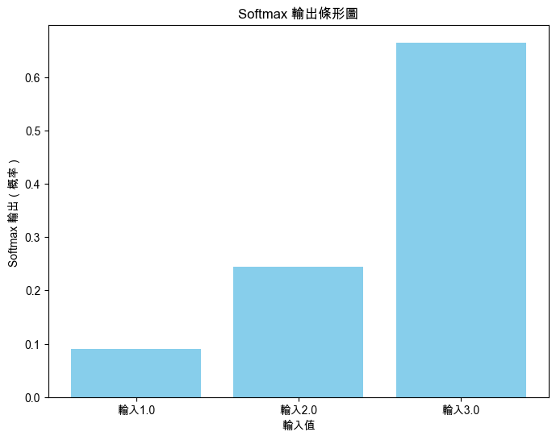

<br>

## Swish 函數

1. 公式如下。

    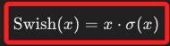

<br>

2. 範圍 (-∞, ∞)，是 Sigmoid 函數和輸入的乘積，具備自我調整的非線性特性，並且在一些深度學習模型中性能優於 ReLU。

<br>

3. 程式碼。

    ```python
    import numpy as np
    import matplotlib.pyplot as plt

    # 使用支持中文的字體
    plt.rcParams['font.sans-serif'] = ['Arial Unicode MS']
    # 用來正常顯示負號
    plt.rcParams['axes.unicode_minus'] = False

    # 定義 Swish 函數
    def swish(x):
        return x * sigmoid(x)

    # 計算 Swish 的輸出
    y = swish(x)

    # 可視化 Swish 函數
    plt.plot(x, y)
    plt.title('Swish 函數')
    plt.xlabel('輸入')
    plt.ylabel('輸出')
    plt.grid()
    plt.show()
    ```

    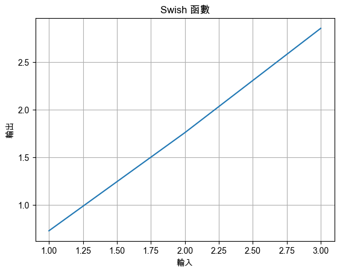

<br>

___

_END_