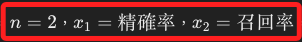
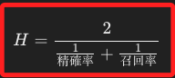

# F1 分數

_F1 Score_

 

## 定義

1. F1 分數是一種用於衡量 `分類模型` 性能的指標，尤其適用於 `不平衡數據集`，它綜合了 `精確率（Precision`）` 和 `召回率（Recall）`，通過它們的 `調和平均` 來衡量模型的整體性能。

 

2. F1 分數的公式如下。

    

 

## 調和平均的特色

1. `調和平均（Harmonic Mean）` 相比於 `算術平均` 更適合於反映兩個指標之間的平衡性，當數據集中包含 `極端值` 時，調和平均會偏向於較小的數值；以數學原理來說，如果數據中存在一個非常小的數，它的倒數將非常大，故而對整個分母的值有很大的影響，使得調和平均數更偏向於這個小數值；所以說調和平均數總是會偏向於較小的數值，更容易受 `極端小值` 的影響。

 

2. 從另外一個角度看，當精確率和召回率不平衡時，也就是一個大、一個小時，F1 分數自然也會偏低，所以會反映模型在這兩個指標上的不平衡性能；這種敏感性使得調和平均特別適合於像 F1 分數這樣需要同時考慮兩個指標且不希望忽略其中任意一個的場景。

 

## 調和平均的數學推導

1. 調和平均的公式如下。

    

 

2. 在 F1 分數的情況下。

    

 

3. 因此調和平均公式如下。

    

 

4. 以上算式可進一步推導如下，這便是 `F1 分數` 的公式。

    

 

## 應用

_F1 分數尤其適合於下列場景_

 

1. 不平衡數據集：當數據集中正類和負類的數量不平衡時，F1 分數能夠更好地反映模型性能。

 

2. 需要同時考慮精確率和召回率：例如，在醫學診斷中，既希望有高的精確率（減少誤報）又希望有高的召回率（減少漏報），此時 F1 分數是一個很好的指標。

 

___

_END_