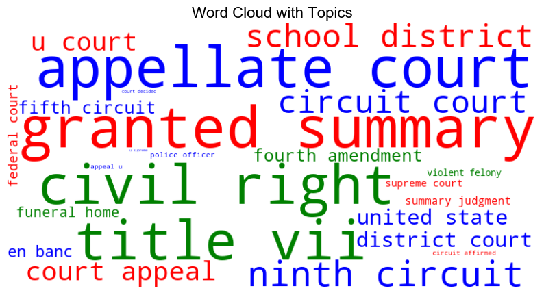
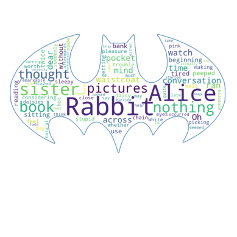

# 文字雲

_處理複雜文本數據時，可透過文字雲進行可視化_

<br>

## 說明

1. 安裝套件。

    ```bash
    pip install wordcloud
    ```

<br>

2. 使用 `wordcloud` 庫來生成文字雲，在以下的範例中，文字雲將根據單詞的重要性（`importance`）來調整每個單詞的字體大小，並可以根據 `topics` 來為不同的單詞著色。

    ```python
    import matplotlib.pyplot as plt
    from wordcloud import WordCloud
    import numpy as np

    # 模擬資料
    words = [
        'district court', 'court appeal', 'united state', 'u court', 'circuit affirmed', 
        'ninth circuit', 'en banc', 'supreme court', 'fifth circuit', 'federal court', 
        'u supreme', 'appeal u', 'fourth amendment', 'granted summary', 'violent felony', 
        'police officer', 'school district', 'summary judgment', 'funeral home', 'circuit court',
        'title vii', 'court decided', 'civil right', 'appellate court'
    ]
    # 模擬重要性數據
    importance = np.random.rand(len(words)) / 100

    # 為每個字詞分配主題編號 (Topic)
    topics = np.random.randint(0, 3, len(words))

    # 定義顏色對應每個 topic
    colors = {0: 'red', 1: 'green', 2: 'blue'}

    # 建立單詞和重要性字典，準備生成文字雲
    word_importance = {word: imp for word, imp in zip(words, importance)}

    # 自定義著色函數，根據 topic 來設置單詞的顏色
    def color_func(word, font_size, position, orientation, random_state=None, **kwargs):
        index = words.index(word)
        topic = topics[index]
        return colors[topic]

    # 生成文字雲
    wordcloud = WordCloud(
        width=800, height=400, 
        background_color='white', 
        color_func=color_func
    ).generate_from_frequencies(word_importance)

    # 顯示文字雲
    plt.figure(figsize=(10, 6))
    plt.imshow(wordcloud, interpolation='bilinear')
    plt.axis('off')
    plt.title('Word Cloud with Topics', fontsize=16)
    plt.show()
    ```

    

<br>

3. 優化範例，使用遮罩圖片來建立形狀文字雲，同時根據詞的重要性來調整字體大小，遮罩部分必須使用黑白圖片，若有需求可參考 [遮罩圖庫](https://www.kaggle.com/datasets/evilspirit05/wordcloud-mask-collection)，這裡從以上網址下載一張蝙蝠俠圖片，另外，文件部分讀取以下這個文件內容，並將文件命名為 `demo.txt`。

    ```txt
    Alice was beginning to get very tired of sitting by her sister on the bank, and of having nothing to do: once or twice she had peeped into the book her sister was reading, but it had no pictures or conversations in it, `and what is the use of a book,' thought Alice `without pictures or conversation?'
    So she was considering in her own mind (as well as she could, for the hot day made her feel very sleepy and stupid), whether the pleasure of making a daisy-chain would be worth the trouble of getting up and picking the daisies, when suddenly a White Rabbit with pink eyes ran close by her.

    There was nothing so very remarkable in that; nor did Alice think it so very much out of the way to hear the Rabbit say to itself, `Oh dear! Oh dear! I shall be late!' (when she thought it over afterwards, it occurred to her that she ought to have wondered at this, but at the time it all seemed quite natural); but when the Rabbit actually took a watch out of its waistcoat-pocket, and looked at it, and then hurried on, Alice started to her feet, for it flashed across her mind that she had never before seen a rabbit with either a waistcoat-pocket, or a watch to take out of it, and burning with curiosity, she ran across the field after it, and fortunately was just in time to see it pop down a large rabbit-hole under the hedge.
    ```

    

<br>

4. 代碼。

    ```python
    import os
    from PIL import Image
    import numpy as np
    import matplotlib.pyplot as plt
    from wordcloud import WordCloud, STOPWORDS

    # 確認當前的工作目錄
    d = os.getcwd()

    # 讀取文本數據，確保 demo.txt 文件在同一目錄下
    text_path = os.path.join(d, 'demo.txt')
    with open(text_path, 'r') as file:
        text = file.read()

    # 讀取遮罩圖片 cloud.png，確保使用的是存在的遮罩文件
    mask_path = os.path.join(d, "batman.png")
    alice_mask = np.array(Image.open(mask_path))

    # 設置停止詞
    stopwords = set(STOPWORDS)
    stopwords.add("said")

    # 生成文字雲
    wc = WordCloud(
        background_color="white", 
        max_words=2000, 
        mask=alice_mask,
        stopwords=stopwords, 
        contour_width=3, 
        contour_color='steelblue'
    )

    # 生成文字雲數據
    wc.generate(text)

    # 儲存生成的文字雲圖片
    output_image_path = os.path.join(d, "cloud_output.png")
    wc.to_file(output_image_path)

    # 顯示文字雲
    plt.imshow(wc, interpolation='bilinear')
    plt.axis("off")

    # 顯示文字雲圖表
    plt.show()
    ```

    

<br>

___

_END_