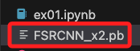
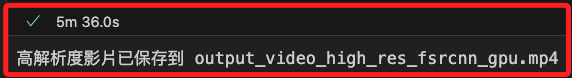

# 提高影片的解析度

_使用 Python 結合 OpenCV 和一些影像處理技術來完成_

<br>

## 說明

1. 提高解析度的技術被稱為 `超解析度（Super Resolution, SR）`，這種技術包括多種方法，如 `插值法（例如雙線性、雙三次插值）` 和基於深度學習的算法。以下使用 OpenCV 的雙三次插值（bicubic interpolation）來提高解析度，然後使用 ffmpeg 提取音訊並合併回高解析度視頻中；先確保必要庫已安裝。

    ```bash
    pip install opencv-python
    ```

<br>

2. 範例。

    ```python
    import cv2
    import subprocess

    # 讀取影片
    input_video_path = "input_video.mp4"
    cap = cv2.VideoCapture(input_video_path)

    # 檢查影片是否成功打開
    if not cap.isOpened():
        print("無法打開影片文件。")
        exit()

    # 取得影片的原始屬性
    fps = int(cap.get(cv2.CAP_PROP_FPS))
    frame_width = int(cap.get(cv2.CAP_PROP_FRAME_WIDTH))
    frame_height = int(cap.get(cv2.CAP_PROP_FRAME_HEIGHT))

    # 設定新解析度，這裡將解析度提高一倍
    new_width = frame_width * 2
    new_height = frame_height * 2

    # 設定影片編碼器和建立 VideoWriter 物件
    output_video_path = "output_video_high_res.mp4"
    # 用於暫存無音訊的高解析度影片
    temp_video_path = "temp_video.mp4"
    # MPEG-4 編碼
    fourcc = cv2.VideoWriter_fourcc(*"mp4v")
    out = cv2.VideoWriter(
        temp_video_path, fourcc, fps,
        (new_width, new_height)
    )

    # 逐幀處理影片
    while cap.isOpened():
        ret, frame = cap.read()
        if not ret:
            break

        # 使用雙三次插值提高解析度
        high_res_frame = cv2.resize(
            frame, (new_width, new_height),
            interpolation=cv2.INTER_CUBIC
        )

        # 寫入提高解析度後的影格到新影片
        out.write(high_res_frame)

    # 釋放所有資源
    cap.release()
    out.release()
    cv2.destroyAllWindows()

    print(f"高解析度影片已保存到 {temp_video_path}")

    # 使用 ffmpeg 提取音訊並合併到高解析度視頻中
    # 提取音訊
    subprocess.run(
        [
            "ffmpeg", "-i", input_video_path,
            "-q:a", "0", "-map", "a", "temp_audio.aac", "-y"
        ]
    )

    # 合併視頻和音訊
    subprocess.run(
        [
            "ffmpeg",
            "-i",
            temp_video_path,
            "-i",
            "temp_audio.aac",
            "-c:v",
            "copy",
            "-c:a",
            "aac",
            "-strict",
            "experimental",
            output_video_path,
            "-y",
        ]
    )

    print(f"高解析度影片（帶音訊）已保存到 {output_video_path}")

    # 清理臨時文件
    import os

    os.remove("temp_video.mp4")
    os.remove("temp_audio.aac")
    ```

<br>

## 使用深度學習提高解析度

1. 基於深度學習的方法可以顯著提高影片的質量，但這些方法通常需要更高的計算資源，常用的深度學習模型如 `EDSR`、`ESPCN`、`FSRCNN` 等，可以在如 PyTorch、TensorFlow 或 OpenCV 的深度學習模組如 `cv2.dnn_superres`中找到；先安裝必要的庫

    ```bash
    pip install opencv-python opencv-contrib-python
    ```

<br>

2. 如果安裝了錯誤的版本或有損壞的安裝，可以重新安裝。

    ```bash
    pip uninstall opencv-python opencv-contrib-python
    pip install opencv-python opencv-contrib-python
    ```

<br>

3. 下載模型 [FSRCNN_x2.pb](https://github.com/Saafke/FSRCNN_Tensorflow/blob/master/models/FSRCNN_x2.pb)，並加入專案資料夾中；FSRCNN 是一種相對輕量且速度較快的超解析度模型。

    

<br>

4. 使用 OpenCV 的 `dnn_superres` 模組進行超解析度的範例，包含使用 ffmpeg 來提取原影片的音軌，然後將音軌合併到超解析度處理後的影片中；需要一點時間。

    ```python
    import cv2
    import subprocess

    # 初始化超解析度模型
    sr = cv2.dnn_superres.DnnSuperResImpl_create()

    # 使用 FSRCNN 模型進行 2x 放大（這是一個輕量級模型）
    model_path = 'FSRCNN_x2.pb'
    sr.readModel(model_path)

    # 設定為 FSRCNN 模型並進行 2x 放大
    sr.setModel('fsrcnn', 2)

    # 設定 DNN 後端和目標為 GPU
    sr.setPreferableBackend(cv2.dnn.DNN_BACKEND_DEFAULT)
    sr.setPreferableTarget(cv2.dnn.DNN_TARGET_OPENCL)

    # 讀取影片
    input_video_path = 'input_video.mp4'
    cap = cv2.VideoCapture(input_video_path)

    # 檢查影片是否成功打開
    if not cap.isOpened():
        print("無法打開影片文件。")
        exit()

    # 取得影片的原始屬性
    fps = int(cap.get(cv2.CAP_PROP_FPS))
    frame_width = int(cap.get(cv2.CAP_PROP_FRAME_WIDTH))
    frame_height = int(cap.get(cv2.CAP_PROP_FRAME_HEIGHT))

    # 設定新解析度
    new_width = frame_width * 2
    new_height = frame_height * 2

    # 設定影片編碼器和建立 VideoWriter 物件
    output_video_path = 'output_video_high_res_no_audio.mp4'
    fourcc = cv2.VideoWriter_fourcc(*'mp4v')
    out = cv2.VideoWriter(
        output_video_path, fourcc, fps,
        (new_width, new_height)
    )

    # 逐幀處理影片
    while cap.isOpened():
        ret, frame = cap.read()
        if not ret:
            break

        # 使用超解析度模型提高解析度
        high_res_frame = sr.upsample(frame)
        
        # 寫入提高解析度後的影格到新影片
        out.write(high_res_frame)

    # 釋放所有資源
    cap.release()
    out.release()
    cv2.destroyAllWindows()

    print(f"高解析度影片已保存到 {output_video_path}")

    # 提取原影片音頻
    audio_output_path = 'extracted_audio.mp3'
    subprocess.run([
        'ffmpeg', '-i', input_video_path,
        '-q:a', '0', '-map', 'a',
        audio_output_path, '-y'
    ])

    # 合併視頻和音頻
    final_output_path = 'output_video_high_res_with_audio.mp4'
    subprocess.run([
        'ffmpeg', '-i', output_video_path,
        '-i', audio_output_path,
        '-c:v', 'copy', '-c:a', 'aac',
        '-map', '0:v:0', '-map', '1:a:0',
        final_output_path, '-y'
    ])

    print(f"影片和音頻合併後的最終影片已保存到 {final_output_path}")
    ```

    _大概耗時五分半_

    

<br>

___

_END_
